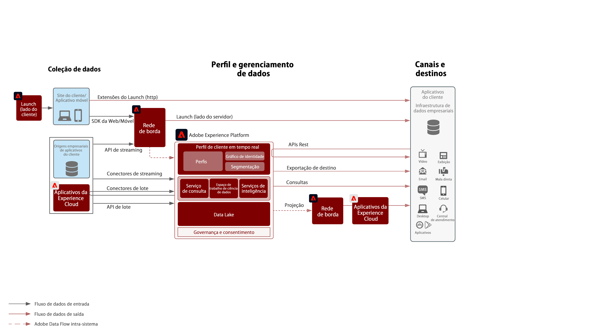
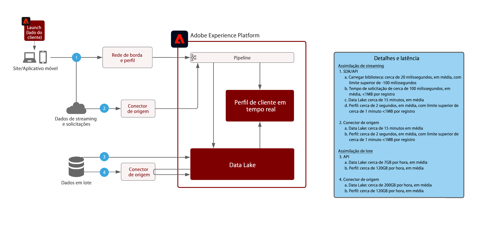

# Arquitetura de fluxo de dados do Adobe Experience Platform

## Diagrama de fluxo de dados

O diagrama abaixo ilustra os vários caminhos para a assimilação de dados e saída do Adobe Experience Platform.

## Garantias da Assimilação de Dados

O diagrama abaixo ilustra as medidas de proteção de desempenho médio e a latência para a assimilação de dados no Adobe Experience Platform.

