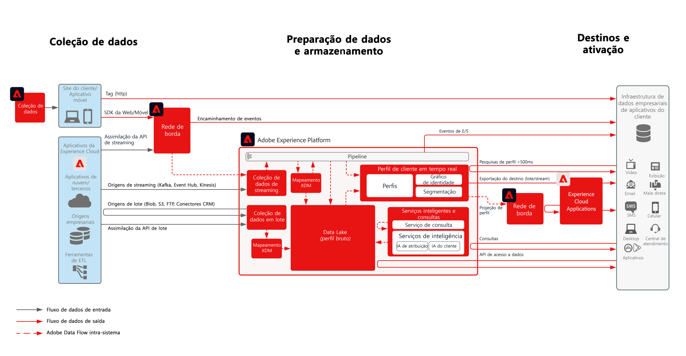

# Diagramas da arquitetura de fluxo de dados da Adobe Experience Platform Diagramas

## Diagrama de fluxo de dados

O diagrama abaixo ilustra os vários caminhos para a assimilação e saída de dados da Adobe Experience Platform.

## Padrões de entrada e saída de dados

Para obter uma lista detalhada de todos os padrões de assimilação, coleção, ingresso e saída, consulte a [Documentação de assimilação de dados](https://experienceleague.adobe.com/en/docs/experience-platform/collection/home).