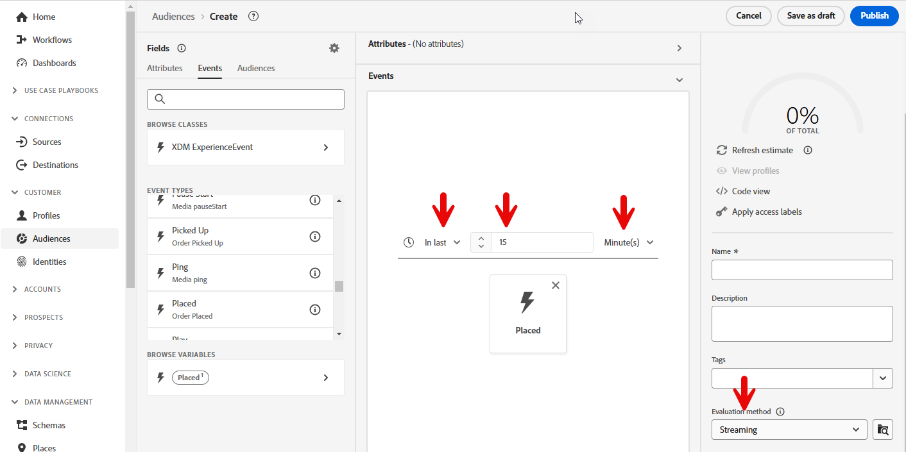
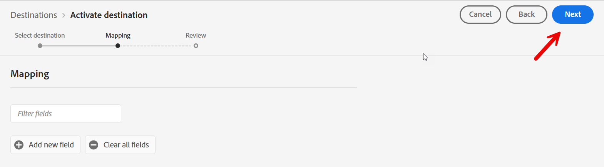
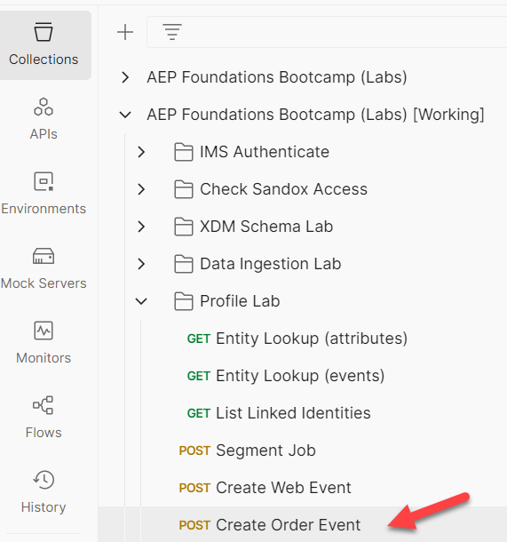

# Enviar evento de ordem para Hub

## Transmissão para Hub vs. Edge

No caso de uso #1, enviamos um Evento para a Edge.  Há alguns casos de uso em que podemos ter um sistema de back-end que deseja transmitir em um evento, mas não precisa enviá-lo para a Edge.  Este laboratório mostra como fazer isso ao transmitir um evento de pedido para o Hub.

## Criar um segmento de pedido (se não tiver feito)

Clique em Público-alvo no painel à esquerda e clique no botão Criar público-alvo na parte superior direita.


Encontre o cartão de tipo de evento Pedido feito e arraste-o para a tela.


## Atualizar regras de evento

Faça as seguintes alterações nas regras de evento (talvez seja necessário expandir o evento para vê-lo)

1. No(s) último(s)
1. 15
1. Minutes
1. Alterar para Avaliação de streaming

Salvar como **Transmissão de Evento de Pedido (em 15 minutos)**




## Ativar para destino

Abra o público-alvo que acabou de criar se estiver fechado.

Clique em Ativar para destino


### Destino

Selecione o destino de streaming que você criou anteriormente (Webhook de transmissão DEP)


### Mapeamento

Deixe o Mapeamento sozinho e clique em Próximo



Clique em Concluir

## Abrir Postman

Inicie o postman em seu computador e navegue até a seguinte chamada de API:

1. **Barra Lateral Esquerda do Postman** —> `Collections`
1. **Coleção** —> `AEP Foundations Bootcamps (labs)`
1. **Pasta** —> Laboratório de perfis
1. **Solicitação de API** —> `Create Order Event`




## Modificar solicitação de API

Para criar a solicitação de API de exemplo, você precisa preencher as seguintes partes no corpo da solicitação de API.

Comece reunindo os seguintes valores:

## Localizar ponto de extremidade de transmissão da conta

1. Navegue até **Fontes** no painel esquerdo e clique em **Contas** na navegação superior
1. Pesquise por **dep: API HTTP \[raw]**, realce a linha, copie e salve o valor do **Ponto de Extremidade de Streaming** em algum lugar que você possa referenciar mais tarde

 conta e copiar seu Ponto de Extremidade de Streaming&rbrack;(assets/send-order-event-to-hub-http-api-raw-streaming-endpoint.png &quot;dep: HTTP API \[raw]&quot;)

## Encontrar ID de fluxo de dados

1. Localize o registro de **dep: Pedidos (fluxo)** e clique no link de fluxos de dados
1. No painel direito, copie e salve os valores de **ID de fluxo de dados** em algum lugar que você possa consultar mais tarde

>[!NOTE]
>
>Clique em um espaço vazio na linha.  NÃO clique nos links azuis!


## Criar solicitação de API final

Copie os valores salvos nas etapas anteriores nos locais destacados abaixo.

- **Vermelho** —> `Streaming Endpoint URL`
- **Verde** —> `Dataflow ID`

Sua solicitação final da API deve ter esta aparência quando concluída

>[!CAUTION]
>
>AINDA NÃO EXECUTAR!


## Executar a API

1. Salve sua chamada de API clicando no botão **Salvar**
1. Execute sua solicitação clicando no botão **Enviar**

Uma chamada bem-sucedida deve resultar na seguinte resposta...


## Validar

1. Vá para o Perfil e procure o Perfil para ver se o evento foi assimilado no Perfil.  Ele deve aparecer em segundos.
   1. Pesquisar o perfil usando o email no pedido
1. Validar se o perfil se qualificou para os segmentos (pode levar alguns minutos). Ele deve aparecer em segundos a minutos.
   1. Fluxo contínuo do evento do pedido (em 15 minutos)
1. Verifique seu webhook para ver se o Destino notificou o webhook de um Segmento &quot;realizado&quot;.  Ele deve aparecer entre 5 e 10 minutos.
1. Após 15-30 minutos, você pode até verificar seu conjunto de dados com o seguinte:
   1. Altere o nome da tabela abaixo para o da sua sandbox.  Para encontrá-lo, vá para a lista de conjuntos de dados e filtre por &quot;`dest`&quot;, abra o conjunto de dados e copie o nome da tabela no painel direito.

```sql
SELECT * FROM profile_export_for_destination_merge_policy_xxx
WHERE extSourceSystemAudit.LASTREFERENCEDDATE >= CURRENT_DATE
AND identitymap['email'][0].ID in ('depche.mode@dep.com')
ORDER BY extSourceSystemAudit.LASTREFERENCEDDATE DESC
LIMIT 10
```
