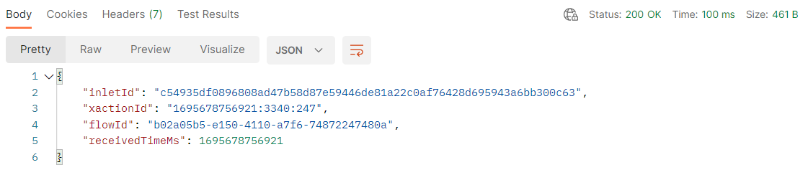

# Enviar evento da Web para Hub

>[!IMPORTANT]
>
>Conclua a [configuração do Postman](../../postman-setup/postman-installation.md) antes de iniciar este laboratório. Você também precisa de acesso ao [webhook.site](https://webhook.site/) para o [fluxo de trabalho de ativação de destino externo](../use-case-1-acquisition/configure-destinations/setup-streaming-destination.md) relacionado.

## Abrir Postman

Inicie o postman em seu computador e navegue até a seguinte chamada de API:

1. **Barra Lateral Esquerda do Postman** —> `Collections`
1. **Coleção** —> `AEP Foundations Bootcamps (labs)`
1. **Pasta** —> Laboratório de perfis
1. **Solicitação de API** —> `Create Web Event`


## Modificar solicitação de API

Para criar a solicitação de API de exemplo, você precisa preencher as seguintes partes no corpo da solicitação de API.

Comece reunindo os seguintes valores:


## Localizar ponto de extremidade de transmissão da conta

1. Navegue até **Fontes** no painel esquerdo e clique em **Contas** na navegação superior
1. Pesquise por **dep: API HTTP \[raw]**, realce a linha, copie e salve o valor do **Ponto de Extremidade de Streaming** em algum lugar que você possa referenciar mais tarde

 conta e copiar seu Ponto de Extremidade de Streaming](assets/send-order-event-to-hub-http-api-raw-streaming-endpoint.png &quot;dep: HTTP API \[raw]&quot;)

## Localizar ID do fluxo de dados da Web

1. Clique na conta **HTTP API \[raw]**
1. Localize e selecione a linha de fluxo de dados chamada **dep: Web (fluxo)**
1. No painel direito, copie e salve os valores de **ID de fluxo de dados** em algum lugar que você possa consultar mais tarde

>[!NOTE]
>
>Clique em um espaço vazio na linha.  NÃO clique nos links azuis!


## Criar solicitação de API final

Copie os valores salvos nas etapas anteriores nos locais destacados abaixo.

- **Vermelho** —> `Streaming Endpoint URL`
- **Verde** —> `Dataflow ID`

Sua solicitação final da API deve ter esta aparência quando concluída

>[!CAUTION]
>
>AINDA NÃO EXECUTAR!


## Executar a API

1. Salve sua chamada de API clicando no botão **Salvar**
1. Execute sua solicitação clicando no botão **Enviar**

Uma chamada bem-sucedida deve resultar na seguinte resposta...



## Validar

1. Vá para o Perfil e procure o Perfil para ver se o evento foi assimilado no Perfil.  Ele deve aparecer em segundos.
   1. Use o email na sua chamada para procurar o Perfil
1. Dependendo do tempo decorrido desde a última vez que você enviou um evento, talvez não seja necessário se qualificar para novos Segmentos. Caso contrário, você poderá ver estes ou outros:
   1. Qualquer Edge de evento (em 15 minutos)
      1. Lembre-se: todos os públicos-alvo salvos com uma avaliação do Edge também são avaliados no Hub quando os dados de transmissão entram em vigor
   2. dep: Qualquer transmissão de evento (dentro de uma hora)
1. Este evento de Hub não é enviado para o seu webhook.
   1. O encaminhamento de eventos processa eventos enviados para a Edge, não eventos enviados diretamente para o Hub. Use o [fluxo de trabalho de ativação de destino externo](../use-case-1-acquisition/configure-destinations/setup-streaming-destination.md) para capturar um evento no webhook.site.
1. Após pelo menos 30 minutos, você pode até verificar seu conjunto de dados com o seguinte:
   1. Altere o nome da tabela abaixo para o da sua sandbox.  Para encontrá-lo, vá para a lista de conjuntos de dados e filtre por &quot;`dest`&quot;, abra o conjunto de dados e copie o nome da tabela no painel direito.

```sql
SELECT * FROM profile_export_for_destination_merge_policy_xxx
WHERE extSourceSystemAudit.LASTREFERENCEDDATE >= CURRENT_DATE
AND identitymap['email'][0].ID in ('depche.mode@dep.com')
ORDER BY extSourceSystemAudit.LASTREFERENCEDDATE DESC
LIMIT 10
```
