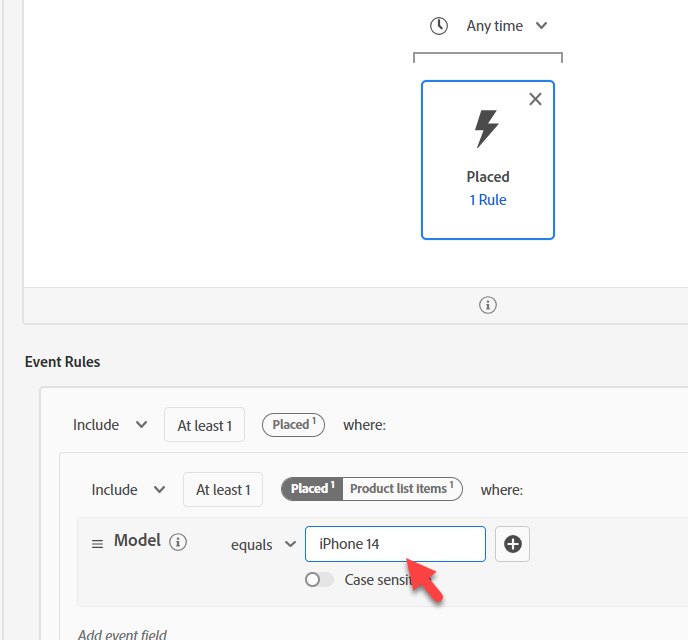
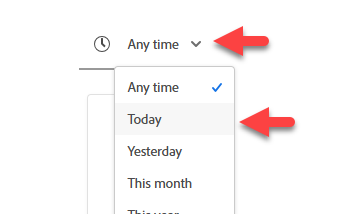

# Criar público-alvo #1

## Objetivo do laboratório

Crie um público-alvo que encontre apenas perfis que fizeram um pedido para um iPhone 14

## Analisar o público-alvo

Comece criando seu primeiro público-alvo. Ele é composto de muitas peças que precisamos incorporar. Clique em Público-alvo no painel à esquerda e clique no botão Criar público-alvo na parte superior direita.

Vamos dividir esse caso de uso em partes e resolvê-los com vários públicos-alvo. A razão para isso é que estamos tentando transformar isso em um streaming e duas coisas estão impedindo isso:

1. A cláusula de exclusão &quot;não existe nenhuma ordem para o iPhone 14/Pixel 7&quot;
1. A cláusula de exclusão &quot;no ative iPhone 14/Pixel 7&quot;. Vamos analisar as ramificações disso no final.

## Parte 1 - descoberta

A primeira parte do nosso público-alvo é procurar por &quot;não existe nenhum pedido para um iPhone 14&quot;. Imagine que somos um novo profissional de marketing da AEP e não projetamos o esquema. Pesquise por &quot;Pedido&quot; na guia Eventos no painel esquerdo

Você obtém muitos objetos relacionados a um pedido

- Atributos: por exemplo, ID do pedido, Data do pedido
- Pastas: por exemplo, Ordem, Detalhes da Ordem do Plano
- Tipos de evento: por exemplo, Pedido feito, Pedido enviado etc.

>[!NOTE]
>
>* Não existe um &quot;i&quot; para a &quot;pasta&quot; do pedido. Mesmo que nossa descrição tenha sido preenchida, ela não a possui e isso pode ser uma fonte de confusão para o profissional de marketing, pois ele pode tentar usá-la ou querer saber o que é.
>* O &quot;i&quot; para Cartões de evento apenas repete o tipo, já que o Tipo de evento é um campo, não muitos.
>* Os dados de resumo serão exibidos somente se o valor estiver presente em mais de 2% dos perfis mesclados. Isso também direciona qualquer preenchimento automático ao filtrar em uma string.

Use o cartão Tipo de evento feito no pedido e arraste-o para a tela.

> [!TIP]
>
>**Opcional:**
>
>Todos os eventos têm um tipo de evento.  Podemos filtrar por Tipo de evento em vez de usar um cartão de tipo de evento.
>
>Lembre-se de quando estendemos o Tipo de evento do esquema de pedido. Adicionamos os valores que agora vemos no menu suspenso.  Esses mesmos valores são exibidos como cartões Tipo de evento
>
>Se desejar, você pode usar qualquer uma das abordagens.
>
>Em um novo Público-alvo, acesse Evento de experiência XDM e arraste em Tipo de evento.
>
>
>
>A filtragem usando cartões Tipo de evento é a mesma que filtrar usando o Campo Tipo de evento
>
>
>
>Vantagem de usar Cartões de tipo de evento:
>
>- Ele mostra o nome do Tipo de evento no Público-alvo, tornando-o fácil e rápido de entender
>- É rápido e requer menos etapas
>
>Benefício de usar o Campo de tipo de evento:
>
>- Ela permite selecionar vários Tipos de evento (por exemplo, &quot;Ordem Separada&quot; ou &quot;Ordem Entregue&quot;) se quisermos incluir vários tipos em um critério
>- Ele suporta distinção entre maiúsculas e minúsculas

>[!NOTE]
>
>Há algumas opções a serem consideradas para &quot;Nenhum pedido existe&quot;.  Estamos escolhendo uma abordagem simples, mas há coisas para pensar no mundo real:
>
>- Ordem Efetuada, mas Separada ou Remetida
>- Pedido realizado mas cancelado
>- Vários pedidos feitos, mas um cancelado

Nosso profissional de marketing sabe, com base em seu treinamento, que mais de uma fonte de dados foi carregada:

- Pedidos (capturados pelo sistema de pedidos em todos os canais)
- Web (rastreamento do lado do cliente do que as pessoas estão clicando, incluindo Pedidos feitos no site)
- comércio eletrônico (capturado pelo sistema de comércio eletrônico do site)

Qual fonte devemos usar? Todos representam logicamente o mesmo evento &quot;Pedido feito&quot;. Mas elas são armazenadas fisicamente em sistemas diferentes. Como sabemos qual usar? A melhor maneira é observar as descrições de cada objeto de Esquema e de cada campo a ser conhecido.

>[!NOTE]
>
>As descrições devem ter informações relevantes para ajudar a tomar essas decisões, como:
>
>1. De onde vêm os dados?
>2. O que ele contém ou não contém?
>3. Qual é a latência?
>4. Algum sistema foi designado como &quot;fonte da verdade&quot;?
>5. Existem nuances que precisamos levar em consideração?

Para nós, queremos usar o Pedido feito, mas lembre-se de que, dependendo do nosso caso de uso, poderíamos ter os seguintes requisitos, que podem influenciar a origem da qual obtemos:

- Compras no local nos últimos 30 minutos
- Pedidos feitos e não cancelados
- Ordens recebidas no prazo de 1 dia após estarem prontas

>[!TIP]
>
>Exercício de pensamento opcional, imagine que fizemos um único pedido em nosso site hoje (lembre-se de que o pedido é registrado por todos os três sistemas):
>
>1. Quantos eventos seriam contados para pedidos feitos hoje?
>2. Quantos pedidos foram feitos do ponto de vista dos clientes?
>3. Quantos eventos seriam contados se filtrássemos por Método de envio = durante a noite (supondo que eles escolhessem isso)?
>4. Como devemos lidar com isso (público-alvo ou modelo de dados)?

Depois de fazer uma análise, vamos com o `Orders Event of Event Type=”order. placed”`. Queremos garantir que nosso público-alvo esteja usando a fonte da verdade na compensação de velocidade (os dados da Web fluem com cada clique enquanto o Pedido passa por algum processamento antes de ser enviado). Além disso, no futuro, podemos excluir aqueles que cancelaram e isso pode ser feito por meio de qualquer canal.

## Parte 2 — criar o público-alvo

Ativar Mostrar esquema completo

Desenvolva a partir do que você começou.  Clique no cartão Inserido e **limpe &quot;inserido&quot; da Pesquisa** no painel à esquerda e vá para:

Evento de experiência XDM -> Pasta de itens da lista de produtos

>[!WARNING]
>
>Uma confusão comum para seu profissional de marketing seria usar o Dispositivo em vez do Produto aqui (já que filtraremos no iPhone). Mais uma vez, outro motivo para boas descrições.

Estamos procurando algo que possamos filtrar e que possa ter iPhone. Observe que temos três opções

- Nome
- Produto
- SKU

Todos eles podem ser bons candidatos, mas não sabemos.  Clique no &quot;i&quot; para obter mais detalhes sobre cada um.

>[!NOTE]
>
>É possível alterar as descrições de qualquer campo OOTB. Atualize ou até oculte os campos que não estão sendo usados para reduzir a confusão dos usuários. Essas descrições de OOTB podem não fazer sentido em seu setor/empresa.
>
>Uma boa descrição pode até conter exemplos
>
>- Nome Descrição = O nome de exibição do produto conforme apresentado ao usuário para esta exibição do produto. Por exemplo: iPhone 14, Pixel 7
>- Descrição do SKU = Unidade de manutenção de estoque (SKU), o identificador exclusivo de um produto definido pelo fornecedor. Por exemplo: iP14, Pix7
>- Descrição do produto = O identificador XDM do próprio produto. Por exemplo: 123, 456

Ativar &quot;Mostrar apenas campos com dados&quot;

>[!NOTE]
>
>**Esquema observável**
>
>Isso é apenas o que os campos têm dados.  É uma maneira de os aplicativos criados no AEP excluírem do uso de campos que são efetivamente inúteis.
>
>**Esquema XDM completo**
>
>Esses são todos os campos no Esquema de união, independentemente de quaisquer dados terem sido carregados neles.

Depois de ativar &quot;mostrar apenas campos com dados&quot;, você notará os campos que estava pensando em usar como desaparecem.

Detalhe XDM ExperienceEvent > Itens da lista de produtos > Profundidade > Modelo

O modelo se parece com ele, mas não tem nenhuma descrição.

Arraste-o para o Cartão de evento inserido.

Adicionar o iPhone 14

Acima do evento inserido, altere &quot;A qualquer momento&quot; para &quot;Hoje&quot;

>[!NOTE]
>
>Filtramos hoje porque não nos importamos com pedidos feitos há uma semana, um mês ou um ano.  Além disso, uma pesquisa mais longa será abordada na próxima seção.  Em algum momento, a ordem se transforma em &quot;*própria*&quot; e criaremos um segmento para isso.

Fornecer uma descrição

Alterar método de avaliação para **Streaming**

**Salvar público-alvo** como &quot;*Pediu o iPhone 14*&quot;

Clique no botão azul **Ativar público-alvo** para destino

Selecione o Destino do **Webhook de DEP de Streaming** e clique em Próximo

Não altere o mapeamento, clique em Próximo e Concluir

>[!NOTE]
>
>**Contêineres**
>
>Observe que quando filtramos por Nome na Lista de produtos, alguns contêineres eram adicionados automaticamente. O motivo para isso é que os itens da lista de produtos são um tipo de dados Array. Ao filtrar em uma Matriz, um Contêiner é criado (chamado de Itens da lista de produtos no nosso exemplo).
>
>
>
>
>
>Os containers são uma maneira de fazer referência a uma variável de Evento ou a um elemento de Matriz. Você pode ler mais sobre qual é a ramificação disso neste Blog, mas por uma questão de simplicidade, isso permite especificar se um único elemento na matriz atende a ambas as condições ou se a condição pode ser espalhada por dois elementos.
>
>[https://experienceleaguecommunities.adobe.com/t5/adobe-experience-platform-blogs/how-exactly-do-containers-work-in-aep-segmentation-a-deeper-look/ba-p/458780](https://experienceleaguecommunities.adobe.com/t5/adobe-experience-platform-blogs/how-exactly-do-containers-work-in-aep-segmentation-a-deeper-look/ba-p/458780)

>[!WARNING]
>
>**Filtros de Tempo**
>
>Embora nada seja especificado nos requisitos, esse Público-alvo tem um problema que devemos retornar e esclarecer com a empresa.
>
>Os requisitos não tinham filtro de tempo. Isso significa que se alguém fizesse um pedido há um ano ou cinco anos, se qualificaria para isso. Sempre tente incorporar um método para garantir que você não caia nessa armadilha ou sempre atualize seus públicos-alvo à medida que a nova versão for sendo lançada.
>
>Se alterarmos o filtro de tempo adicionado, até que ponto podemos voltar antes que um segmento do Edge se torne Streaming ou mesmo Lote?

>[!CAUTION]
>
>**O produto está armazenado em dois locais?**
>
>Observe as diferentes convenções e descrições de nomenclatura de caminho. Comparar com o público-alvo anterior
>
>- Perfil individual XDM > Profundidade > Produtos ativos > Propriedades da ID do produto > Nome do produto
>  - Descrição: Nome do produto.
>- XDM ExperienceEvent > Itens da lista de produtos > Dep > Modelo
>  - Descrição: O nome de exibição do produto conforme apresentado ao usuário para esta exibição do produto.
>
>Quando começamos a armazenar o mesmo valor em lugares diferentes por motivos e finalidades diferentes, precisamos analisar as ramificações para nossos usuários e como o Perfil os mesclará (e como uma Política de mesclagem resolverá esse conflito, se necessário).
>
>Nossas descrições atuais dificultam para o profissional de marketing saber qual usar
