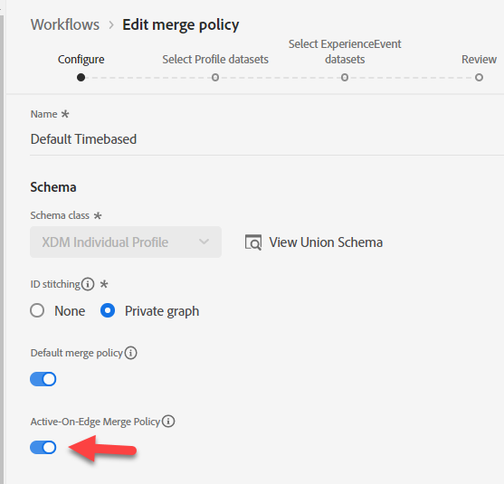

# Criar público-alvo #2

## Objetivo do laboratório

Crie um público-alvo que encontre todos os perfis que não têm uma linha ativa que seja um iPhone 14

## Tarefas de análise

Esse público-alvo é &quot;aqueles que não têm um iPhone 14 ativo&quot;

- Como sabemos que alguém não &quot;tem um iPhone 14 ativo&quot;?  Ideias:
  - Inclua aqueles que compraram um iPhone 14
  - Incluir aqueles que têm dados de faturamento para um iPhone 14
  - Inclua aqueles que têm dados da Web provenientes de uma iPhone 14
  - Algum outro?

No final, isso se resume a uma escolha de negócios sobre para quem eles querem vender. No nosso caso, a empresa considerou isso tão importante que criamos um esquema que define Linhas ativas, então, use isso.

>[!NOTE]
>
>Como a Ative Lines é um array armazenado em um Perfil, você selecionará o proprietário da conta em relação a cada proprietário individual do dispositivo. Certifique-se de que a equipe de marketing esteja ciente disso e deseje fazê-lo. Caso contrário, você pode querer uma abordagem diferente.

## Criar um novo público-alvo (proprietário do iPhone 14)

1. Na guia Atributos no painel à esquerda, navegue até Nome do produto (ou procure por ele).
   - Perfil individual XDM —> \&lt;nome do locatário> —> Produtos ativos —> Propriedades da ID do produto —> Nome do produto
1. Arraste o Nome do produto até a tela

## Salvar o público-alvo

1. Tipo iPhone 14 (manter como avaliação em lote)
1. Fornecer uma descrição
1. Salvar público-alvo como &quot;*Proprietário do iPhone 14*&quot;
   - Siga as mesmas etapas acima para o Pixel 7 (se tiver tempo).

>[!TIP]
>
>**Pensamento lateral, &quot;não poderíamos filtrar os Eventos, em vez de fazer com que outro campo do Perfil armazene a mesma coisa&quot;?**
>
>Sim, poderíamos, mas precisamos abordar algumas nuances técnicas e comerciais que tornam o público complexo e apresentam alguns desafios:
>
>1. Se usarmos o Evento de compra:
>   1. E se eles não comprassem de nós, mas tivessem uma linha ativa?
>   1. E se eles compraram há 2 anos, minha regra tem que olhar para trás N número de anos e mantivemos apenas 1 ano de eventos no perfil?
>1. O evento de cobrança parece ser uma opção mais adequada:
>   1. Mas agora os dados são de até um mês atrás.
>   1. E se o último Evento de Faturamento tivesse ocorrido há 2 anos, isso poderia incluir pessoas que não são clientes?
>   1. E se meu carregamento de dados falhar, minha contagem pode cair para zero se eu estiver observando apenas um mês para excluir dados antigos
>   1. Capturamos o dispositivo para um evento de cobrança? Não, portanto, teríamos que alterar nosso feed de dados
>
>No final, teremos que fazer algumas compensações para esse Público. Se o seu coração ainda estiver definido ao usar Eventos para esta regra, leia este Blog sobre isso: https\://experienceleaguecommunities.adobe.com/t5/adobe-experience-platform-blogs/how-to-capture-latest-experience-event-in-adobe-experience/ba-p/430941

>[!NOTE]
>
>**Habilitando uma Política de Mesclagem para o Edge**
>
>Verifique se a Política de mesclagem está configurada para Públicos da Edge. Vá para as Políticas de mesclagem e edite a Política de mesclagem padrão para \_xdm.context.profile.  Ative a Política de mesclagem ativa no Edge e salve.
>
>
>
>
>
>

## Recriar o público-alvo

O marketing entrou hoje e nos deu um requisito para ter esse Streaming e, infelizmente, a maneira que temos isso construído é em lote. Corrija isso:

1. Abra o Público-alvo &quot;*Proprietário do iPhone 14*&quot; e altere o nome para &quot;*Proprietário do Lote do iPhone 14*&quot;.

   >[!WARNING]
   >
   >Atualmente, não é possível alterar o Método de avaliação na interface do usuário. Todos os públicos que referenciam esse público também precisam ser excluídos. Lembre-se disso ao decidir sobre sua estratégia de criação de usar Segmentos dentro de Segmentos.

2. Crie um novo Público-alvo. Adicione o público-alvo &quot;Proprietário do lote de público-alvo do iPhone 14&quot; à tela e clique em Converter para regras.

   

   

3. Atualize a Descrição, o Nome e o Método de avaliação para Streaming no canto inferior direito e clique no ícone de pasta ao lado do Método de avaliação. Você deve ver isso:

   

   Embora não seja óbvio, o motivo é que estamos usando o Nome do produto em um esquema de pesquisa

   >[!NOTE]
   >
   >Sempre que usamos uma pesquisa, nosso método de avaliação é forçado ao Batch.
   >
   >Você pode dizer isso se olhar para o caminho e ele tiver &quot;propriedades&quot; em qualquer lugar
   >
   >

4. Substitua o valor existente para que o nome do produto agora venha do esquema do Perfil individual XDM

   Substitua o seguinte caminho:

   - Perfil individual XDM > Profundidade > Produtos ativos > Propriedades da ID do produto > Nome do produto

   Adicione o novo caminho:

   - Perfil individual XDM > Dep > Produtos ativos > Modelo

   

   

5. Altere o Método de avaliação para Streaming e clique no ícone de pasta

   

6. Forneça uma descrição para o novo Público-alvo qualificado de streaming.

   - Salve o público-alvo como &quot;*Proprietário do público-alvo do iPhone 14*&quot;.
   - Clique no botão azul **Ativar público-alvo** para destino

   

7. Selecione o Destino do **Webhook de DEP de Streaming** e clique em **Avançar**

8. Clique em **Avançar** e **Concluir**

>[!NOTE]
>
>Considerações sobre por que você pode querer selecionar Lote vs. Streaming ou Edge:
>
>Medidas de proteção mais recentes: [https://experienceleague.adobe.com/docs/experience-platform/profile/guardrails.html?lang=pt-BR](https://experienceleague.adobe.com/docs/experience-platform/profile/guardrails.html?lang=pt-BR)

>[!TIP]
>
>**Laboratório de desafio opcional**
>
>Terminou cedo?
>
>Crie um público-alvo com a &quot;Fidelidade de dispositivos Apple&quot; em uma família.  Todas as pessoas do plano têm o mesmo tipo de dispositivo (Apple).
