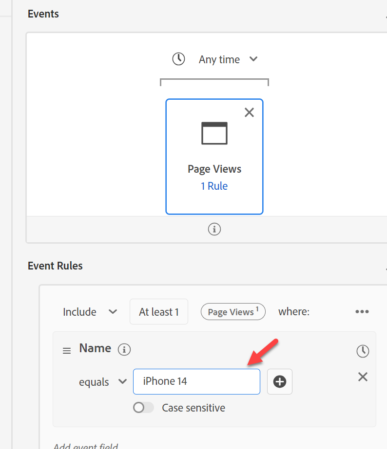
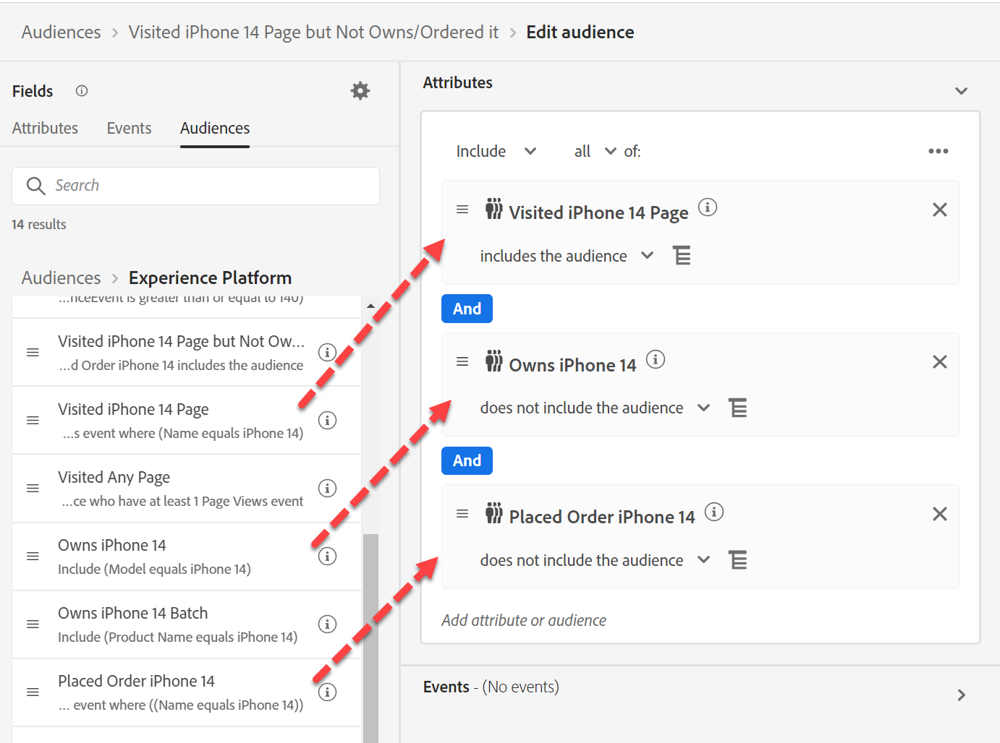

# Criar público-alvo #3

## Objetivo do laboratório

Criar um público-alvo que visitou uma página de produto do iPhone 14

## Tarefas de análise

Este público-alvo deve ser direto.  Podemos ter várias páginas de produtos, mas nada complicado aqui.

## Criar um público-alvo (visitou qualquer página)

1. Encontre o evento Exibição de página na guia Evento, em Tipos de evento no painel à esquerda, e adicione ao Público-alvo

>[!NOTE]
>
>**Usando Tipos de Evento**
>
>Ao usar o Evento de exibição de página, garantimos que o Público-alvo esteja avaliando apenas o Nome de página no contexto de uma Exibição de página. Ela deve ser redundante, pois um Nome de página só existe em uma Exibição de página, mas oferece dois benefícios:
>
>- Fornece documentação visual de alto nível para o usuário ao pesquisar na interface
>- Fornece filtragem para garantir que, à medida que novos eventos forem adicionados, eles não serão incluídos quando essa não for a intenção
>
>Por isso, recomendamos que cada Esquema de evento criado tenha muita reflexão sobre os Tipos de evento que você usa. Eles são fundamentais para filtragem e guias visuais.

&#x200B;2. Forneça uma descrição e faça a transmissão.

&#x200B;3. Acima do evento inserido, altere &quot;A qualquer momento&quot; para &quot;Hoje&quot;

&#x200B;4. Salvar este público-alvo como &quot;*Visitou qualquer página*&quot;

&#x200B;5. Clique no botão azul **Ativar público-alvo** para destino

&#x200B;6. Selecione o Destino do **Webhook de DEP de Streaming** e clique em Próximo

&#x200B;7. Clique em Avançar e Concluir

## Criar um público-alvo (visitou a página do iPhone 14, mas não a possui/solicitou)

1. Criar um novo público-alvo e adicionar o evento de exibições de página

&#x200B;2. Navegue até onde o Nome da página é e adicione o campo Nome da página ao Evento para que possamos filtrá-lo.

- XDM ExperienceEvent —> Web —> Detalhes da página da Web —> Nome

&#x200B;3. Adicionar contém &quot;iPhone 14&quot;

&#x200B;> [!TIP]
>
>**Procurando por &quot;Página&quot;**
>
>Em vez de navegar até o campo, tente pesquisar por &quot;Página&quot;
>
>Você vê que o Nome da página não aparece. Isso se deve ao seu nome:
>
>- XDM ExperienceEvent > Web > Detalhes da página da Web > Nome
>
>Assim, sua pasta aparecerá, mas não o campo em si. Ao reunir suas convenções de nomenclatura, considere este e outros termos comuns que as pessoas podem pesquisar e incorporar em sua nomenclatura.
>
>A pesquisa não pesquisa descrições
>
>

&#x200B;4. Acima do evento inserido, altere &quot;A qualquer momento&quot; para &quot;Hoje&quot;

>[!NOTE]
>
>Como estamos ativando com base nos eventos que ocorreram hoje, nos concentramos somente nas exibições de página para hoje.

&#x200B;5. Verifique se é Streaming e forneça uma descrição.

&#x200B;6. Salvar público-alvo como &quot;*Página visitada do iPhone 14*&quot;

&#x200B;7. Clique no botão azul **Ativar público-alvo** para destino

&#x200B;8. Selecione o Destino do **Webhook de DEP de Streaming** e clique em Próximo

&#x200B;9. Clique em Avançar e Concluir

## Criar um público-alvo de públicos-alvo

1. Acesse a guia Públicos-alvo na navegação superior esquerda
1. Detalhamento para o Experience Platform
1. Extrair os outros três públicos-alvo criados anteriormente
1. Altere Incluir para Não inclui para Proprietário da iPhone 14 e Pedido feito iPhone 14.

&#x200B;5. Forneça uma descrição.

&#x200B;6. Alterar para streaming

&#x200B;7. Salvar como &quot;*Página do iPhone 14 Visitada, mas Não Proprietária/Ordenada*&quot;

&#x200B;8. Clique no botão azul **Ativar público-alvo** para destino

&#x200B;9. Selecione o Destino do **Webhook de DEP de Streaming** e clique em Próximo

&#x200B;10. Clique em Avançar e Concluir

>[!NOTE]
>
>**Filtro de Tempo**
>
>Os requerimentos não tinham requisitos de tempo, então se alguém visitasse três anos atrás, eles se qualificariam. Dependendo do nosso caso de uso, isso pode ou não funcionar. Vale a pena perguntar. Adicionamos um porque estamos ativando com base nas pessoas que visitaram nosso site hoje.  Isso pode não funcionar em todos os casos de uso.  Se adicionarmos um filtro de tempo, até que ponto podemos voltar antes que um público-alvo do Edge se torne Streaming ou até Mesmo Lote?
> [!NOTE]
>
>**Ramificações da divisão**
>
>Dividimos o que é um requisito simples em muitos públicos-alvo por alguns motivos. O requisito é para um Streaming, mas esses dois requisitos transformam nosso Público-alvo em Lote. Mais detalhes aqui sobre as regras de qualificação de streaming aqui:
>
>[https://experienceleague.adobe.com/docs/experience-platform/segmentation/ui/streaming-segmentation.html?lang=pt-BR](https://experienceleague.adobe.com/docs/experience-platform/segmentation/ui/streaming-segmentation.html?lang=pt-BR)

>[!NOTE]
>
>**O que são públicos-alvo de transmissão de públicos-alvo**
>
>Nosso blog *Peeking Underneath the Hood of Audience* (link abaixo) fala um pouco sobre isso abaixo. Ele mostra como o resultado de um público-alvo é armazenado no Perfil. Isso é importante, pois, à medida que os dados fluem no, ele verifica os resultados de um público-alvo armazenado no perfil, não executa novamente o público-alvo nesse momento. Uma nuance simples, mas que vale a pena entender. A maioria dos atributos de perfil é atualizada periodicamente, portanto, essa abordagem faz sentido.
>
>Precisamos entender que, ao usar um Público-alvo em um Público-alvo, o AEP tentará sequenciar quando puder. Há casos excepcionais em que isso não é possível, por exemplo, Se um Público-alvo de públicos-alvo for usado, a desqualificação de perfis ocorrerá a cada 24 horas.
>
>[https://experienceleaguecommunities.adobe.com/t5/adobe-experience-platform-blogs/peeking-underneath-the-hood-of-segments-in-aep-adobe-experience/ba-p/453535?profile.language=pt](https://experienceleaguecommunities.adobe.com/t5/adobe-experience-platform-blogs/peeking-underneath-the-hood-of-segments-in-aep-adobe-experience/ba-p/453535?profile.language=pt)

## Por que criar vários públicos-alvo?

Se tivéssemos criado todos esses públicos-alvo em um público-alvo em vez de quatro, obteríamos um método de avaliação em lote, mesmo que cada público-alvo individualmente seja de streaming.

Ao dividir esses públicos e usar um público de públicos, obtemos esse comportamento.  Qualificação desses públicos-alvo em tempo real como fluxos de dados no

- IPhone solicitado 14
- Proprietário do iPhone 14
- Página do iPhone 14 visitada

>[!WARNING]
>
>Hoje há uma desqualificação diária de latência de 24 horas dos públicos-alvo

Em resumo: trocamos a entrada mais rápida no Público ao quebrá-lo em pedaços com uma latência de 24 horas deles desaparecendo do Público.

>[!TIP]
>
>**Laboratório de desafio opcional**
>
>Terminou cedo?
>
>Eu quero direcionar as pessoas com um email se elas tiverem um telefone antigo.  Crie um público-alvo com &quot;Tem telefone antigo&quot;.  Como podemos direcioná-los?
