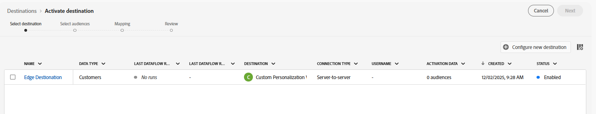

# Configurar destino do Personalization personalizado

Usar um [Destino personalizado do Personalization](https://experienceleague.adobe.com/en/docs/experience-platform/destinations/catalog/personalization/custom-personalization) é uma maneira de disponibilizar públicos-alvo no Edge para uso por terceiros, geralmente usando a API do Servidor de Rede, para uso na Personalização.

Esse laboratório configura o Destino personalizado do Personalization para que possamos enviar Atributos de perfil para a Edge.

## Procurar catálogo de destino

>[!NOTE]
>
>Para personalizar usando o Adobe Target, usaríamos o [Destino do Adobe Target.](https://experienceleague.adobe.com/en/docs/experience-platform/destinations/catalog/personalization/adobe-target-v2) O comportamento é idêntico ao do Personalization personalizado.

1. No painel à esquerda, clique em **Destinos**
1. No painel superior, clique em **Catálogo**
1. Em seguida, selecione a categoria de **Personalization**
1. No meio da tela, você deverá ver o destino intitulado **Personalization Personalizado com Atributos.** Clique no botão **Configurar** nesse cartão.

## Configurar destino

### Configurar conta

Nomeie sua conta `DEP Labs Custom PZN` e clique no **botão Conectar ao destino**

### Adicionar detalhes do destino

Preencha os seguintes detalhes do destino:

1. Nome -> **Destino Edge**
1. Alias de Integração -> **edgeAlias**
1. ID da sequência de dados -> *selecione o nome da sequência de dados criado anteriormente*
1. Quando terminar, clique no botão **Avançar**

>[!CAUTION]
>
>Depois de clicar em Avançar, você não poderá alterar o **Nome** nem o **Alias de integração**.  Esses itens aparecerão posteriormente nas respostas do Edge Network

### Selecionar política de governança

Selecione **Personalization no site** e clique no botão **Criar**

>[!NOTE]
>
>Embora essa etapa seja opcional, é altamente recomendável que qualquer destino criado tenha uma política de governança atribuída para evitar a ativação incorreta de perfis

Quando terminar, você deverá ver esta tela observando seu sucesso!

## Ativar destino

### Selecionar públicos

Selecione o destino que acabou de criar clicando na linha para realçá-la e clique no botão **Avançar**

Selecione **Todos os públicos** e clique em **Avançar**

### Mapeamento

Adicione um **novo mapeamento** da seguinte maneira:

| Campo do Source | Campo de destino |
| ---------------------- | ------------ |
| \_tenantName.plan.name | Nome do plano |

> [!NOTE]
>
>Lembre-se de substituir **\_tenantName** pelo seu nome de locatário

>[!NOTE]
>
>O Campo de público-alvo permite fornecer um nome amigável que pode ser diferente do nome XDM

Quando terminar, sua tela deve ficar parecida com a imagem abaixo.  Você pode clicar no **botão**

>[!NOTE]
>
>Como os atributos de perfil podem conter dados confidenciais, todas as chamadas da [API do Edge Network Server](https://experienceleague.adobe.com/en/docs/experience-platform/edge-network-server-api/overview) devem ser feitas em um contexto autenticado para recuperar o atributo após sua inclusão na Edge.

### Revisão

Na tela final, é possível revisar os detalhes da configuração e clicar no botão Finish.

>[!NOTE]
>
>Este é o ponto em que a [Imposição Automática](https://experienceleague.adobe.com/en/docs/experience-platform/data-governance/enforcement/auto-enforcement) verifica as [Políticas de Uso de Dados](https://experienceleague.adobe.com/en/docs/experience-platform/data-governance/policies/overview). Ele verificará suas Ações de marketing com as Regras que você criou e gerará erros.
