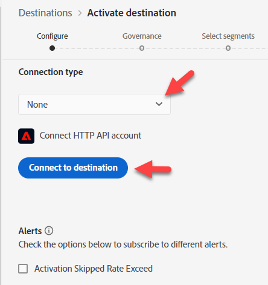
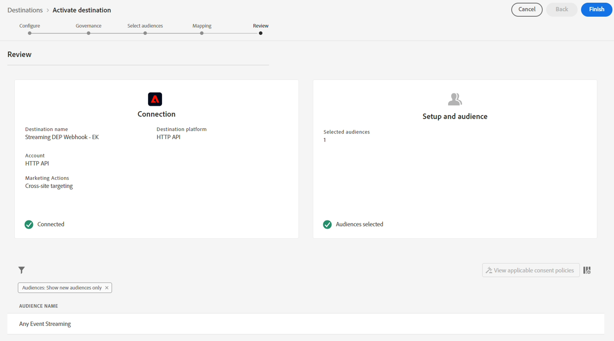

# Configurar destino de transmissão

>[!NOTE]
>
>Pule para a próxima etapa se já tiver configurado o destino do streaming!

## Obter URL do webhook

>[!NOTE]
>
>Vamos usar um webhook aqui para vermos se os dados chegaram ao Destino para o qual estamos enviando. Em um cenário do mundo real, em vez disso, efetuaríamos logon nesse destino e usaríamos suas ferramentas para ver o que chegou.

1. Abra o link a seguir em uma nova guia do navegador -> [https://webhook.site](https://webhook.site/)
1. Copie o URL exclusivo que você vê e salve-o em algum lugar seguro

## Configurar destino da API HTTP

>[!NOTE]
>
>Estamos usando um Destino de transmissão como proxy para enviar esses dados a terceiros (por exemplo, Facebook). Em um cenário real, você usaria um Destino do Facebook no lugar de um Destino da API HTTP para enviar dados para o Facebook.

Na interface do Experience Platform, navegue até o catálogo de destinos fazendo o seguinte

1. Clique em **Destinos** no painel esquerdo
1. Clique em **Catálogo** no painel superior
1. Na caixa de pesquisa, digite **http**
1. Clique no botão **Configurar** para configurar o destino da API HTTP

>[!NOTE]
>
>Você está usando o destino de transmissão da API HTTP para o(s) laboratório(s) para demonstrar como um conector de transmissão real funcionaria.

## Configurar

1. Tipo de conexão **Nenhum**
1. Clique em **Conectar ao destino**

>[!NOTE]
>
>Normalmente, adicionamos credenciais de autenticação no momento, mas nenhuma é necessária para esse webhook.

&#x200B;3. Preencha os detalhes de configuração do seu destino da seguinte maneira:

- **Nome** -> `Streaming DEP Webhook - [Your Initials]`
- **Descrição** -> `[your webhook endpoint you copied above]`
- **Ponto de extremidade** -> ` [your webhook endpoint you copied above]`
- **Parâmetros de consulta** -> `leave blank`
- **Cabeçalhos** -> `leave blank`
- Incluir nomes de segmento -> ativar/desativar
- Incluir carimbos de data e hora do segmento -> ativar/desativar

Quando terminar, verifique se a configuração corresponde ao que você vê abaixo.  Se estiver bom, clique no botão **Avançar** no canto superior direito para prosseguir para a próxima etapa

>[!CAUTION]
>
>Os parâmetros de ponto de extremidade, cabeçalho e consulta não podem ser alterados na interface depois de salvos

## Definir governança

1. Selecione **Direcionamento entre sites** nas Ações de marketing
1. Quando terminar, clique no botão **Avançar** para prosseguir para a próxima etapa

>[!NOTE]
>
>Você pode saber mais sobre as políticas de governança no Experience League
>
>[https://experienceleague.adobe.com/docs/experience-platform/data-governance/policies/overview.html?lang=pt-BR#core-actions](https://experienceleague.adobe.com/docs/experience-platform/data-governance/policies/overview.html?lang=pt-BR#core-actions)

## Selecionar públicos

1. Selecionar todos os públicos-alvo
1. Quando terminar, clique no botão **Avançar** para prosseguir para a próxima etapa

## Adicionar mapeamentos

>[!NOTE]
>
>Aqui estamos adicionando um campo do Perfil. Se esse campo não tiver dados, talvez não vejamos nada passado para o Destino. Várias atualizações ao longo do tempo em Perfis e Eventos às vezes podem fazer com que o Destino acione várias vezes e envie várias cargas.

1. Clique em **Adicionar novo campo** para adicionar um campo ao esquema
1. Digite **model** na caixa de entrada do campo de esquema e selecione o campo **\_dep.ativeProducts\[0].model** na lista de campos que aparece
1. Altere o **\[0]** para **\[\*]** no nome do campo.  O campo final agora deve ser exibido como **\_dep.ativeProducts\[\*].model**
1. Quando terminar, clique no botão **Avançar** para prosseguir para a próxima etapa

>[!NOTE]
>
>Isso está mapeando um campo no Perfil, não um Evento de experiência. Embora estejamos enviando perfis para um destino com base na qualificação de público-alvo, temos que ter em mente o que está acontecendo.
>
>1. Um evento entra em
>2. O público qualifica o Perfil com base em regras
>3. A qualificação é armazenada no Perfil
>4. O destino é notificado de que o perfil se qualificou
>5. O destino envia o Perfil. Isso significa que, quando o Destino envia o Perfil, ele não tem mais conhecimento do Evento que acionou a avaliação do Público-alvo.

## Etapa de revisão

Valide se o destino final está bom e clique no botão **Concluir**

>[!NOTE]
>
>O destino agora está configurado e aguarda as qualificações de segmento de todos os segmentos adicionados com base em suas velocidades de avaliação:
>
>- Edge
>- Fluxo
>- Lote

>[!NOTE]
>
>Ao configurar inicialmente um Destino, é importante lembrar o seguinte:
>
>- Leva até 2 horas para qualquer preenchimento retroativo (perfil qualificado existente) começar a ativar
>- Leva até 20 minutos para um público-alvo recém-adicionado começar a ativar
