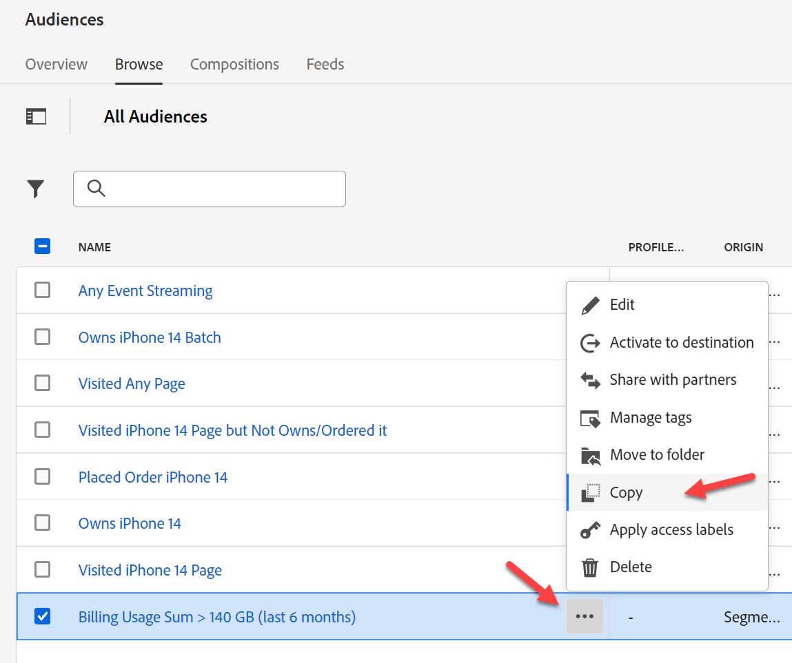
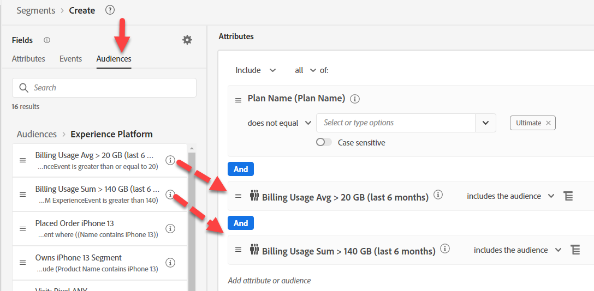

# Opção #1 - uso de públicos para agregar

Agregações em Públicos-alvo permitem agregar Eventos na regra de Público-alvo. Mas como só podemos fazer um agregado por vez, precisamos dividir os dois do nosso caso de uso.

## Público-alvo #1 - uso de dados de faturamento nos últimos 6 meses > 140 GB

Nesta build de público-alvo, você determina o uso total dos dados de faturamento nos últimos 6 meses > 140 gb. Para fazer isso, execute o seguinte procedimento:

1. Crie um novo Público-alvo.  Use o Cartão de evento do demonstrativo de faturamento.

   

   >[!NOTE]
   >
   >Uma boa estrutura de Tipo de evento facilita o uso e a compreensão dos usuários.  Reserve tempo para desenvolver uma abordagem padronizada em todos os esquemas.
   >
   >Ajuda com erros ortográficos.
   >
   >Você sempre pode recorrer ao campo Tipo de evento e digitar manualmente.

2. Clique no botão de Elipse nas regras da parte inferior direita e escolha Agregar. Clique em Selecionar um atributo e digite Uso. Selecione o campo Uso de dados de faturamento.

   

   

3. Altere o valor Igual a maior que e o valor a 140.

4. Altere o horário acima do cartão Evento de Qualquer horário para Último e o valor para 6 e os dias para meses

   

5. Forneça uma descrição e salve.

6. Dê ao público o nome &quot;*Soma de Uso de Cobrança > 140 GB (últimos 6 meses)*&quot;

>[!NOTE]
>
>Públicos agregados só podem ser salvos como Lote

>[!NOTE]
>
>Há duas maneiras de usar agregados em Públicos.
>
>- Sum/Count/Min/Max/Average (como fizemos acima)
>- Conta apenas (conta cada Evento como 1)
>
>
>
>Ambos podem ser usados juntos, se desejado
>
>

## Público #2 - média de 6 meses uso mensal de dados de >= 20 GB

1. Não clique no hiperlink, mas selecione a linha na interface do usuário da Lista de público-alvo para que ela destaque a que acabamos de criar. Depois de realçado, clique em copiar.

   

2. Clique na cópia e edite-a.  Clique no cartão Evento e altere a Soma para Média. Altere o maior que para maior que ou igual a e o valor para 20. Copie o pseudocódigo na descrição.

   

3. Dê ao público o nome &quot;*Média de uso de cobrança > 20 GB (últimos 6 meses)*&quot;

## Público #3 - não tem um plano de telefone definitivo

1. Criar um novo público-alvo
1. Em Atributos, procure por Nome do Plano
1. Adicionar Nome do Plano (Nome do Plano)
1. Selecione &quot;Ultimate&quot;.  Alterar para Não é Igual

   >[!NOTE]
   >
   >Lembra-se do nosso pré-trabalho? Usa um campo em nossa dimensão de pesquisa:
   >
   >Perfil Individual XDM > Devbc > Detalhes do Plano > Propriedades da ID do Plano > **Nome do Plano (Nome do Plano)**

   

&#x200B;5. Clique em Audiences —> Experience Platform. Arraste a Soma de Uso de Faturamento > 140 GB e a Média de Uso de Faturamento >= 20 GB ao lado do Nome do Plano.

   

&#x200B;6. Copiar o pseudo código na descrição

&#x200B;7. Marque esta opção para Streaming. **Não pode ser Streaming**. Faça algumas alterações:

   >[!NOTE]
   >
   >Qualquer uso de um conjunto de dados de Pesquisa cria um Público-alvo de várias entidades que é avaliado em Lote.  Usamos um campo em nosso Público-alvo:
   >
   >Perfil Individual XDM > Devbc > Detalhes do Plano > Propriedades da ID do Plano > Nome do Plano (Nome do Plano)

&#x200B;8. Substituir **Nome do Plano (Nome do Plano)** por: Perfil Individual XDM > Devbc > Detalhes do Plano > **Nome do Plano**

   

   >[!NOTE]
   >
   >Lembre-se de que a etapa Desnormalizar TAMPA adiciona o Nome do plano ao Perfil. Isso permite fazer referência a ele em um Público-alvo. Como resultado, isso remove uma associação à pesquisa e permite fazer o método de avaliação Streaming.
   >
   >A desvantagem aqui é que movemos essa lógica no sentido upstream para pré-assimilação de dados, em vez de durante a avaliação do público-alvo.
   >
   >Também precisamos atualizar qualquer perfil se o nome do plano for alterado.
   >
   >Mas o benefício é que agora podemos reagir em tempo real.

&#x200B;9. Valide se agora você pode salvar como Transmissão. Salvar público como &quot;*Uso alto de dados de cobrança, mas nenhum plano Ultimate*&quot;

>[!NOTE]
>
>Embora esse método de avaliação seja Streaming, ele baseia a qualificação de Públicos-alvo em dois públicos-alvo em lote.

>[!NOTE]
>
>Essa abordagem funcionará, mas agora temos um Público-alvo de streaming (em tempo real), usando Públicos-alvo em lote (que serão executados uma vez a cada 24 horas). Se isso funcionar para nossos casos de uso e carregamentos de dados, essa é uma boa opção (por exemplo, talvez nossos dados de cobrança sejam carregados diariamente ou mensalmente, o que é altamente provável, mas nem todos os casos de uso serão assim). Caso contrário, uma abordagem comum é agregar os dados antes de enviá-los para o AEP. Analise outra opção se precisar de uma abordagem mais em tempo real.
