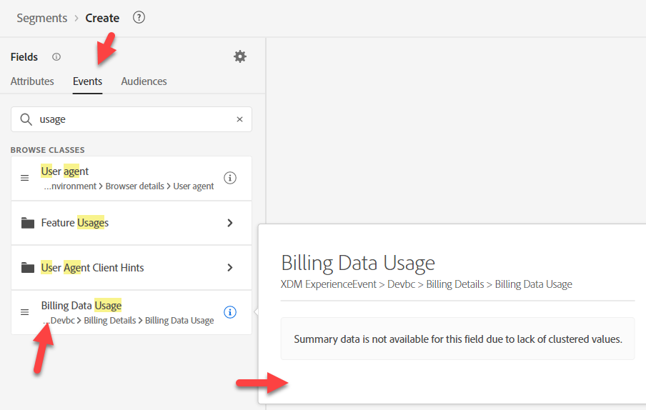

# Trabalho prévio

Neste caso de uso, não há muito trabalho prévio a ser feito. Basicamente, temos duas coisas que estamos procurando: 1) Uso, 2) Plano.  Descubra onde eles estão.

## Uso de dados de cobrança

1. Criar um novo público-alvo
1. Procure por &quot;uso&quot; em Atributos. Clique no &quot;i&quot; para analisar a descrição (não há nenhuma).

&#x200B;3. Procure por &quot;uso&quot; em Eventos.  Clique no &quot;i&quot; para analisar a descrição (não há nenhuma).

&#x200B;> [!NOTE]
>
>Nenhum deles tem descrição, portanto, o profissional de marketing pode fazer algumas suposições e adivinhar errado.
>
>As descrições são importantes.  Sem descrições, como o profissional de marketing saberá:
>
>- Qual usar?
>- Latência dos dados?
>- Recomendado/preferencial em casos de uso específicos?
>
>Ao fornecer essas informações em descrições, podemos orientá-las melhor.
> [!NOTE]
>
>Tente pesquisar por &quot;Faturamento&quot;.  Observe que ele não é exibido como um Atributo de perfil.  Ele é exibido como um Cartão de tipo de evento, juntamente com o campo &quot;Uso de dados de faturamento&quot;.
>
>Existem convenções de nomenclatura para seu profissional de marketing também.  Dependendo do que pesquisam ou se estão procurando/esperando que seja um Evento ou um Perfil, isso afeta o que encontram e eventualmente usam.

## Plano

Procure por &quot;Plano&quot; em Atributos.  Observe que temos várias opções disponíveis.  Restrinja-o ao &quot;Nome do plano&quot;.  Nós temos dois nomes de planos?!

O Nome do Plano (Nome do Plano) parece ser o que precisamos com base na descrição e o outro não tem uma descrição.
