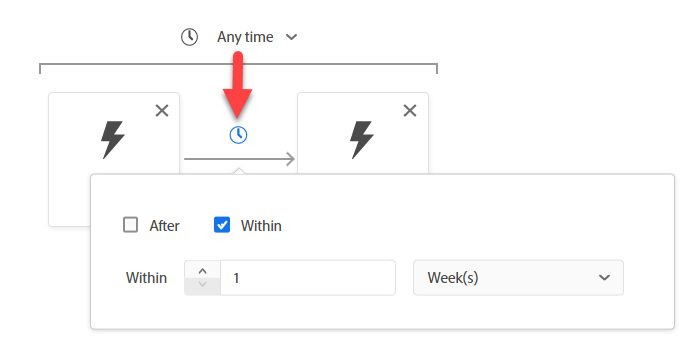
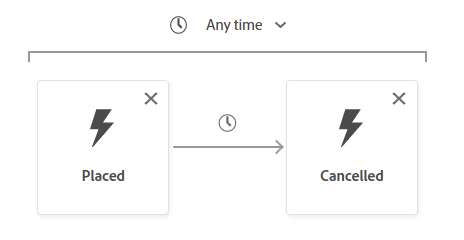

# Criar caso de uso #3

## Criar o público-alvo

1. Criar um novo público-alvo
1. Adicionar o evento Pedido feito à tela
1. Adicione o evento Pedido cancelado à direita do evento Pedido feito
1. Alterar o horário para dentro de uma semana

>[!NOTE]
>
>**Campo de Tipo de Evento**
>
>Poderíamos ter usado:
>
>- Qualquer evento filtrado por Tipo de evento=order.placement
>- Qualquer evento filtrado por Tipo de evento=order.canceled

>[!NOTE]
>
>**Hora**
>
>O mecanismo de público-alvo usa somente o carimbo de data e hora para interpretar a ordem dos eventos. Portanto, se você tiver vários campos de data e hora no Evento, lembre-se de que o campo Carimbo de data e hora é o usado.

## Configurar o evento cancelado

Procure a ID do pedido e arraste o campo até o Evento de pedido cancelado.

>[!NOTE]
>
>Estamos adicionando um filtro para o ID do pedido para garantir que o pedido feito seja o mesmo pedido cancelado

Limpe qualquer pesquisa e clique em **Colocado** em **Procurar Variáveis**

Detalhe a ID do pedido e arraste para adicionar um operando de comparação

>[!WARNING]
>
>**Não usar a pesquisa em uma Variável**
>
>Ele não manterá o contexto da variável

O resultado final deve ser o que você viu abaixo

>[!NOTE]
>
>**Contêineres**
>
>Isso está usando o contêiner variável para garantir que Pedido cancelado seja o mesmo Pedido que foi feito
>
>Anteriormente, usamos um Contêiner para isolar um elemento em uma Matriz. Aqui estamos usando Containers para fazer referência a um Evento específico em um critério de filtro dentro de outro Evento.
>
>O evento Pedido cancelado garante que sua própria ID do pedido seja a mesma ID do pedido feito
>
>De que outra forma poderíamos usar isto?
>
>- Comparar um SKU de produto para uma Exibição de página é o SKU de produto comprado
>- Comparar uma Cidade para Entrega é diferente da Cidade para Faturamento
>- A comparação de dois campos do mesmo tipo de dados deve ser possível, mesmo que os Eventos possam vir de Esquemas diferentes
>
>https\://experienceleaguecommunities.adobe.com/t5/adobe-experience-platform-blogs/how-exatamente-do-containers-work-in-aep-segmentation-a-deep-look/ba-p/458780

>[!NOTE]
>
>**Nomes de Contêineres**
>
>Os contêineres herdarão seu nome de variável do contexto.
>
>por exemplo, Se você usar o cartão Qualquer evento, o nome do container será Qualquer1

## Salve o público-alvo

1. Forneça uma descrição. Defina seu método de Avaliação como Lote.
1. Salve seu público-alvo como &quot;*Pedido realizado e Pedido cancelado em uma semana*&quot;

>[!TIP]
>
>**Laboratório de desafio opcional**
>
>Terminou cedo? Experimente isto...
>
>Gostaríamos de iniciar uma nova campanha para Abandonar o carrinho.  Crie um público-alvo para Abandonar o carrinho, mas certifique-se de que não começamos a direcionar pessoas por uma hora.
>
>
>
>Ainda tem tempo? Experimente isto...
>
>A empresa passou por uma fusão e adquiriu duas novas unidades de negócios para:
>
>- ISP
>- Cabo
>
>Como você pode precisar modificar os esquemas para incluí-los?
