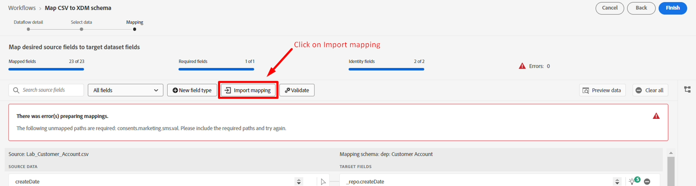

# Criar um novo fluxo de dados

## Navegar até Origens

1. Na interface do usuário do Adobe Experience Platform, navegue até o seguinte local:\
   **Fontes** -> **Catálogo** -> **Sistema local**
1. Clique no botão **Adicionar Dados** para o cartão **Carregamento de Arquivo Local**

## Configurar o fluxo de dados

1. Na tela de detalhes do Fluxo de Dados, escolha **Conjunto de dados existente**.
1. Use o conjunto de dados criado anteriormente com o nome **Conta do cliente - \&lt;Suas iniciais>**
1. Verifique se o **Conjunto de dados de perfil** está ativado.
(Se você não ativar isso, o Armazenamento de perfis não poderá monitorar os novos dados que entram nesse conjunto de dados e, portanto, não assimilará esses dados no Perfil)
1. Ative a opção **Habilitar assimilação parcial**
(Se você não ativar isso, a assimilação inteira poderá falhar se apenas um dos registros tiver um erro)
1. Defina o nome do fluxo de dados como **Lote de contas de clientes v2 - \&lt;Suas iniciais>**
1. Ativar todos os alertas **Início/Sucesso/Falha do fluxo de dados de fontes**
1. Se tudo estiver bem, clique no botão **Avançar**, no canto superior direito da tela, para prosseguir para a próxima etapa.

## Carregar arquivo de amostra

1. Arraste e/ou carregue o arquivo **Lab\_Customer\_Account.csv** na interface.  Quando terminar, sua tela deverá ficar parecida com a exibida abaixo.

## Importar mapeamentos

Na tela de mapeamento, em vez de configurar todos os mapeamentos novamente, você pode importar os que criou anteriormente.

1. Clique no botão **Importar mapeamento**
1. Selecione o fluxo de dados que tem o mapeamento criado anteriormente

>[!NOTE]
>
>A importação de mapeamentos é uma maneira útil de reutilizar mapeamentos de outros fluxos de dados e reduzir a quantidade de trabalho de mapeamento necessário
