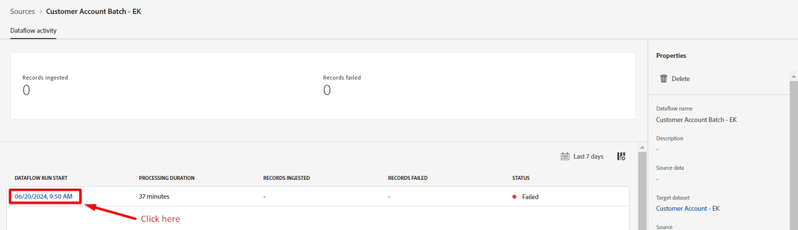

# Erros de depuração

## Visualizar diagnóstico de erro

Após alguns minutos, você deve notar que o **Status** mostra uma falha. Analise os detalhes da falha para ver o que a causou.

1. Clique na data de **Início da Execução do Fluxo de Dados**
1. Clique em **Visualizar diagnóstico de erro** para ver os detalhes específicos de cada linha que falha




A tela que você vê agora mostra vários detalhes sobre o que significam os códigos de erro com a mensagem de erro completa e a linha que falhou.


>[!NOTE]
>
>Role para o lado direito para ver os dados de origem associados a este código de erro


## Noções básicas sobre tipos de erro

### Erro INGEST-XXXX-XXX

Este erro ocorre porque **person.birthDayAndMonth** é esperado no formato de um mês de dois dígitos mais um dia de dois dígitos (isto é, 27 de abril deve ser formatado como 04-27)

```none
The value (9-27) does not conform to the specified
regex pattern: [0-1][0-9]-[0-9][0-9] in field: 
person.birthDayAndMonth of type: String
```

>[!CAUTION]
>
>Observe que person.birthDayAndMonth não é um campo obrigatório, mas a não conformidade com a expressão regular é tratada pelo sistema como um &quot;problema de corrupção de dados&quot; e é um erro grave.


### Erro MAPPER-XXXX-XXX

Este erro ocorre porque o campo de origem de **createDate** tem valores de cadeia de caracteres de `Created on 2022-04-22T19:34:17Z`. Este valor não pode ser convertido em uma data automaticamente devido ao texto no início: `Created on`. Um campo calculado deve ser usado para limpar os dados.

```none
Error transforming data for destination path 
_dep.account.createDate. Details: Unable to convert 
Created on 2023-09-24T10:19:58Z to schema type DATE_TIME
```

>[!NOTE]
>
>Esse erro não é grave, pois isso gera apenas avisos durante o mapeamento. A execução do fluxo de dados não falha por causa disso, portanto, este laboratório não corrige esse erro.
