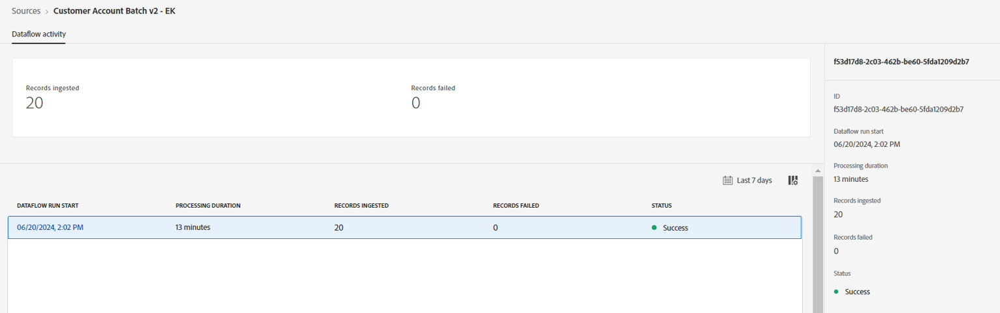
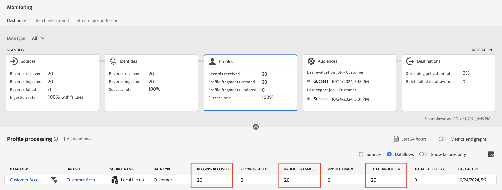

# Correção de erros

## Dia e mês fixos de nascimento

1. Clique no ícone de seta ao lado do campo calculado que preenche o campo XDM **person.birthDayAndMonth**

   

1. Atualize a expressão usando o código de campo calculado abaixo e clique em **Visualizar**

   ```none
   concat(date_part("mm", date(birth_Date, "M/d/yyyy")).toString(),"-", date_part("dd", date(birth_Date, "M/d/yyyy")).toString())
   ```

   >[!NOTE]
   >
   >Os dados devem aparecer como um mês de 2 dígitos e um dia de 2 dígitos (ou seja, 27 de abril, mostrado como 04-27). Os parâmetros `mm` e `dd` adicionam 0 preenchimento.

1. Se tudo estiver bem **Salve** o campo calculado

1. Em seguida, clique em **Concluir** para executar a assimilação do fluxo de dados.


## Validar assimilação

Após alguns minutos, a execução do fluxo de dados deve ser executada e você deve ter sucesso.




## Tela de monitoramento

1. Navegue até a tela de monitoramento clicando no painel esquerdo no ícone **Monitoramento** na seção **Gerenciamento de dados**.
1. Clique no cartão **Fontes** e role a barra inferior para ver os detalhes da execução do fluxo de dados. Observe o seguinte:
   - **Registros recebidos:** 20 registros foram recebidos da origem para processamento
   - **Registros assimilados:** 20 registros foram assimilados no Data Lake após o mapeamento e o processamento de dados.
   - **Registros com falha:** Você deve ver um 0 aqui. Isso representa o número total de erros INGEST e DCVS. Isso exclui os avisos do MAPPER.
   - **Taxa de assimilação:** é a proporção de registros assimilados para os registros recebidos. 100% dos registros recebidos foram processados com êxito


>[!NOTE]
>
>Com a assimilação de dados parcial habilitada, a **Taxa Assimilada** para uma execução de fluxo de dados específica pode ser \&lt;100% até o limite que você definiu como parte dos detalhes do fluxo de dados. Além disso, esteja ciente de que 100% de sucesso será relatado para execuções de fluxo de dados em que nenhum dado foi assimilado.

>[!NOTE]
>
>Observe que os registros não podem ser perdidos.
>
>**Registros recebidos** = **Registros assimilados** + **Registros com falha**
>
>**Taxa de assimilação = Registros assimilados / Registros recebidos**
>
>**Limite de assimilação parcial = Registros com falha / Registros recebidos**


## Identidades

Clique no cartão **Identidades** e role a barra inferior para ver os detalhes detalhados do fluxo de dados. Observe o seguinte no Serviço de identidade

- **Registros recebidos:** 20 registros foram recebidos pelo *Repositório de Identidades* enquanto monitorava novos lotes, ou seja, o conjunto de dados estava marcado para o Perfil.
- **Registros assimilados:** 20 registros foram assimilados (ou seja, processados para informações de identidade)
- **Registros ignorados:** nenhum, pois não tínhamos registros de identidade únicos ou registros com novas relações de identidade.
- **Taxa de êxito (disponível somente no cartão):** Essa é a proporção entre os registros recebidos e os registros assimilados.
- **Identidades adicionadas:** 40 identidades (20 para CustomerID e 20 para endereço de email) foram adicionadas ao gráfico de identidade geral para o Perfil do Cliente em Tempo Real
- **Gráficos criados:** 20 gráficos exclusivos foram criados com base nos registros processados (ou seja, relações encontradas em cada linha de dados)
- **Gráficos atualizados:** informa se as identidades foram adicionadas a um gráfico.


## Perfis

Clique no cartão **Perfis** e role a barra inferior para ver os detalhes da execução do fluxo de dados. Observe o seguinte no Serviço de perfil:

- **Registros recebidos:** 20 registros foram recebidos pelo repositório de perfis para processamento
- **Registros com falha:** nenhum dos registros falhou. Mas se eles falharam, então você sabe que foi uma assimilação no problema do Perfil.
- **Fragmentos de perfil criados:** 20 fragmentos de perfil foram criados
- **Fragmentos de perfil atualizados:** 20 fragmentos de perfil gerais foram tocados
- **Taxa de sucesso:** 100%. Esta é a proporção de registros com falha para registros recebidos.

>[!NOTE]
>
>Observe que a métrica **Registros ignorados** não está disponível para o Perfil.



>[!NOTE]
>
>Observe que há o cartão de Destino e que ele tem métricas semelhantes às que exploramos neste laboratório. Essas métricas só farão sentido depois que você ativar um público ou um conjunto de dados.
