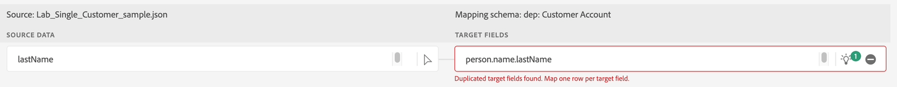

# Corrigir mapeamentos de passagem

## Soltar mapeamentos específicos

Alguns dos dados de origem que você tem precisam ser tratados usando campos calculados.  Para resolvê-los, remova-os dos mapeamentos e revalide-os.

1. Solte os seguintes dados de origem dos mapeamentos:
   - birth\_date
   - origem
   - sms\_optIn
1. Revalidar os mapeamentos clicando no botão validar

>[!NOTE]
>
>Depois de clicar em Validar, talvez ainda haja erros

## Exemplos de mapeamento incorreto

Embora as recomendações de IA/ML sejam úteis, às vezes elas estão erradas.  Se você inspecionar suas recomendações, poderá encontrar esses tipos de erros que precisa corrigir

>[!NOTE]
>
>Abaixo estão alguns exemplos de mapeamentos inválidos que você pode ver em sua própria sandbox. Você também pode ver outros erros.

## Duplicar mapeamentos

Neste cenário, você vê que a recomendação do AI/ML mapeou dois campos de origem diferentes para o mesmo campo de destino **person.name.lastName**

## Mapeamentos incorretos

Este mapeamento parece correto, mas na inspeção mais detalhada, o **email** não é o mesmo que **emailFormat**

E este aqui, onde **email\_optIn** está mapeando incorretamente para o objeto de consentimento errado

## Correção de mapeamentos de passagem

Para corrigir mapeamentos de passagem que apontam incorretamente para o campo de destino errado, execute as etapas a seguir.

### Exemplo

1. Comece com um mapeamento inválido e clique na caixa de campo de destino. Por exemplo, no mapeamento abaixo, o campo **person.name.lastName** não está mapeado corretamente e está mapeado para **planName**
1. No painel de esquema de destino que é aberto à direita, escolha o campo de destino apropriado e selecione **\_devbc.plan.name**
1. O campo de destino agora deve ser atualizado na caixa de campo de destino
1. Após corrigir cada erro, pressione o botão **Validar** para ter certeza de que está reduzindo esses tipos de erros e não introduzindo novos.

>[!WARNING]
>
>Não avance para a próxima etapa até resolver todos os seus erros de mapeamento
