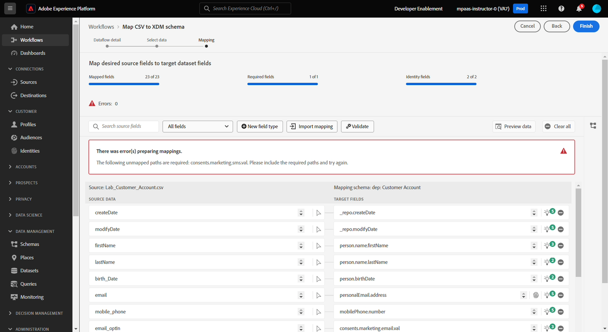

# Mapeamento de dados

## Visão geral

Na tela Mapeamento, o mecanismo de recomendação do AI/ML mapeará vários atributos automaticamente entre os campos no conjunto de dados de origem e os campos do esquema. Esses mapeamentos automatizados são chamados de mapeamentos de passagem, mas exigem **inspeção cuidadosa**, pois frequentemente ocorrerão erros e mapeamentos incorretos.

>[!NOTE]
>
>As recomendações de IA/ML são baseadas em contexto e sua tela pode ser diferente da captura de tela acima ou pode ser diferente do vizinho

>[!NOTE]
>
>Observe que todas as colunas de origem são SEMPRE tratadas como cadeias de caracteres
