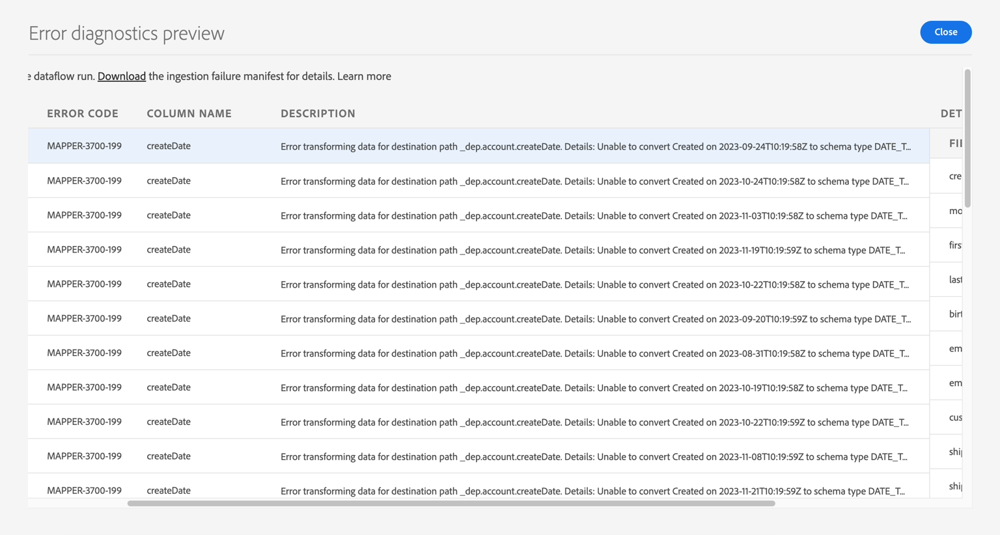

# Corrigir erros de MAPPER para CreateDate

Neste exercício, você precisará descobrir como remover o erro de MAPPER que vimos no laboratório de assimilação em lote. O erro precisa ser corrigido porque, mesmo que createDate não seja um campo obrigatório, os registros ainda serão assimilados porque a data mal formatada será transformada em um campo vazio.

Valor 
