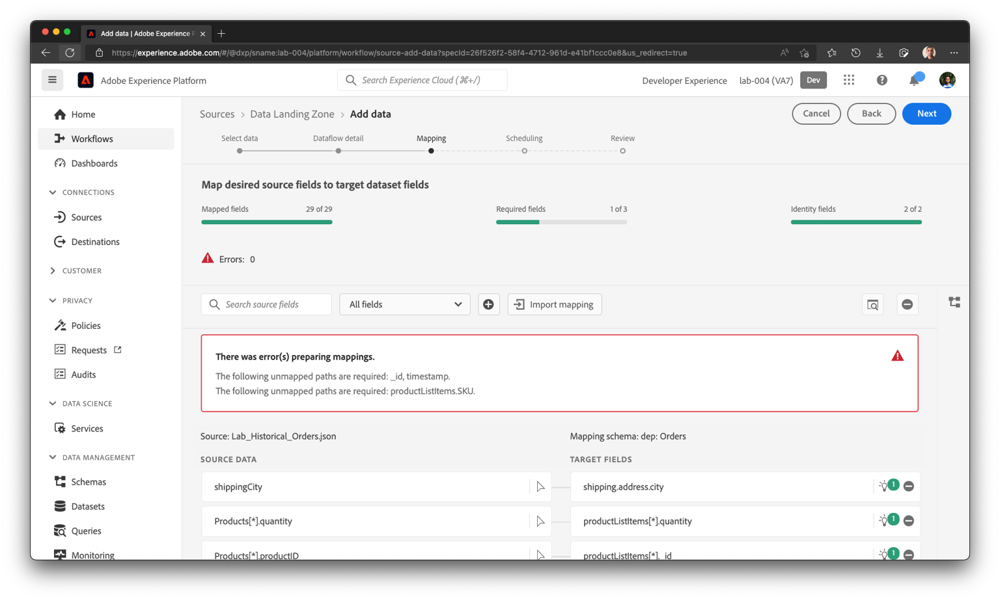
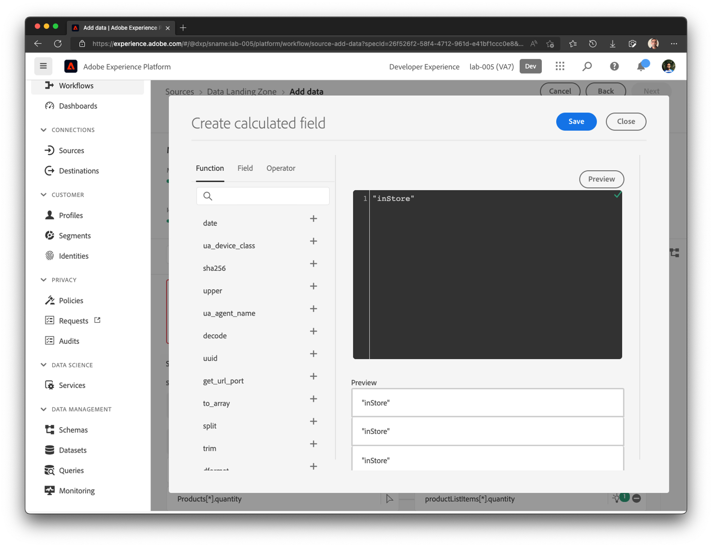

# Mapeamentos iniciais

Como no exercício anterior, será necessário verificar o mapeamento e, em alguns casos, modificá-lo.

## Verificar recomendações de ML

1. Na etapa Mapeamento, o ML Recommendations mapeia automaticamente a maioria dos atributos. No entanto, você também vê vários erros. A tela inicial pode ser semelhante à exibida abaixo.



>[!NOTE]
>
>Como estamos mapeando um conjunto de dados de Evento de Experiência pela primeira vez, observe que **\_id** e **timestamp** nunca são recomendados ou mapeados por padrão para Eventos de Experiência. É necessário garantir manualmente que eles sejam mapeados corretamente.

## Mapear campos \_id, carimbo de data e hora e ordem.\_devbc.acqSource

1. Para mapear **\_id,** grave a seguinte expressão de campo calculado e clique em visualizar

```none
concat(orderID, "-", lastOrderStatusUpdate)
```


1. Verifique se o campo **carimbo de data/hora** no esquema de destino está mapeado para o seguinte campo calculado:

```none
lastOrderStatusUpdate
```


1. Mapear a expressão de campo calculado **&quot;inStore&quot;** para **order.\_devbc.acqSource**



## Manuseio de mapeamentos duplicados

Se a tela de mapeamento reclamar agora, há um mapeamento duplicado, como **orderStatus** mapeado para **order.\_devbc.acqSource,** clique no ícone &quot;-&quot; para remover o mapeamento.

> [!NOTE]
>
>Lembre-se de que vários campos de entrada não podem ser mapeados para o mesmo campo de saída, pois isso torna o mapeamento ambíguo. Mas um único campo de entrada pode ser mapeado para vários campos de saída no esquema XDM.


