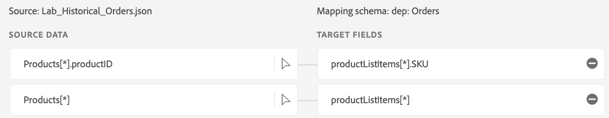

# Mapeamentos de cópia de objeto

Nesta seção, você adicionará os mapeamentos de cópia de objeto e criará algumas substituições.

## Mapeamentos de passagem

Adicione os seguintes mapeamentos de passagem com **products\[\*]** e **products\[\*].productID** clicando em Novo tipo de campo e adicione um novo campo para cada linha aqui. Alguns podem já estar presentes devido a Recomendações de ML.

| Coluna Source | Coluna XDM |
| ----------------------- | ------------------------- |
| orderStatus | eventType |
| lastOrderStatusUpdate | carimbo de data e hora |
| products\[\*] | productListItems\[\*] |
| products\[\*].productID | productListItems\[\*].SKU |

>[!NOTE]
>
>Observe que **products\[\*]** está fazendo um mapeamento de campo 1-1 entre os campos de objeto e o mapeamento de campo explícito **products\[\*].productID** está substituindo a cópia padrão.

>[!NOTE]
>
>**products\[\*].productID** também está mapeado para **productListItems\[\*].SKU** além de **productListItems\[\*].\_id**. Este é um exemplo de um único campo de entrada sendo mapeado para vários campos de saída no esquema XDM. Mantenha o mapeamento como está.

1. Manter o mapeamento **products\[\*].price** para **productListItems\[\*].priceTotal**

## Adicionar sobreposições em determinados campos

1. Substituir os mapeamentos de cópia de objeto por
   1. Mapeando **produtos\[\*].make** para **productListItems\[\*].\_devbc.make**
   2. Mapeando **products\[\*].model** para **productListItems\[\*].\_devbc.model**

## Excluir sobreposições em determinados campos

1. Observe que **productListItems.currencyCode** e **productListItems.quantity** são preenchidos automaticamente.
1. Remova os mapeamentos de **productListItems\[\*].quantity** e **productListItems\[\*].currencyCode**.
1. As substituições não ocorrem e a cópia do objeto assume o controle com campos de passagem passando.

## Resumo de mapeamentos, substituições e exclusões de cópia de objeto

| Coluna Source | Coluna XDM | Ação |
| -------------------------- | ----------------------------------- | -------------------------------------- |
| products\[\*] | productListItems\[\*] | `Add` |
| products\[\*].productID | productListItems\[\*].SKU | `Add` |
| products\[\*].productID | productListItems\[\*].\_id | `No change` |
| products\[\*].make | productListItems\[\*].\_devbc.make | `Change` |
| products\[\*].model | productListItems\[\*].\_devbc.model | `Change` |
| products\[\*].price | productListItems\[\*].priceTotal | `No change` |
| products\[\*].quantity | productListItems\[\*].quantity | `Remove` |
| products\[\*].currencyCode | productListItems\[\*].currencyCode | `Remove` |

## Verificar mapeamentos

Há dois conjuntos de mapeamentos que você deve verificar. No total, você deve ter seis mapeamentos após a remoção de 2.

