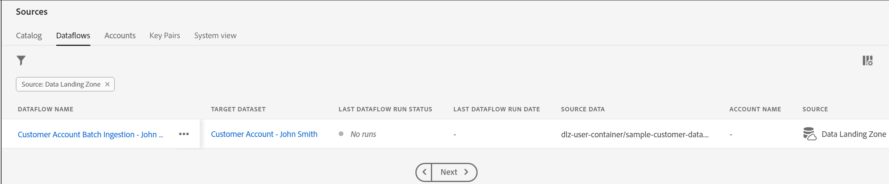

# Agendar fluxo de dados

Na etapa **Agendamento**:

1. Defina a **Frequência** como Minuto.
1. Defina o **Intervalo** como 15, ou seja, 15 minutos.
1. Ative a opção **Preenchimento retroativo**.

>[!NOTE]
>
>Observe que a **Hora de início** está em UTC.
>
>O Tempo Universal Coordenado (UTC) é um padrão de tempo global usado como ponto de referência para a marcação de tempo em todo o mundo. Para uma equipe distribuída globalmente, ele fornece uma referência comum para várias regiões e países, facilitando a coordenação de atividades e a programação de eventos em diferentes fusos horários.
>
>Em diferentes partes da interface do usuário do AEP, você vê o horário UTC como a base do agendamento de tempo. A hora UTC está 1 hora atrasada em relação à hora de Londres. Se você não tem certeza sobre a hora UTC, simplesmente google &quot;hora UTC agora&quot;.

>[!NOTE]
>
>Na prática, a opção **Preenchimento retroativo** faz um preenchimento retroativo único de todos os arquivos e as execuções subsequentes usam novos arquivos.

Revise o fluxo de dados e clique em **Concluir.**

>[!CAUTION]
>
>Se você escolher a opção **Executar uma vez** para seu fluxo de dados, não poderá editar esse agendamento nem atualizar o fluxo de dados posteriormente. No entanto, você pode executar o fluxo de dados sob demanda, ou seja, executar novamente se precisar assimilar novos dados.

Depois de clicar em **Concluir**, você será redirecionado à tela **Fluxos de Dados**. A criação do fluxo de dados deve levar alguns minutos. Observe que o Status da Última Execução do Fluxo de Dados indica **Nenhuma execução**. A primeira corrida deve começar em alguns minutos.

>[!NOTE]
>
>É necessário atualizar a página continuamente para ver a atualização de status, pois o back-end não envia atualizações para a interface.

>[!NOTE]
>
>Se você ativar todos os alertas, receberá um alerta no navegador, no canto superior direito do navegador, quando o fluxo começar a ser executado e for concluído com sucesso ou falhar
