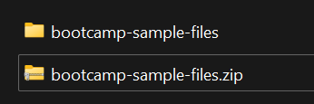

# Arquivos de exemplo

Baixe o arquivo zip abaixo e descompacte-o no armazenamento local.

Baixar Arquivo — [bootcamp-sample-files.zip](assets/bootcamp-sample-files.zip)

Quando terminar, você deverá ver uma pasta como essa com o conteúdo a seguir.  Você referenciará essa pasta nos seguintes laboratórios.

