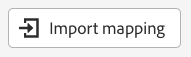

# Configurar mapeamento

&#x200B;> [!NOTE]
>
>Siga esta seção somente se tiver concluído com êxito o laboratório de assimilação em lote.  Caso contrário, siga as etapas [Dados de mapeamento](../batch-ingestion/mapping-data/overview.md) encontradas no laboratório de assimilação em lote.

## Importar conjunto de mapeamento

Se você concluiu o laboratório de Assimilação em lote, é possível reutilizar o conjunto de mapeamento criado lá 😄🎉

Execute as seguintes etapas:

1. Clique no botão **Importar Mapeamento** na tela de mapeamento

1. Escolha o fluxo de dados criado na seção Assimilação em lote e selecione-o.  Ele deve ser nomeado como **Lote de contas de clientes v2 - \&lt;suas iniciais>.**

Após a importação, você verá erros serem exibidos.  Isso ocorre porque o formato de data usado para o campo birth\_Date no arquivo de amostra foi alterado.

- Arquivo de amostra em lote usado -> mm/dd/aaaa
- Arquivo de amostra de fluxo usado -> aaaa-mm-dd

Os campos calculados que usam funções **date** precisarão ser atualizados para levar em conta a alteração no formato de data usado.

## Atualizar campos calculados

Atualize cada campo calculado clicando no ícone de seta ao lado de cada campo calculado e valide os mapeamentos

| Campo de destino | Novo Campo Calculado |
| ----------------------- | ----------------------------------------------------------------------------------------------------------------------------------- |
| person.birthYear | date\_part(&quot;aaaa&quot;,date(birth\_Date,&quot;yyyy-M-d&quot;)) |
| person.birthDayAndMonth | concat(date\_part(&quot;mm&quot;, date(birth\_Date, &quot;aaaa-M-d&quot;)).toString(), &quot;-&quot;, date\_part(&quot;dd&quot;, date(birth\_Date, &quot;aaaa-M-d&quot;)).toString()) |
