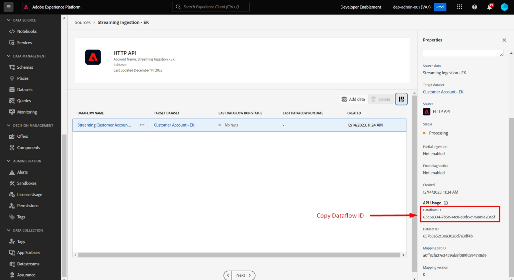

# Transmitir um perfil

## Visão geral da API

É importante entender a estrutura da API ao transmitir dados na Adobe Experience Platform de forma bruta, para que você possa recriá-la facilmente, independentemente do fluxo de dados criado.  Veja abaixo um exemplo da estrutura básica da chamada usando cURL

**Solicitação de Exemplo (dados brutos)**

```curl
curl --location '' \
--header 'Content-Type: application/json' \
--header 'x-adobe-flow-id:  <dataflow-id>;' \
--header 'Authorization: Bearer XXX;' \
--data '{
    "customer_id": "202208240125",
    "firstName": "",
    "lastName": "",
    "email": "",
    "createDate": "1660096899",
    "modifyDate": "2022-08-09T22:01:40Z",
    "birth_Date": "1991-06-12",
    "mobile_phone": "888-888-8888",
    "email_optIn": "y",
    "sms_optIn": "n",
    "shipping_street_address": "1901 W Madison St",
    "shipping_city": "Chicago",
    "shipping_state": "IL",
    "shipping_zip_code": "60612",
    "billing_street_address": "1901 W Madison St",
    "billing_city": "Chicago",
    "billing_state": "IL",
    "billing_zip_code": "60612",
    "plan_id": "m1",
    "plan_name": "basic",
    "account_create_date": "Created on 2022-04-20T22:19:03Z",
    "account_end_date": "2022-01-20T13:15:32Z",
    "source": "inStore"
}'
```


Alguns elementos importantes a serem observados na solicitação acima:

| Elementos principais | Obrigatório | Descrição |
| --------------------------- | -------- | ------------------------------------------------------------------------------------------------------------------------------------------------------------------------------------------- |
| URL de solicitação (ou seja, localização) | - | Este é o URL da conta de origem da API HTTP que você criou para o qual os dados de transmissão apontarão. **É sempre do tipo POST** |
| Cabeçalho &quot;Content-Type&quot; | * | Sempre defina como `application/json`, pois os dados que você está enviando estão no formato JSON |
| Cabeçalho &quot;x-adobe-flow-id&quot; | - | Defina para a id do fluxo de dados criada a partir do conector de origem |
| Cabeçalho &quot;Autorização&quot; | * | Valor opcional, mas altamente recomendado por motivos de segurança. Este é o mesmo `access_token` que você gerou durante os laboratórios de [Instalação do Postman](../../postman-setup/environment-file.md) |
| Conteúdo do corpo | - | Contém os dados reais que você deseja enviar para o Adobe Experience Platform |

>[!NOTE]
>
>O conteúdo do corpo deve estar sempre no formato JSON e corresponder à amostra de carga fornecida durante o design do fluxo de dados


## Coletar valores necessários

Antes de transmitir dados, é necessário coletar alguns dos valores obrigatórios listados acima (ou seja, especificamente o URL do ponto de extremidade de transmissão e os valores de &quot;cabeçalho&quot; do conteúdo do corpo).

Execute as seguintes etapas:

1. Copie o valor de **Ponto de extremidade de streaming** e salve-o no computador local (supondo que você não tenha saído da etapa da seção anterior). Se você navegou, é possível encontrá-lo em Fontes -> Contas.

   >[!NOTE]
   >
   >Se você navegou para fora, é possível acessar essa página fazendo o seguinte:
   >
   >- Clique em **Fontes** no painel esquerdo
   >- Verifique se você está na guia **Contas** e clique na conta criada com o título **Assimilação de streaming - \&lt;Suas iniciais>**

   >[!NOTE]
   >
   >Se você não vir esse valor, verifique se não tem a linha de fluxo de dados selecionada clicando na linha.  NÃO CLIQUE NOS LINKS AZUIS

   


1. Selecione a linha de fluxo de dados clicando em qualquer lugar dela, evitando os links azuis. Copie a **ID do fluxo de dados** e salve-a em um local seguro




## Atualizar sua solicitação de API

Mude para o aplicativo Postman e atualize a solicitação Criar conta do cliente com as informações que você acabou de coletar.

1. Abra o Postman e navegue até a **Solicitação do laboratório de assimilação de dados -> Criar conta do cliente** para abrir a solicitação de API

   


1. Copie e cole o valor de **Ponto de extremidade de streaming** que você salvou anteriormente na URL da solicitação

   


1. Copie e cole o valor da ID de fluxo de dados que você salvou anteriormente no valor de cabeçalho **x-adobe-flow-id**

   


1. No corpo da solicitação, atualize os seguintes atributos da seguinte maneira:

   - **firstName** -> Seu nome
   - **lastName** -> Seu Sobrenome
   - **email** -> Seu endereço de email
   - **data_de_nascimento** -> DD/MM/AAAA

   **5. Salve** sua solicitação

1. Clique no botão **Enviar** para executar a solicitação para transmitir em seu Perfil de Conta de Cliente

   


1. Você deve receber uma resposta `200 OK` indicando que foi recebida com êxito pela Adobe Experience Platform

Exemplo de resposta 200 OK

```none
{
    "inletId": "57e8b639020de08147888c2ce2046f2f4d36f622ee22b7313a565ab3a4ecee54",
    "xactionId": "1688068236344:7186:152",
    "flowId": "7d1d1a20-3df2-43fb-8bd8-2856bb3ea6a4",
    "receivedTimeMs": 1688068236344
}
```

>[!NOTE]
>
>Anote o **xactionId** na resposta.  Se ocorrer um erro onde você não vir um registro assimilado, isso deverá ser sempre fornecido como parte de um tíquete de suporte ao cliente, pois é um marcador usado pelas nossas equipes de suporte para depurar quaisquer problemas de ambiente

>[!TIP]
>
>Parabéns!  Você transmitiu com êxito um registro de perfil na Adobe Experience Platform
