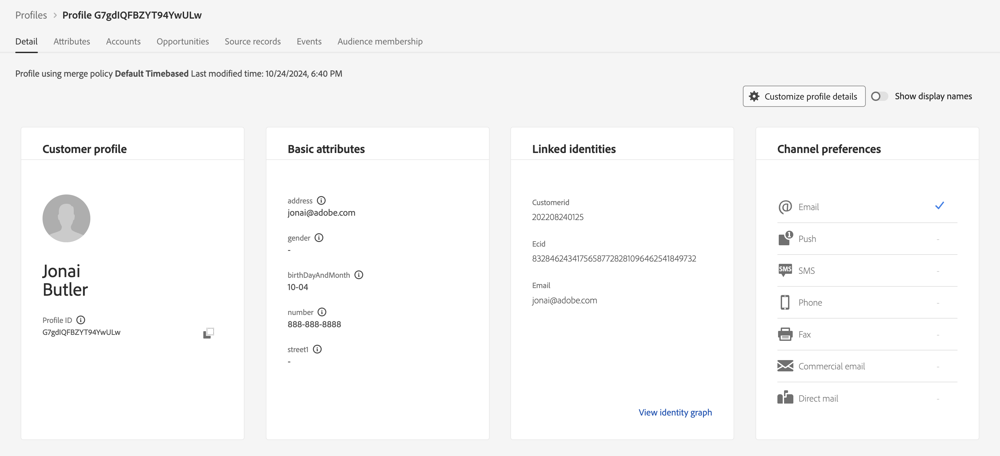

# Verificar perfil assimilado

## Validação de transmissão

A validação de dados de transmissão na Adobe Experience Platform requer algumas etapas diferentes.  Lembre-se de que os dados de transmissão podem gravar em vários bancos de dados, dependendo da configuração do conjunto de dados.

| Armazenamento | Latência | Descrição |
| -------------- | -------------------------------------------------------------------------- | ---------------------------------------------------------------------- |
| Data Lake | \~até 60 minutos | O local de repouso final para todos os dados de transmissão |
| Loja de perfis | \~1 min em média mas até \~15min | Processar dados somente quando o conjunto de dados subjacente estiver habilitado para o perfil |
| Armazenamento de identidade | \~1 min médio \~10 min microlotes para novas relações de identidade líquidas | Processar dados somente quando o conjunto de dados subjacente estiver habilitado para o perfil |

Dependendo do que você está tentando validar, talvez seja necessário ir para alguns lugares diferentes, como você pode ver acima.  Nesse cenário, você gravou os dados no perfil (já que ativou o conjunto de dados para o perfil), portanto, verifique a Loja de perfis para ver se o perfil está lá.

## Pesquisar seu perfil

1. Na interface, navegue até **Perfis -> Procurar**
1. Insira os seguintes valores nas caixas de entrada Namespace de identidade e Valor de identidade:
   - **Namespace de identidade** -> `customerID`
   - **Valor de identidade** -> `202208240125`
1. Clique no botão **Exibir** para pesquisar seu perfil
1. Clique no link **ID do Perfil** na linha retornada para exibir seu perfil

Consulte seu perfil e valide se ele corresponde ao conteúdo do seu fluxo. Muito legal, hein!

>[!NOTE]
>
>Dada a latência de \~10min na nova identificação de relação de identidade, se você tivesse tentado pesquisar seu perfil usando o namespace de email, você não teria visto uma resposta.
>
>Em vez disso, usar o namespace da customerID (que é a identidade principal) garantiu que você pudesse pesquisar o perfil imediatamente.
>
>Lembre-se de que o perfil só sabe sobre as identidades primárias 😄
