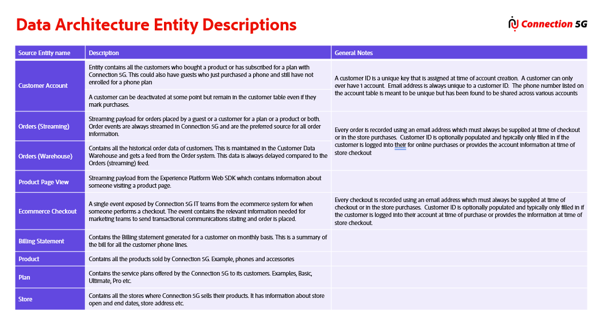

# Parte 2 - Campos-chave

## Palestra

Neste vídeo, você aprenderá a identificar a identidade principal, as identidades de pessoa e as identidades de relacionamento em cada tabela, além dos campos obrigatórios _id, carimbo de data e hora e tipo de evento para eventos de experiência.

>[!VIDEO](https://video.tv.adobe.com/v/3459085/?quality=12&learn=on)

## Detalhes do laboratório

### Campos de identidade

- **Identidade da pessoa** - Usado para identificar uma pessoa de maneira exclusiva. Eles são usados apenas em tabelas de Entidades primárias. Deve haver pelo menos um deles, mas pode haver mais de um.
- **Identidade do relacionamento (ou seja, não pessoa)** - Usado para descrever relacionamentos das tabelas de Entidade Primária do Perfil de Cliente em Tempo Real para uma classe de entidade de suporte associada (ou seja, Pesquisas).
- **Identidade principal** - Pode ser uma identidade de pessoa ou uma identidade de relacionamento (que não seja de pessoa) que está sendo usada como uma chave de armazenamento e é necessária para qualquer esquema que esteja sendo usado pelo Perfil de Cliente em Tempo Real. Para tabelas de Entidade principal, a identidade também identifica exclusivamente uma pessoa. Quando especificado para esquemas de Perfil XDM e esquemas de pesquisa, esse campo determinará se um novo registro será criado ou se um registro existente será atualizado. Deve haver exatamente um desses.

### Campos obrigatórios (somente Evento de experiência XDM)

- **\_id** - usado pelo Perfil de Cliente em Tempo Real em conjunto com a Identidade Principal para criar uma chave de armazenamento exclusiva para o evento. Necessário para evitar a duplicação acidental de dados do evento no Serviço de perfil
- **Carimbo de data/hora** - todos os eventos ocorrem em um horário específico e, portanto, todos os eventos exigem um carimbo de data/hora

Não obrigatório, mas altamente recomendável:

- **Tipo de Evento** - descreve o comportamento de alto nível dos dados do evento (ou seja, compra, reserva etc.)

### Regras gerais

1. Regra de Tabela do Bridge #2 - em situações em que existe uma tabela de ponte entre um pai &quot;**P**&quot; ou &quot;**E**&quot; (ou seja, tabela pai) e uma tabela &quot;**L**&quot;, trate a tabela de ponte como parte da tabela pai
1. Sempre valide se as identidades são exclusivas de uma **única** pessoa neste estágio para evitar retrabalho durante a assimilação de dados
1. Para esquemas de evento de experiência, a identidade principal é o que identifica exclusivamente esse comportamento para uma única pessoa.
1. Para tabelas de pesquisa, a chave primária (PK) do modelo relacional sempre será a Identidade primária que não seja de pessoa

Para cada tabela do ERD de Warehouse 5G de Conexão e do ERD de transmissão que você rotulou como um **&quot;P&quot;, &quot;E&quot; ou &quot;L&quot;,** agora você executa as etapas abaixo para identificar as identidades primárias, as identidades de pessoa, as identidades de relacionamento e quaisquer campos obrigatórios para as classes de esquema fornecidas.

>[!NOTE]
>
>Consulte o diagrama abaixo durante os laboratórios ao rotular identidades em schemas
>
>

## Etapa 1 - Rotular campos-chave nas tabelas de Perfil individual XDM

Execute as etapas abaixo para identificar os campos principais na tabela Conta do cliente:

- Identifique o campo que será usado como a Identidade primária e rotule-o com um `PI`
- Identificar todas as outras identidades de pessoa e rotular com um `I`
- Identifique qualquer Identidade de Relacionamento e rotule-as com um `R`

## Etapa 2 - Rotular campos principais nas tabelas de Eventos de experiência XDM

Execute o mesmo conjunto de tarefas que você fez na Etapa 1, mas agora para as tabelas de Evento de experiência XDM:

- Identifique o campo em cada tabela que será a Identidade primária e rotule-a com um `PI`
- Identificar todas as outras identidades de pessoa em cada tabela e rotular com um `I`
- Identificar todas as Identidades de Relacionamento e rotular com um `R`

Além dos rótulos acima, também rotule o seguinte:

- Identificar ou criar a ID de evento exclusiva para cada tabela de Evento de experiência XDM e rotular com um `_id`
- Identifique o carimbo de data e hora do evento para cada tabela e rotule-a com um `T`
- Identificar ou criar o Tipo de Evento para cada tabela e rotular com um `ET`

## Etapa 3 - Rotular campos principais nas Tabelas de pesquisa

Identifique em cada tabela de pesquisa o campo que será a Identidade primária e rotule-o com um `PI`

## Revisão

O vídeo abaixo analisa os principais campos identificados nas tabelas 5G da Connection, incluindo por que um campo concatenado era necessário como a ID de evento exclusiva para registros de pedido mutável.

>[!VIDEO](https://video.tv.adobe.com/v/3459088/?quality=12&learn=on)
