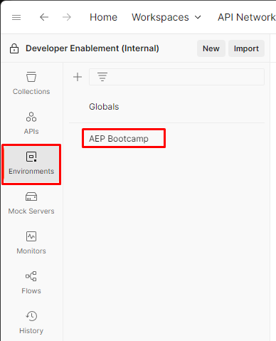

# Arquivo de ambiente

## Arquivo de ambiente do Postman

Baixar arquivo — [AEP Bootcamp.postman_environment.json](assets/aep-bootcamp.postman_environment.json)

## Importar arquivo de ambiente

1. Abra o `Environment File` no navegador clicando no arquivo
1. Copie o URL do arquivo para a área de transferência
1. Inicie o Postman no computador local e clique no botão `Import` no espaço de trabalho
1. Cole a URL de `Environment File` na caixa de texto modal de importação na sobreposição.  Essa ação aciona uma importação automática

Depois de importado, valide se o arquivo de ambiente existe clicando na guia `Environments` na barra lateral esquerda.  Você vê algo semelhante ao mostrado abaixo.

## Variáveis de ambiente

Antes de fazer chamadas de API, é necessário atualizar algumas das variáveis no arquivo de ambiente que você acabou de importar.  Essas variáveis são referenciadas nas chamadas de API, portanto, verifique se elas estão preenchidas corretamente.  As variáveis são divididas em dois grupos:

- **Valores de Projeto de Desenvolvedor** -> estas são as variáveis padrão geradas a partir do Projeto de Desenvolvedor que foram criadas no Adobe Developer Console
- **Outros valores** -> são variáveis criadas personalizadas que normalmente são criadas por um usuário para trabalhar com as várias APIs do Experience Platform

>[!NOTE]
>
>Esses valores vêm da credencial OAuth Server-to-Server criada na [Instalação do Developer Console](../sandbox-setup/developer-console-setup.md#collect-your-values)

### Atualizar valores de projeto do desenvolvedor

1. Clique na guia `Environments` na barra lateral esquerda do Postman
1. Clique no arquivo de ambiente `AEP Bootcamp`
1. Atualize o `current values` para as variáveis listadas abaixo:
   - CLIENT\_SECRET
   - CLIENT\_ID (também chamado de CHAVE DE API)
   - TECHNICAL\_ACCOUNT\_ID
   - IMS\_ORG

Quando terminar, seu arquivo de ambiente deve ser semelhante a esta imagem:

### Atualizar outros valores

Os únicos outros valores que precisam ser atualizados são as variáveis `SANDBOX_NAME` e `TENANT_NAME`.

- `SANDBOX_NAME` - informa à Adobe Experience Platform em qual sandbox executar
- `TENANT_NAME` - usado para preencher previamente o nome do locatário em chamadas XDM específicas

>[!NOTE]
>
>Se você estiver trabalhando nesses laboratórios de forma independente, em vez de em um evento de treinamento ao vivo com um sandbox-assignment.pdf, encontre os dois valores enquanto estiver conectado à sandbox pelo URL da interface do usuário do Adobe Experience Platform. Por exemplo:
>
>`https://experience.adobe.com/#/@dep/sname:prod/platform/home`
>
>- `SANDBOX_NAME` é o valor depois de `sname:` — neste exemplo, `prod`
>- `TENANT_NAME` é o valor depois do símbolo `@`, prefixado com um sublinhado — neste exemplo, `_dep`

1. Atualize o `current values` para as variáveis listadas abaixo:
   - SANDBOX\_NAME
   - LOCATÁRIO\_NAME
1. Salve suas atualizações clicando no botão `Save` na parte superior direita do espaço de trabalho do ambiente

Quando terminar, o arquivo de ambiente deverá ter esta aparência:

>[!SUCCESS]
>
>Parabéns! Você concluiu a configuração do ambiente Postman
