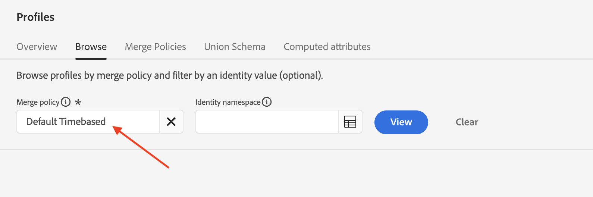
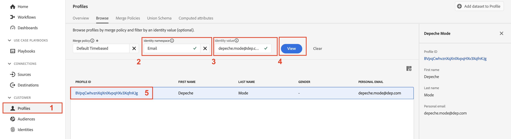

# Mesclar políticas

## O que é?

Você vê políticas de mesclagem no Visualizador de perfis toda vez que pesquisa um Perfil (você provavelmente não percebeu que ele fez algo)

Uma Política de mesclagem faz duas coisas:

1. Fornece as instruções sobre como montar os fragmentos na Loja de perfis (ou seja, Configuração de identidade). Há duas opções:
   - Usar o gráfico de identidade (ou seja, Serviço de identidade)
   - Não use o Gráfico de identidade (ou seja, confie somente na identidade fornecida para encontrar fragmentos de perfil armazenados de forma semelhante)
1. Informa ao serviço de perfil como resolver conflitos de campo nos conjuntos de dados baseados em classe de Perfil individual XDM quando um campo pode vir de vários conjuntos de dados (ou seja, Método de mesclagem). Há duas opções:
   - Precedência do carimbo de data e hora - use o registro mais recente de todos os conjuntos de dados como o conjunto verdadeiro e permita que todos os outros registros preencham as lacunas, na ordem do mais recente ao mais antigo
   - Precedência do conjunto de dados - escolha quais conjuntos de dados do Perfil individual XDM podem ser usados para formar o perfil e em que ordem montá-los

&#x200B;> [!NOTE]
>
>Quando o método de mesclagem de Precedência do conjunto de dados é escolhido, é possível escolher quais conjuntos de dados de Perfil individual XDM e Evento de experiência XDM poderão ser usados na formação do perfil.
>
>O método de mesclagem de precedência de carimbo de data e hora SEMPRE utiliza todos os conjuntos de dados

>[!WARNING]
>
>Toda sandbox exige pelo menos uma política de mesclagem marcada como **padrão** para que a segmentação e o perfil funcionem

>[!NOTE]
>
>Muitas vezes projetamos para que não precisamos usar uma Política de mesclagem personalizada que use a Precedência do conjunto de dados.
>
>- Em vez de vários conjuntos de dados registrarem o mesmo campo, damos a eles nomes exclusivos, por exemplo:
>  - Nome - CRM
>  - Nome - Fidelidade
>  - Nome - Formulário Web
>- Isso permite que um profissional de marketing escolha qual fonte de dados+campo usar, em vez de o sistema escolher um automaticamente com base em um conjunto de regras que ele pode não entender e possivelmente escolher campos do Perfil de uma fonte e outros campos de outra sem entender que isso está acontecendo.
>- Para nosso modelo de dados, não precisamos resolver conflitos de campo, portanto, não é necessária uma Política de mesclagem personalizada

Para entender melhor como as Políticas de mesclagem funcionam com o Gráfico de identidade, crie um que não utilize o Gráfico de identidade para compilação de ID.

## Criar uma política de mesclagem sem correspondência

Crie uma política de mesclagem que não use o Gráfico de ID para que você possa ver seu comportamento com a formação de perfil.

## Criar

1. Clique em **Perfis** no painel esquerdo
1. Clique em **Políticas de mesclagem** na navegação superior
1. Clique em **Criar política de mesclagem** próximo à extremidade direita da tela

## Configurar

Agora é necessário definir as configurações de política de mesclagem.  Insira as seguintes informações:

| Configuração | Valor |
| --------------------------- | --------------- |
| Nome | Sem compilação de ID |
| Configuração de ID | Nenhum |
| Política de mesclagem padrão | Desabilitado |
| Política de mesclagem ativa no Edge | Desabilitado |

Quando terminar, clique em **Avançar**

## Selecionar conjuntos de dados do perfil

1. Para o método Merge, selecione **Carimbo de data/hora ordenado**
1. Clique em **Avançar**

## Selecionar conjuntos de dados de Evento de experiência

Lembre-se de que, se você selecionar carimbo de data e hora solicitado para o método de mesclagem, você informará ao Serviço de perfil que todos os conjuntos de dados baseados em classe de Perfil individual XDM e Evento de experiência participam da formação do perfil.

Portanto, você pode simplesmente clicar em **Avançar**, pois não há nada a fazer nesta etapa.

## Revisão

Na etapa final, você verá uma pré-visualização das configurações escolhidas e perfis de amostra que mostram a política de mesclagem em ação.

Clique no botão **Concluir** para criar a política de mesclagem

## Métodos de mesclagem em ação

Lembre-se que o gráfico de identidade do perfil, Modo de profundidade, parecia com a captura de tela abaixo. Para entender como o serviço de perfil funciona, é melhor ignorar o uso desse gráfico de identidade durante o processo de montagem.

## Comparar usando email

Vá em frente e abra o visualizador de perfil seguindo as etapas abaixo:

1. Clique em **Perfis** no painel esquerdo e, na navegação superior, selecione **Procurar**
1. Selecione o namespace de identidade de **Email**
1. Insira o Valor de identidade de **depeche.mode\@dep.com**
1. Clique no botão **Exibir** para pesquisar o perfil
1. Clique no **link** para exibir os detalhes do perfil

Faça outra pesquisa pelo perfil Modo de Profundidade, mas desta vez usando a **Política de mesclagem Sem Compilação de ID**.

1. Clique com o botão direito do mouse em **Perfis** no painel à esquerda e selecione **abrir em uma nova guia**
1. Na navegação superior, selecione **Procurar**
1. Selecione a política de mesclagem de **Sem compilação de ID**
1. Selecione o namespace de identidade de **Email**
1. Insira o Valor de identidade de **depeche.mode\@dep.com**
1. Clique no botão **Exibir** para pesquisar o perfil
1. Clique no **link** para exibir os detalhes do perfil

Comparando ambas as visualizações do perfil você deve notar que elas são muito diferentes. Alguns atributos e identidades estão ausentes na versão que usa a **Política de mesclagem sem compilação de ID**.

Se você observar os eventos de cada perfil, perceberá que o perfil que está usando a **Política de mesclagem sem compilação de ID** contém apenas um único evento, enquanto a outra versão contém todos os eventos.

O único evento na versão Sem compilação de ID do perfil ocorre porque esse evento é armazenado usando a identidade principal do &quot;personalEmail.address&quot;.

>[!NOTE]
>
>Lembre-se de que ao usar um método de mesclagem que não usa o perfil de gráfico de identidade, o dependerá somente da identidade fornecida para localizar fragmentos de perfil armazenados de forma semelhante.

## Comparar usando customerID

Você pode examinar os vários fragmentos do perfil Modo de profundidade usando algumas das outras identidades do gráfico.  Tente pesquisar o mesmo perfil novamente com a política de mesclagem Sem compilação de ID, mas dessa vez usando o namespace e o valor da customerID fornecidos abaixo:

| Namespace de identidade | Valor |
| ------------------ | --------- |
| customerID | 266242885 |

**Perguntas a si mesmo**

Pergunta: Você notou algo sobre os atributos? Não há nenhum, por quê?

Resposta: você carregou atributos usando email como identidade principal

Pergunta: Notou algo sobre os eventos?

Resposta: Os únicos eventos que aparecem são aqueles que têm a ID do cliente como a identidade principal

## Comparar usando GAID

Tente pesquisar o mesmo perfil novamente com a política de mesclagem Sem compilação de ID, mas dessa vez usando o namespace e o valor GAID fornecidos abaixo:

| Namespace | Valor |
| --------- | ----------- |
| GAID | 266242-9013 |

**Pergunta para si mesmo**

Pergunta: nenhum perfil encontrado! O que está acontecendo? Por que nenhum perfil é encontrado? Resposta: não há fragmentos de perfil armazenados usando esse valor GAID como uma identidade principal

## Perfil + Identidade

Sinopse rápida:

- O armazenamento de perfis contém fragmentos de perfis armazenados usando a identidade principal
- O Gráfico de identidade contém os relacionamentos entre duas (2) ou mais identidades com base em pessoas

Quando o gráfico de identidade é usado com o armazenamento de perfis, você pode pensar nele como dando orientações sobre como encontrar os fragmentos de perfil corretos que tratam cada valor de identidade no gráfico de identidade como identidades primárias.

Sem o gráfico de identidade, o armazenamento de perfis só pode recuperar fragmentos de perfil usando um único identificador (ou seja, identidade principal)

&#x200B;> [!TIP]
>
>**Ganhe tempo extra e deseje experimentar...:**
>
>- Procure outros perfis na interface do usuário que você conhece que tenham duas identidades
>- Veja como alguns eventos são armazenados em um fragmento, mas não no outro
>- Veja como alguns atributos de perfil são armazenados em um fragmento, mas não no outro
>- Vá para um perfil que você já pesquisou e faça uma nova pesquisa usando a **Política de mesclagem Sem Compilação de ID**.  Observe a diferença
