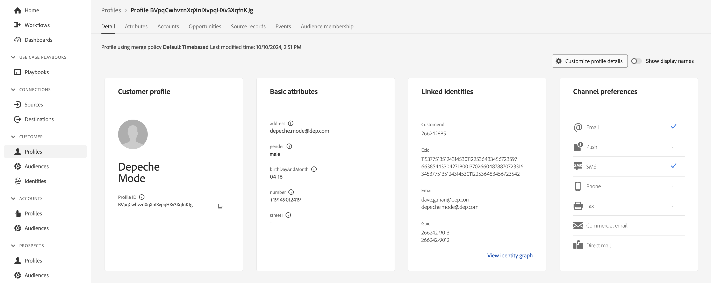
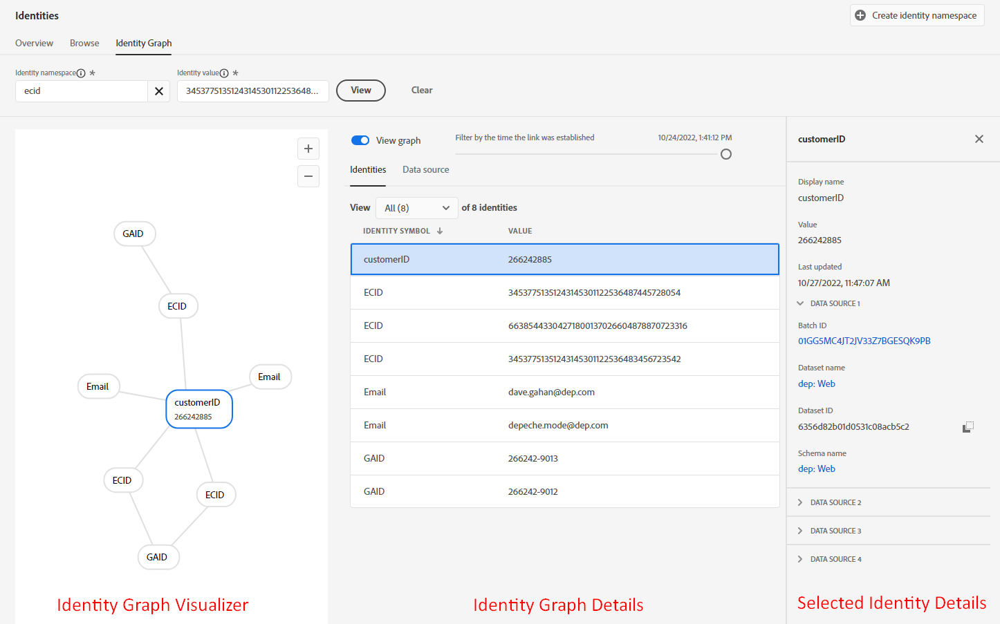

# Noções básicas de perfil

## Esquema de união de perfil

Lembre-se de que a visualização de qualquer Perfil de cliente em tempo real é criada usando os esquemas definidos e ativados para o perfil. É o que a Adobe chama de Esquema de união do perfil.

Você pode ver o Esquema de união do perfil fazendo o seguinte:

1. Clique em **Perfis** no painel esquerdo
1. Clique em **Esquema de união** na navegação superior


>[!NOTE]
>
>Lembre-se de que o perfil cria uma visualização de união para cada classe XDM. Você utiliza essa visualização para ver quais esquemas contribuíram para qual classe, as identidades dentro de cada classe e quaisquer relacionamentos.

Revise o Esquema de união para a classe Perfil individual XDM e expanda o namespace do locatário. Aqui você deve ver vários itens provenientes de vários esquemas definidos na **Metodologia de LID** e nos **Laboratórios de Modelagem XDM.**


Clique no objeto **account** e observe o que aparece no painel direito da tela. Agora é possível ver os detalhes sobre o objeto, quais esquemas e conjuntos de dados contribuíram para sua formação e outras informações relevantes.


>[!NOTE]
>
>O esquema de união é uma ótima ferramenta para entender por que determinados elementos existem em um perfil e de onde eles vieram.
>
>Lembre-se de que o Esquema de união é observável, o que significa que o perfil mostrará apenas os campos que contêm dados ao visualizar um Perfil de cliente em tempo real


## Pesquisa de perfil

1. Clique em **Perfis** no painel esquerdo e, na navegação superior, selecione **Procurar**
1. Selecione o namespace de identidade de **Email**
1. Insira o Valor de identidade de **depeche.mode\@dep.com**
1. Clique no botão **Exibir** para pesquisar o perfil
1. Clique no **link** para exibir os detalhes do perfil

")


Você deveria ver isso agora!



Reserve um minuto para explorar o perfil, Modo Depeche, observando cada guia na navegação superior. Estas são as guias que você usará:

- Detalhe - exibe cartões personalizados que mostram vários aspectos de um determinado perfil
- Atributos - exibe todos os atributos associados ao perfil específico provenientes do esquema de união
- Eventos - exibe todos os eventos associados para o perfil fornecido proveniente do esquema de união
- Associação de público-alvo - exibe os públicos dos quais o perfil é membro no momento

## Exibir atributos

Navegue até a guia **Atributos** e clique em **Exibir JSON**


Veja como são exibidos os campos provenientes dos Grupos de campos adicionados ao Esquema de conta do cliente.

- Procure o nó pai denominado **entidade**
- Observe o objeto filho **billingAddress** (isso veio do Grupo de Campos de Detalhes de Contato Pessoal)

```json
"billingAddress": {
  "postalCode": "11355",
  "city": "New York City",
  "state": "NY",
  "street1": "108 Ruskin Terrace"
}
```

Compare isso com o que o Esquema de União de Perfil tem e você deve piscar no que pode ser observado significa 😄

```json
"billingAddress": {
    "_repo": {
        "createDate": "datetime",
        "modifyDate": "datetime",
    },
    "_schema": {
        "description": "string",
        "elevation": "double",
        "latitude": "double",
        "longitude": "double"
    },
    "_id": "string",
    "city": "string",
    "country": "string",
    "countryCode": "string",
    "createdByBatchID": "string",
    "dmaID": "integer",
    "label": "string",
    "lastVerifiedDate": "date",
    "modifiedByBatchID": "string",
    "msaID": "string",
    "postOfficeBox": "string",
    "postalCode": "string",
    "primary": "boolean"
    "region": "string",
    "repositoryCreatedBy": "string",
    "repositoryLastModifiedBy": "string",
    "state": "string",
    "stateProvince": "string",
    "status": "string",
    "statusReason": "string"
    "street1": "string",
    "street2": "string",
    "street3": "string",
    "street4": "string"
}
```

>[!NOTE]
>
>Esquema observável significa literalmente mostrar apenas os campos onde há dados e ocultar os campos que não contêm dados.  Muito diferente do banco de dados relacional tradicional!


Próxima pesquisa pelo objeto **consentimentos** (isso veio do grupo de campos Detalhes sobre Consentimento e Preferência)

```json
"consents":{
   "marketing":{
      "sms":{
         "val":"y"
      },
      "email":{
         "val":"y"
      }
   }
}
```


Role para baixo até o namespace do locatário, **\_devbc**, e procure o objeto **plan** (isso veio de um grupo de campos criado de forma personalizada chamado &#39;dep: Detalhes do Plano&#39;)

```json
"plan": {
    "planID": "m3",
    "type": "mobile",
    "name": "pro"
}
```


Observe o objeto **aggregates** que você definiu para o caso de uso de venda adicional. Esses campos também estão no namespace do locatário \_devbc. Eles vieram de um esquema diferente (dep: Customer Aggregates) e um grupo de campos personalizado (dep: Aggregates)

```json
"aggregates":{
   "rollingSixMonthAvgMonthlyDataUsage":30,
   "rollingSixMonthTotalDataUsage":200
}
```

## Exibir Mapa de identidade

Você também pode ver as identidades associadas de um perfil, pois elas são armazenadas em um objeto baseado em mapa chamado **identityMap.** Procure por **identityMap** próximo à parte inferior do documento JSON.

Essa é uma representação de todas as identidades que você transmitiu, independentemente de ter usado o campo identityMap ou marcado um campo usando um Descritor de identidade.

```json
"identityMap": {
  "ecid": [{
          "id": "34537751351243145301122536487445728054"
      },
      {
          "id": "66385443304271800137026604878870723316"
      },
      {
          "id": "34537751351243145301122536483456723542"
      }
  ],
  "email": [{
          "id": "dave.gahan@dep.com"
      },
      {
          "id": "depeche.mode@dep.com"
      }
  ],
  "customerid": [{
      "id": "266242885"
  }],
  "gaid": [{
          "id": "266242-9013"
      },
      {
          "id": "266242-9012"
      }
  ]
}
```

>[!NOTE]
>
>Observe que não há referência ao conceito de &quot;identidade primária&quot; em identityMap. A razão para isso é de dois tipos:
>
>1. O identityMap que você vê nos atributos do perfil é criado para cada perfil utilizando o gráfico do serviço de identidade\*
>2. O Gráfico de identidade só se preocupa com as relações entre identidades. Cada identidade é tratada da mesma forma. A está relacionado a B e não importa se foi por meio de uma identidade primária, identidade de pessoa etc.
>
>*\* Se nenhum gráfico de identidade for usado, identityMap será composto somente pela identidade solicitada na pesquisa*

>[!NOTE]
>
>Ao criar o esquema de conta do cliente, você tinha apenas um campo de email marcado como uma identidade (ou seja, personalEmail.address). Você notou que o identityMap tem dois endereços de email!
>
>O que está acontecendo?
>
>- O Gráfico de identidade está constantemente registrando novos relacionamentos e os valores nesses relacionamentos à medida que os dados fluem para seu serviço
>- O comportamento do perfil é substituir valores de campo existentes por novos valores conforme os dados são assimilados no serviço
>- Quando você sinaliza um campo com um descritor de identidade, ele ainda é um campo para Perfil


## Gráfico de identidade

Volte para a guia **Detalhes** na navegação superior e clique no link **Exibir gráfico de identidade**, localizado na parte inferior do cartão **Identidades vinculadas**


Agora você deve ver esta tela.



A exibição acima é o Gráfico de identidade do perfil Modo de profundidade e está dividida em três (3) áreas principais:

**Visualizador de Gráfico de Identidade** - mostra as identidades e suas relações associadas no cluster de identidade de perfis

**Detalhes do gráfico de identidade** - fornece detalhes específicos sobre os namespaces de gráficos de identidade gerais, valores e fontes de dados que criaram todas as relações vistas no Visualizador de gráfico de identidade

**Detalhes de identidade selecionados** - exibe informações detalhadas sobre a identidade selecionada junto com os últimos cinco (5) lotes em que essa identidade foi processada em uma relação

>[!NOTE]
>
>O visualizador de gráficos de identidade exibe os relacionamentos entre todas as identidades, bem como informações sobre a última vez que o relacionamento de identidade foi visto e de qual conjunto de dados


Visualize o gráfico de identidade do Modo de implantação usando a identidade customerID.  Execute as seguintes ações:

1. Copie e salve a **customerID** em algum lugar.
1. Altere o valor do namespace na caixa Namespace de identidade para **customerID**
1. Cole o valor **customerID** salvo da etapa anterior
1. Clique no botão **Exibir** para ver o gráfico de identidade que contém essa identidade usando o novo valor de identidade


>[!NOTE]
>
>Observe como você vê exatamente o mesmo gráfico de identidade. Qualquer identidade usada neste gráfico sempre resultará no mesmo resultado


## Alteração de identidades

Volte para o Visualizador de perfis e pesquise o Modo de conclusão usando a customerID agora

1. Alterar o namespace de identidade para **customerID**
1. Atualize o valor Identidade usando o valor customerID salvo na última seção
1. Clique no botão **Exibir**


Você deve ver o mesmo perfil que visualizou anteriormente!


>[!NOTE]
>
>O gráfico de identidade garante que qualquer identidade usada resulte no mesmo perfil ao montar os vários fragmentos de perfil
