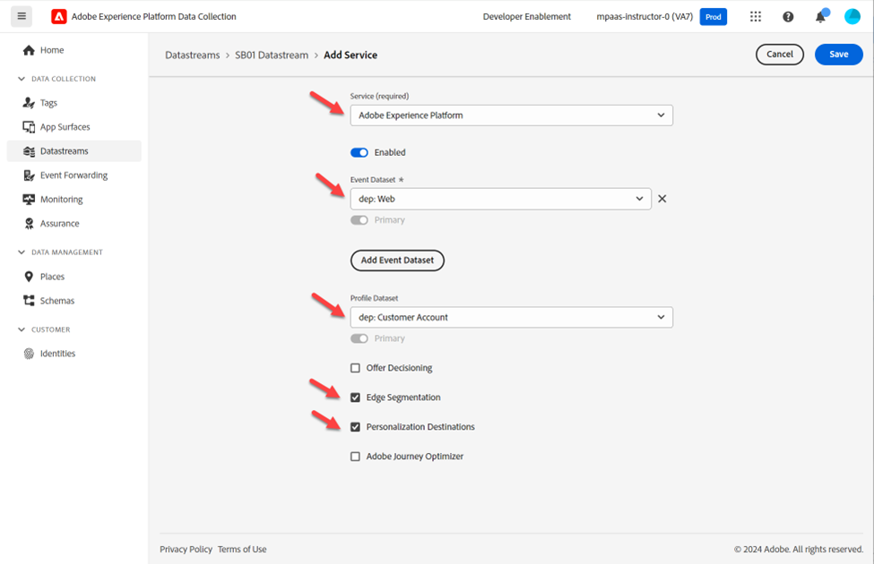

# Criar sequência de dados

Uma sequência de dados define quais serviços a utilizarão.

- Ao enviar dados para a Edge, você especifica qual sequência de dados usar
- Os dados enviados para esses Datastreams podem agir de acordo com o serviço configurado
  - Encaminhamento de eventos
  - Adobe Experience Platform

## Criar um novo fluxo de dados

1. No painel esquerdo, em **Coleção de dados**, clique em **Sequências de dados**
1. Em seguida, clique em **Novo Datastream** para criar um

## Configurar sequência de dados

Configure o fluxo de dados com as seguintes informações:

1. Nome -> **Datastream SB + \&lt;sandbox name> (ou seja, Datastream SB01)**
1. Esquema de Evento -> **dep: Web**
1. Alternar **em** todas as opções em **Geolocalização e Pesquisa de Rede**
1. Clique no botão **Salvar** quando terminar

>[!WARNING]
>
>Não clique em Salvar e Adicionar Mapeamento.  Se você acidentalmente, apenas cancele

Depois de salvar o fluxo de dados, você verá a seguinte tela:

## Adicionar serviço de encaminhamento de eventos

Isso permite usar o encaminhamento de eventos para dados recebidos por essa sequência de dados.

1. Clique em **Adicionar serviço**

   

1. Configure os seguintes itens:

   - Serviço -> Encaminhamento de eventos
   - Propriedade -> Selecione a propriedade que você criou na etapa anterior.  Ele deve ser nomeado assim: Propriedade de encaminhamento de eventos SB + \&lt;número da sandbox>
   - Ambiente -> Desenvolvimento

1. Quando terminar, clique em **Salvar**

## Adicionar serviço Adobe Experience Platform

Isso permite enviar dados para o Hub e chegar a um conjunto de dados para os dados recebidos por esse fluxo de dados.

1. Clique em **Adicionar serviço**

   

1. Configure os seguintes itens:

   - Serviço -> Adobe Experience Platform
   - Conjunto de dados do evento -> profundidade: Web
   - Conjunto de dados do perfil -> dep: Conta do cliente
   - Marque a caixa de seleção -> Segmentação do Edge
   - Marque a caixa de seleção -> Destino do Personalization

   

1. Quando terminar, clique em **Salvar**.

1. A tela final deve ficar parecida com abaixo, com dois serviços presentes. **Copiar** e **salvar** a **ID da sequência de dados** no computador local (você a usará posteriormente no Postman)

