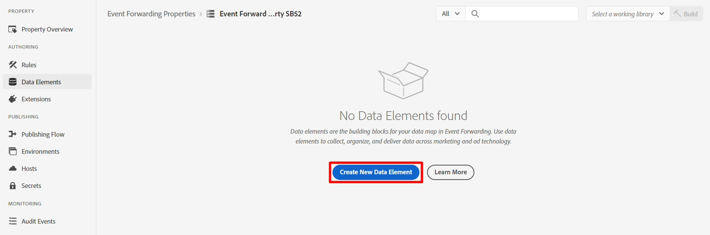
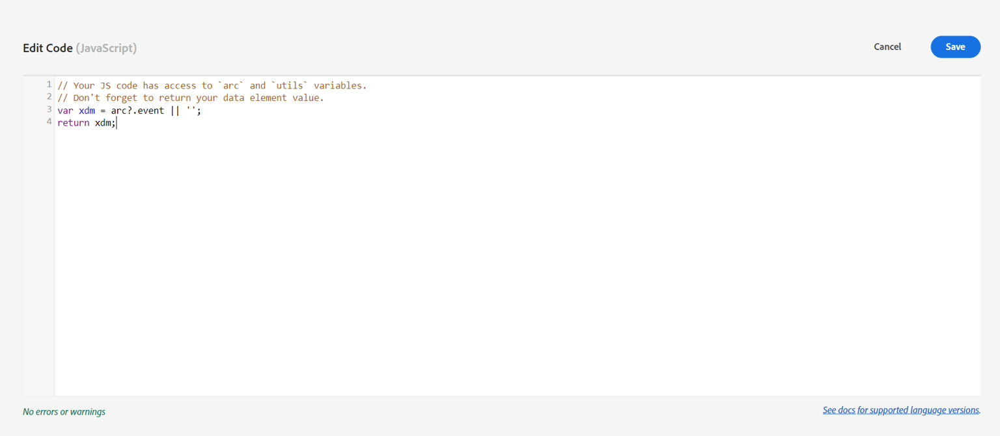
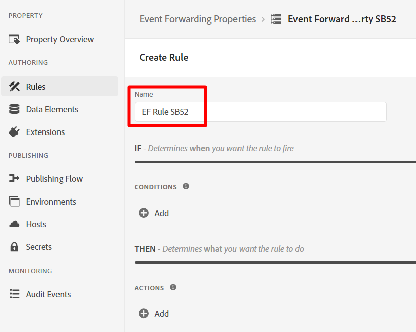
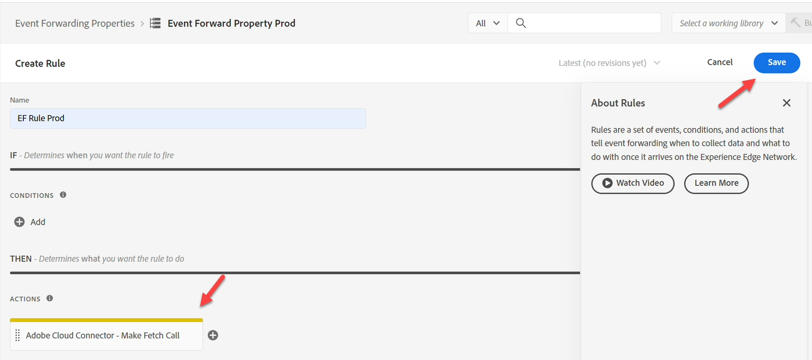
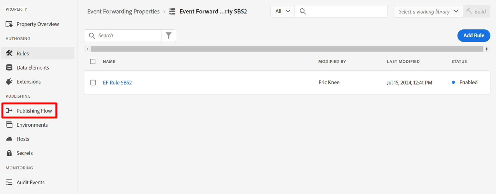

# Criar propriedade

Normalmente, queremos encaminhar um Evento de experiência para terceiros (embora ele não precise ser). Normalmente, isso é usado quando uma cópia de um Evento é necessária em tempo real para notificar um terceiro em circunstâncias específicas (por exemplo, notificar a Google, a Meta ou a TikTok sobre uma compra).

>[!NOTE]
>
>Lembrete: uma propriedade contém todas as extensões, elementos de dados e regras necessários para decidir o que encaminhar e para onde

1. No painel à esquerda, clique em Encaminhamento de evento
2. Em seguida, clique em Nova propriedade

   

3. Atualize o nome da propriedade usando a seguinte fórmula: `Event Forward Property SB + [sandbox number]`. Seu nome final seria mais ou menos assim: **Propriedade de Encaminhamento de Eventos SB01**

4. Clique em **Salvar** ao concluir


## Instalar extensão

1. Clique na propriedade de encaminhamento de eventos que você acabou de criar

   


2. Você deve ver uma tela como a abaixo.  Clique em **Extensões**.

   


3. Instale a extensão Adobe Cloud Connector fazendo o seguinte:

4. Clique em **Catálogo** na navegação superior
5. Clique no cartão **Adobe Cloud Connector**
6. No painel direito, clique no botão **Instalar**


Depois de clicar em Instalar, você deve ver a exibição da extensão nas extensões Instaladas da propriedade, como mostrado abaixo


## Criar elemento de dados

>[!NOTE]
>
>Um elemento de dados faz referência ao evento recebido e pode analisá-lo em vários componentes individuais, se necessário

1. No painel à esquerda, clique em **Elementos de Dados**


   


2. Clique no botão **Criar novo elemento de dados**

   


3. Configure o novo elemento de dados com as seguintes informações:

   | Tipo de elemento | Valor a ser configurado |
   | ----------------- | ------------------ |
   | Nome | Objeto de dados |
   | Extensão | Núcleo |
   | Tipo de elemento de dados | Custom Code |

   


4. Clique no botão **Abrir Editor** para adicionar o seguinte código personalizado:

   


5. Adicione o código personalizado ao editor assim como e salve

   ```none
   var xdm = arc?.event || '';
   return xdm;
   ```

   

   >[!NOTE]
   >
   >Isso está capturando todo o objeto xdm sem fazer qualquer tradução na carga útil.  Se necessário, podemos analisar cada parte individual do objeto XDM (por exemplo, nome da página, valor de compra) em um elemento de dados por campo.  A razão para fazer isso pode ser se houver transformação da estrutura para uma estrutura diferente


6. Clique no botão **Salvar** para salvar seu elemento de dados.


Quando terminar, você deve ver a tela a seguir confirmando que o elemento de dados foi adicionado:


## Criar regras

>[!NOTE]
>
>Uma regra contém:
>
>1. Condições sobre o que enviar
>2. Ações que podem transformar a carga e definir para onde enviá-la


1. No painel esquerdo, clique em **Regras**

   


2. Em seguida, clique em **Criar nova regra**

   A página 


3. Atualize o nome da regra usando a seguinte fórmula: `"EF Rule SB" + [your sandbox number]` (ou seja, Regra EF SB01). Você pode encontrar seu número de sandbox na parte superior direita da janela do navegador, como mostrado abaixo\...

   

4. Clique em **Salvar** ao concluir

   >[!NOTE]
   >
   >Verifique se o nome da regra segue o padrão de fórmula de `"EF Rule SB" + [sandbox number]`

   


5. Adicione uma Ação à regra clicando no sinal (+) para adicionar uma nova ação


## Obter URL do webhook (para usar em ação)

>[!NOTE]
>
>Este laboratório usa um webhook aqui para que você possa ver se os dados chegaram ao destino para o qual você está enviando. Em um cenário real, você faria logon nesse destino e usaria suas ferramentas para ver o que chegou.


1. Abra o link a seguir em uma nova guia do navegador -> [https://webhook.site](https://webhook.site/)
2. Copie o URL exclusivo que você vê e salve-o em algum lugar seguro

   Página 


3. Configure sua ação com as seguintes informações:

| Configuração | Valor |
| ----------- | ------------------------------------------------------------------------------------------------------------------------------------------------------------------- |
| Extensão | Adobe Cloud Connector |
| Tipo de ação | Fazer chamada de busca |
| Método | Publicar |
| URL | Use o mesmo URL do webhook que você usou ao configurar o destino de streaming. Você pode encontrá-la abrindo uma nova guia no navegador e navegando até Destinos -> Navegar |
| Corpo | Brutos |
| Dados do corpo | \{ &quot;data&quot;: \{ &quot;event&quot;: &quot;\{\{Data Object\}\}&quot; } } |

>[!NOTE]
>
>O \{\{Data Object\}\} referenciado aqui é o elemento de dados criado anteriormente. Aqui, o requisito do sistema downstream era que ele quisesse envolver o evento em um objeto de dados com um objeto de evento. Você pode colocar qualquer formatação aqui.
>
>Se tivéssemos dividido \{\{Data Object\}\} em vários campos (por exemplo, nome da página, compra etc.), poderíamos transformar a estrutura JSON colocando cada campo no local desejado, dando-nos mais controle sobre a correspondência do destino.


Quando você terminar, valide sua tela com aparência semelhante à mostrada abaixo e clique em **Manter alterações**


4. Quando terminar, você deverá ver sua ação adicionada à regra. Clique em **Salvar** para continuar.



>[!WARNING]
>
>Ao enviar um Evento de experiência, você está enviando o Evento, não o Perfil, nem qualquer um de seus atributos, incluindo qualquer Qualificação de público-alvo (mesmo se for um público-alvo da Edge).
>
>Isso acontece para fins de velocidade.


## Publicar as alterações

1. No painel esquerdo, clique em **Fluxo de publicação**

   


2. Clique no botão **Adicionar Biblioteca**

   


3. Configure a biblioteca com as seguintes informações:

   - Nome -> **EF Biblioteca**
   - Ambiente -> **Desenvolvimento**
   - Clique em **Adicionar todos os recursos alterados**


   Quando terminar, sua tela deve ser semelhante à captura de tela abaixo.  Se tudo estiver bem, clique no botão **Salvar e criar no desenvolvimento**

   


4. Você deve ver a build de desenvolvimento ficar verde, declarando que está pronta para uso


