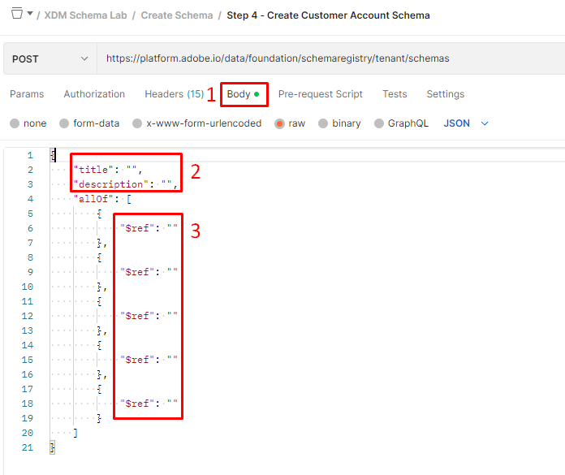

# Criar esquema

## Modificar o corpo da API

>[!CAUTION]
>
>**Não executar a chamada ainda**

1. Clique na chamada à API `Step 4 - Create Customer Account Schema` na pasta `XDM Schema Lab -> Create Schema`.

   

2. Abra o corpo da chamada e visualize a estrutura de como um esquema é definido. Lembre-se de que um esquema é sempre composto de apenas uma (1) classe e um ou mais grupos de campos.

3. Preencha os campos `title` e `description` no corpo do esquema com o seguinte:

   - Título -> `Sample Customer Schema - <your sandbox number>`
   - Descrição -> `Sample Customer Schema - <your sandbox number>`

4. Preencha os campos `$ref` com o `$ids` que você salvou das seções de laboratório anteriores que você concluiu: [Criar grupos de campos personalizados](./create-custom-field-groups.md) e [Obter classe de perfil](./get-profile-class.md). Você tem $ids para cada um dos seguintes itens:

   - Classe -> Perfil individual XDM
   - Grupo de campos -> Detalhes demográficos
   - Grupo de campos -> Detalhes de contato pessoal
   - Grupo de campos -> Detalhes de consentimento e preferência
   - Grupo de campos (personalizado) -> Detalhes da conta do cliente

   

5. Revise seu corpo final e certifique-se de que seja semelhante a este

>[!NOTE]
>
>A ordem de `$refs` não importa nem a localização de `title` e `description` no corpo.

## Executar a API

1. Salve as modificações na solicitação de API antes de continuar.
1. Execute a API clicando no botão `Send`

Uma resposta bem-sucedida para criar o esquema deve resultar em um status `201 Created` e deve se parecer com a imagem abaixo

>[!WARNING]
>
>Não executar a solicitação novamente se for bem-sucedido

## Localize e salve o esquema $id

1. Depois de executar a solicitação de API, copie o `$id` e `$meta:altId` da resposta
1. Salve os valores em algum lugar para reutilizá-los posteriormente

>[!WARNING]
>
>Não continue até que você tenha salvo `$id` e `$meta:altId` em algum lugar.  Eles serão necessários em etapas futuras do laboratório

>[!SUCCESS]
>
>**Parabéns! Você criou um esquema usando apenas as APIs**
