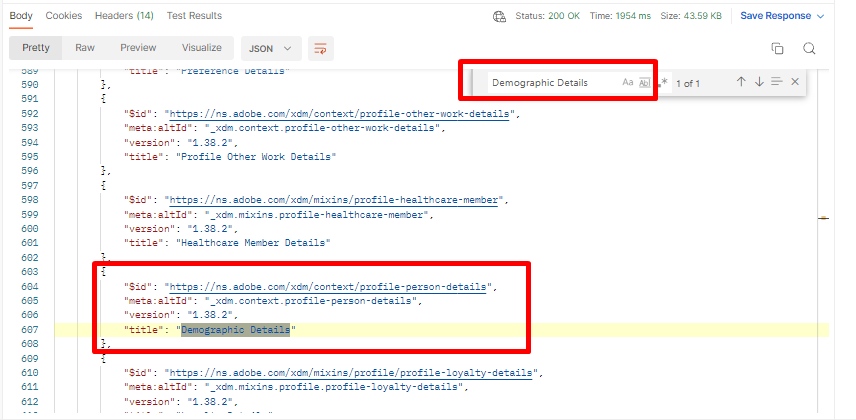

# Obter grupos de campos padrão

>[!NOTE]
>
>O **&quot;Grupo de Campos&quot;** já foi mencionado como um **&quot;Mixin&quot;**. Portanto, esses termos podem ser usados alternadamente nas solicitações e no guia de API.

## Solicitar grupos de campos padrão XDM

1. Clique na chamada à API `Step 1 - Get XDM Standard Field Groups` na pasta `XDM Schema Lab -> Create Schema`
1. Execute a chamada clicando no botão `Send`

**Solicitação**

>[!NOTE]
>
>Observe o uso do valor `global` na URL de solicitações abaixo:
>
>https\://platform.adobe.io/data/foundation/schemaregistry/**global**/mixins
>
>`global` é usado para solicitar somente componentes padrão XDM (grupo/mixin de campos, neste caso). Há dois tipos de proprietários no registro XDM do Experience Platform: Adobe e Locatário (ou seja, personalizado).
>
>- Os objetos criados pela Adobe sempre usam a palavra `global` em qualquer solicitação de pesquisa ou listagem XDM
>- Os objetos criados pelo locatário (ou seja, personalizados) sempre usam a palavra `tenant` em qualquer lista XDM ou chamada de pesquisa

**Resposta**

## Identificar grupos de campos padrão XDM necessários

Um esquema é sempre composto por um ou mais grupos de campos e uma classe.  Para o esquema Perfil individual 5G de conexão, localize os grupos de campos XDM padrão necessários para o esquema.

- Detalhes demográficos
- Detalhes de contato pessoal
- Detalhes sobre consentimento e preferência

1. Procurar o grupo de campos `Demographic Details` na resposta da chamada
1. Copie o `$id` do grupo de campos e salve-o em algum lugar para referência futura
1. Repita as etapas 1 e 2 para os outros dois grupos de campos listados acima

>[!WARNING]
>
>Não continue até que você tenha salvo todos os três (3) `$ids` em algum lugar.  Eles serão solicitados posteriormente para criar o esquema da Conta do cliente
