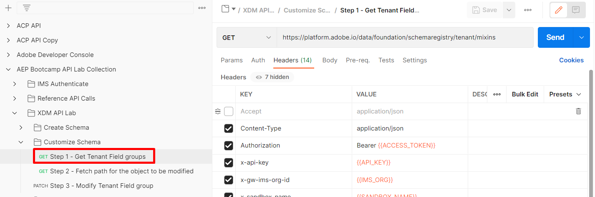
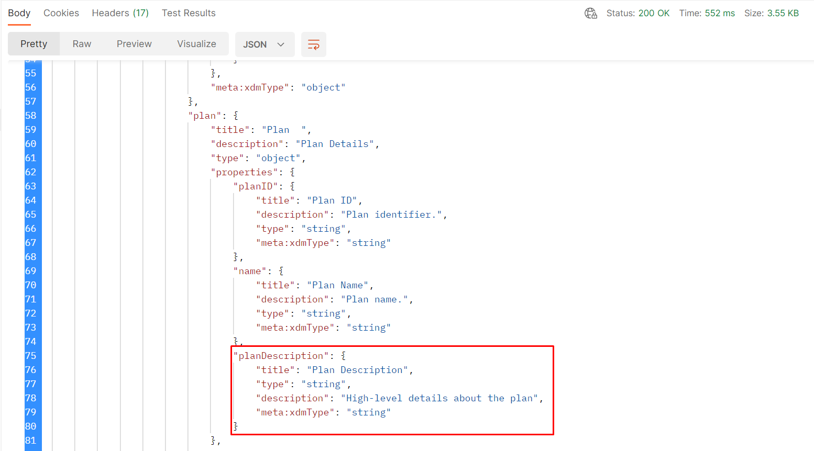

# Modificar esquema - Patch JSON

## Visão geral

Suponha que, depois de criar o esquema, você precise adicionar outro campo ao objeto `plan` chamado `planDescription`. Essa necessidade pode ocorrer porque você esqueceu de adicioná-la ao criar o esquema ou porque foi uma solicitação recebida meses depois. Para executar esta tarefa, execute uma operação `PATCH` que atualize o esquema com o novo campo.

Saiba mais sobre o JSON PATCH nos links abaixo. Para este laboratório, suponha que você tenha um entendimento geral de como funciona.

- [https://jsonpatch.com/](https://jsonpatch.com/)
- [Fundamentos da API do Experience League](https://experienceleague.adobe.com/docs/experience-platform/landing/platform-apis/api-fundamentals.html?lang=en#json-patch)


>[!NOTE]
>
>Lembre-se dos seguintes pontos:
>
>- Um esquema é composto por uma classe e um ou mais grupos de campos
>- Você deve adicionar novos campos a um grupo de campos antes de adicioná-los a um esquema. Essa restrição garante a reutilização de um campo em qualquer esquema que utilize esse grupo de campos.


Para adicionar um novo campo a um esquema, é necessário executar as seguintes operações em ordem. Esse processo é o que você faz nas seguintes etapas de laboratório.

- Identifique o grupo de campos no qual você deseja adicionar a nova propriedade
- Construir uma chamada JSON PATCH para atualizar o grupo de campos
- Executar a chamada JSON PATCH para atualizar o grupo de campos (herdado pelo esquema)


## Localizar e identificar o grupo de campos a ser atualizado

1. Selecione a chamada de API `Step 1 - Get Tenant Field groups` localizada na pasta `XDM Schema Lab -> Customize Schema`
1. Execute a solicitação clicando no botão `Send`

   

   >[!NOTE]
   >
   >Lembre-se de que você criou o objeto `plan` em um grupo de campos personalizados. Os objetos criados personalizados no registro de esquema XDM são chamados de &quot;locatário&quot;, portanto, a chamada de API utiliza o caminho `/schemaregistry/tenant/mixins/`.


1. Na resposta, pesquise a ID do esquema do grupo de campos personalizado que você criou com o título anterior `Customer Account Details - Sandbox <your number here> `

1. Copie o `$meta:altId` e salve-o em um local seguro, conforme necessário, para a próxima etapa


>[!CAUTION]
>
>Selecione o grupo de campos correto para copiar. Não use o grupo de campos com nome semelhante chamado `dep: Customer Account Details`

>[!WARNING]
>
>Você precisa do `$meta:altId` para as próximas etapas de laboratório, portanto salve-o em algum lugar antes de continuar


## Pesquisar o grupo de campos por $meta\:altId

1. Selecione a chamada à API `Step 2 - Fetch path for the object to be modified` na pasta `XDM Schema Lab -> Customize Schema`
1. Na URL da solicitação, substitua o `<replace me>` pelo `$meta:altId` que você salvou da etapa da seção anterior até o fim da chamada, como mostrado abaixo
1. Salve as edições feitas na solicitação
1. Execute a solicitação clicando no botão `Send`


Revise a resposta e observe que o caminho do ponteiro JSON para o objeto **plan** é construído usando cada uma das propriedades destacadas abaixo.


O caminho totalmente composto se parece com o que você vê abaixo.  Copie este caminho e salve em algum lugar para referência

```none
/definitions/customFields/properties/_devbc/properties/plan/properties
```

>[!NOTE]
>
>Lembre-se de atualizar o nome do locatário acima (\_devbc) com o seu próprio


## PATCH do grupo de campos

### Amostra do corpo da API JSON PATCH

```none
[
    {
        "op": "",
        "path": "",
        "value": {
            "title": "",
            "type": "",
            "description": ""
        }
    }
]
```

- **op (Operação)** -> fornece a instrução para qual ação o PATCH deve executar
- **Caminho** -> esse é o caminho que você deseja criar, atualizar ou excluir (ou seja, o ponteiro JSON para o local do novo campo)
- **Valor** -> este campo é opcional e é usado somente ao criar ou substituir um campo existente


### Executar a solicitação de API

1. Clique na chamada à API `Step 3 - Modify Tenant Field group` na pasta `XDM Schema Lab -> Customize Schema`

   


2. Atualize o corpo da solicitação com as seguintes informações

   - **op** ->` add`
   - **caminho** -> `path from previous step +`&#x200B;` the new field name`
   - **valor** ->
     - **título** -> `Plan Description`
     - **tipo** -> `string`
     - **descrição** -> `High-level details about the plan`

   Quando você terminar, sua solicitação de API deverá ser semelhante a esta

   

   >[!WARNING]
   >
   >Certifique-se de incluir o novo nome de campo, **planDescription,** no caminho


3. Se tudo estiver bem `Save`, sua chamada

4. `Execute` a chamada para executar o PATCH

Você vê uma resposta `200 OK` e o campo `planDescription` no seu grupo de campos, da seguinte forma:

Resposta OK 

>[!SUCCESS]
>
>Parabéns! Você atualizou com êxito um grupo/esquema de campos usando o JSON PATCH


## Visualizar a alteração na interface do usuário

Navegue pelo esquema na interface do usuário e visualize o campo recém-adicionado.


