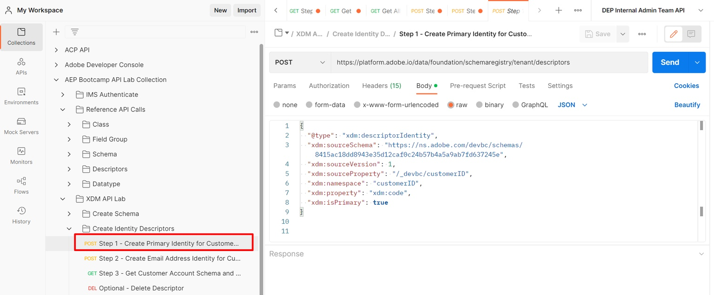

# Criar identidade principal

1. Clique na solicitação de API `Step 1 - Create Primary Identity for Customer Account Schema` na pasta `XDM Schema Lab -> Create Identity Descriptors`

   

   >[!CAUTION]
   >
   >Não executar a solicitação ainda


1. Atualize o valor `xdm:sourceSchema` no corpo da solicitação usando o `$id` que você salvou da etapa do laboratório [Criar esquema](../build-schema/create-schema.md)

1. Atualize o valor `xdm:isPrimary` no corpo da solicitação para `true`

   SOMENTE EXEMPLO

   ```json
   {
     "@type": "xdm:descriptorIdentity",
     "xdm:sourceSchema": "https://ns.adobe.com/devbc/schemas/8415ac18dd8943e35d12caf0c24b57b4a5a9ab7fd637245e",
     "xdm:sourceVersion": 1,
     "xdm:sourceProperty": "/_devbc/customerID",
     "xdm:namespace": "customerID",
     "xdm:property": "xdm:code",
     "xdm:isPrimary": true
   }
   ```

   >[!NOTE]
   >
   >Lembre-se de atualizar o nome do locatário acima (\_devbc) com seu próprio


1. Salve sua solicitação antes de continuar usando o botão `Save`

1. Execute a API clicando no botão `Send`. Agora você deve ver uma resposta de `201 Created` como a seguir


>[!TIP]
>
>Parabéns!  Você acabou de criar um descritor de identidade primário em seu esquema
