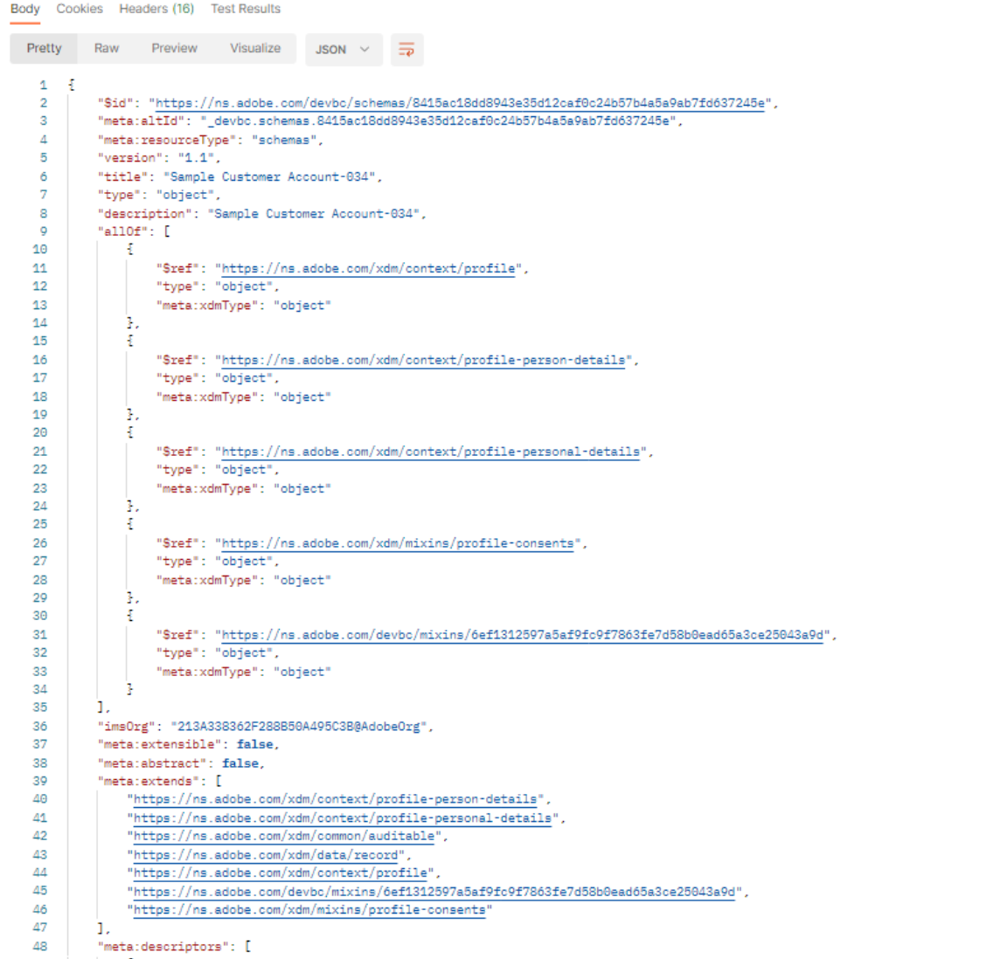
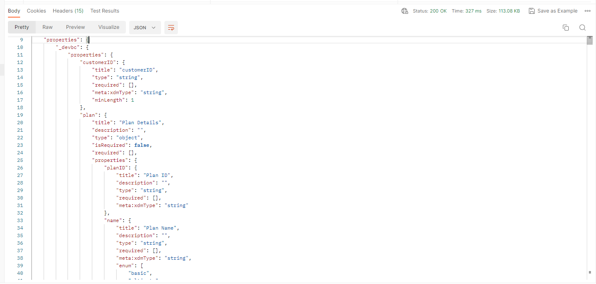

# Exibir esquema

## Visualização por meio da interface

1. Abra o navegador e navegue de volta para a seção `Schema -> Browse`.
1. Procure o esquema **Conta de cliente**
1. Observe que as identidades são adicionadas ao esquema

## Visualização por meio da API

1. Selecione a API `Step 3 - Get Customer Account Schema and its descriptors` clicando nela.

   

1. Na URL da solicitação, substitua `<replace me>` pelo `$meta:altId` que você salvou da seção anterior (Criar seu Esquema) ao final da chamada, como mostrado abaixo

   

1. Salve as edições que você fez na solicitação

1. Execute a solicitação clicando no botão `Send`

Agora você deve ver uma resposta `200 OK` e poder navegar pelo esquema criado através das lentes da estrutura XDM JSON

Navegue mais para baixo na resposta da API para ver os descritores de identidade criados

## Aceitar cabeçalhos

Observe o cabeçalho **Aceitar** usado na solicitação. Esse cabeçalho informa ao Registro de esquema XDM para retornar o `$refs` não resolvido do esquema (ou seja, mostrar a quantidade mínima básica de informações) juntamente com seus descritores associados na resposta da API.  A Adobe fornece outros cabeçalhos **Aceitar** que você pode utilizar para obter vários graus de detalhes sobre o esquema.

>[!NOTE]
>
>Você pode ler mais sobre os vários cabeçalhos Aceitar aqui -> [Endpoint da API de Esquema do Experience League](https://experienceleague.adobe.com/docs/experience-platform/xdm/api/schemas.html?lang=pt-BR#lookup)

Para ver isso em ação, altere o cabeçalho **Aceitar** para informar ao Registro de esquema para responder com todos os `$ref` e `allOf` totalmente resolvidos (isto é, expandidos) e descritores associados

1. Atualize o valor do cabeçalho `Accept` para o seguinte:
   `application/vnd.adobe.xed-full-desc+json; version=1`
1. Salve sua solicitação usando o botão `Save`
1. Executar sua solicitação usando o botão `Send`

Agora você verá uma resposta com esta aparência:

>[!NOTE]
>
>Observe como todas as propriedades do esquema agora são totalmente exibidas na resposta, enquanto na chamada anterior, eram exibidos apenas os valores `$ref` do esquema (ou seja, a quais grupos de campos ele estava fazendo referência) e nada era totalmente resolvido para cada campo/propriedade individual.

>[!NOTE]
>
>Isso é importante para entender porque, ao trabalhar com APIs, nem sempre é necessário a resposta totalmente resolvida se tudo o que você estiver fazendo for obter o `$id` do esquema ou simplesmente verificar sua composição
