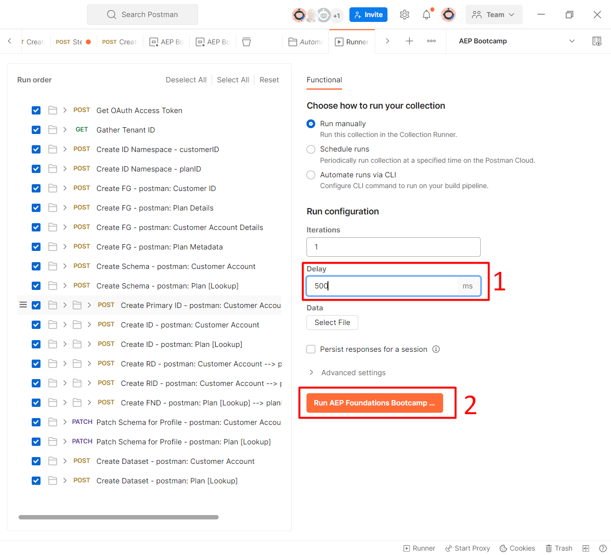
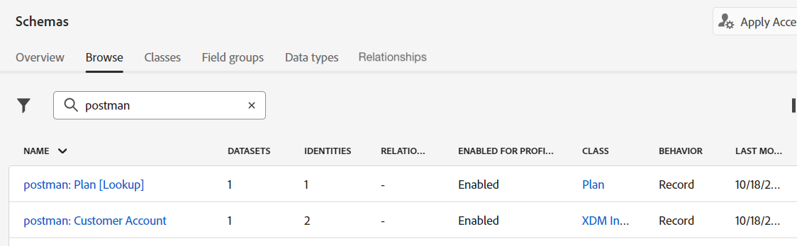

# Automatizar com APIs

## Introdução

Para ver como você pode automatizar implantações usando APIs, execute uma pasta de APIs que cria os seguintes objetos:

- Conta e plano do cliente \[Pesquisa] esquema(s)
- Grupos de campos que compõem os esquemas acima
- Descritores de identidade necessários para o perfil
- Descritores de relacionamento e referência necessários para criar os relacionamentos entre a Conta do Cliente e o Plano \[Pesquisa]
- Dois conjuntos de dados correspondentes a cada esquema criado

## Executar a pasta

1. No Postman, navegue até a pasta **Automação com APIs** na pasta **XDM Schema Lab**

   

1. Clique na pasta **Automação com APIs** e, no espaço de trabalho, clique no botão **Executar**

   >[!NOTE]
   >
   >O botão Executar está no canto superior direito do espaço de trabalho do Postman

   

1. Uma nova janela que mostra todas as chamadas de API na pasta deve ser exibida. Defina o **Atraso** como **500ms** e clique no botão **Executar**.

   

1. Você vê as chamadas de API começarem a ser executadas em ordem e, quando concluído, deve ver 32 testes aprovados.

   

1. Vá para a interface do Experience Platform e você deverá ver dois esquemas e dois conjuntos de dados criados e habilitados para o perfil com o prefixo **postman:**

>[!TIP]
>
>Parabéns!  Você acabou de automatizar a implantação de namespaces de identidade, grupos de campos, esquemas, descritores de identidade/relacionamento e ativar um esquema para criar um perfil e gerar um conjunto de dados utilizando o esquema
