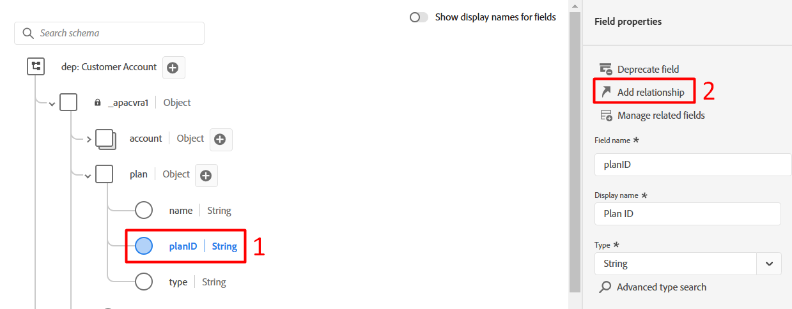

# Configurar para perfil

## Visão geral

Para utilizar um esquema para o Perfil de cliente em tempo real, primeiro é necessário garantir que ele esteja configurado adequadamente. Essa etapa significa pegar o que você identificou durante o laboratório de LID como identidades principais/de pessoa, identidades de relacionamento etc. e garantir que essas configurações sejam feitas em cada esquema. Quando tudo estiver concluído, você ativará um esquema para uso com o perfil.

Olhando para o XDM no papel Connection 5G ERD, você vê as seguintes informações sobre o esquema da conta do cliente.  Esse é o trabalho restante para utilizar o esquema no Perfil do cliente em tempo real.

## Marcar o campo de identidade principal

Todos os esquemas exigem um campo de identidade principal se ele for usado com o Perfil de cliente em tempo real. Para marcar um campo como identidade primária, siga as etapas abaixo.

1. Abra o esquema **Conta do cliente** que você criou
1. Selecione o campo **\_\&lt;nome-do-locatário>.customerID** clicando no campo do esquema
1. No painel direito, marque as caixas de seleção **Identidade** e **Identidade principal**
1. Selecione o namespace **customerID** na lista suspensa
1. Quando terminar, clique no botão **Aplicar** no painel direito e **Salvar** suas alterações.

>[!NOTE]
>
>Valide se uma impressão digital é exibida no campo depois de clicar em aplicar, como abaixo
>
>
>
>

>[!NOTE]
>
>Observe também que no painel esquerdo você agora vê os itens a seguir. As identidades (primárias ou não primárias) aparecem aqui, e as identidades **primárias** também são marcadas como campos obrigatórios.
>
>
>
>

## Marcar os campos de identidade da pessoa

Cada esquema pode **opcionalmente conter** outros campos de identidade de pessoa. Essa regra se aplica a qualquer esquema usado com o Perfil de cliente em tempo real. Para marcar um campo como uma identidade de pessoa, execute as seguintes ações no esquema de Conta de cliente criado anteriormente.

1. Selecione o campo **personalEmail.address**
1. Marque a caixa de seleção **Identidade** localizada no painel direito
1. Selecione o namespace de identidade **Email** na lista suspensa
1. **Aplicar e salvar** suas alterações

>[!NOTE]
>
>Verifique se uma impressão digital é exibida no campo depois de clicar em Aplicar

## Criar o relacionamento do esquema

Para relacionar o schema Plan com o schema Customer Account conforme descrito no ERD, é necessário definir uma relação. Para criar uma relação de esquema entre os esquemas Conta e Plano do cliente (pesquisa), siga as etapas abaixo.

### Adicionar relacionamento

1. Selecione o campo **planID** dentro do objeto Plan conforme mostrado abaixo
1. No painel direito, clique no ícone **Adicionar relacionamento**

### Definir relacionamento

1. Na caixa de seleção Tipo, selecione a opção **Um para um**
1. Na caixa Selecionar esquema de referência, escolha o esquema chamado **dep: Plan \[Lookup]** (esse esquema foi pré-criado para você)
1. Clique em **Aplicar** e **Salvar**

![Definindo uma relação um para um com a dep: Plano [Pesquisa] esquema](assets/configure-for-profile-define-one-to-one-relationship.png)

### Confirmar relacionamento

Quando terminar, você deverá ver a exibição do relacionamento criado, como visto na captura de tela abaixo.

## Configurar esquema para perfil

O Perfil do cliente em tempo real mescla dados de fontes diferentes para criar uma visualização completa de cada cliente individual. Se quiser que os dados capturados por um esquema participem desse processo, configure o esquema para uso no Perfil. Para fazer isso, é necessário executar as seguintes etapas:

1. Abra o esquema **Conta de Cliente - \[suas iniciais]** recém-criado
1. Clique no título do esquema no painel esquerdo
1. Configure seu esquema para o perfil alternando a opção de perfil **ATIVADO** no painel direito
1. No modal exibido, clique no botão **Habilitar**
1. Não esqueça de **Salvar** seu esquema quando terminar!

>[!SUCCESS]
>
>Parabéns!  Você acabou de criar um esquema para usar com o Perfil de cliente em tempo real.

## Revisar o esquema de união de perfis

Como mencionado anteriormente, o poder do XDM + o Perfil do cliente em tempo real é a capacidade de reunir uma variedade de fragmentos de um indivíduo e seus comportamentos em conjunto.  Esse agregado é chamado de &quot;Visualização de união&quot; do cliente.  Nas etapas abaixo, você visualiza a aparência dessa união para cada classe XDM configurada para o Perfil do cliente em tempo real

1. Navegue até **Perfis** no painel esquerdo
1. Selecione a guia **Esquema de união** no menu superior
1. Selecione a classe **Perfil Individual XDM** na lista suspensa

Navegue pela classe Perfil individual XDM e reserve alguns momentos para revisar outras classes, como Evento de experiência XDM ou Classes de plano.

>[!NOTE]
>
>Observe que o esquema mostrado é uma exibição mesclada agregada de todos os esquemas habilitados para perfil na sandbox. Campos semelhantes na estrutura XDM hierárquica se mesclam, enquanto campos com nomes e/ou hierarquias diferentes são adicionados à exibição geral.

>[!NOTE]
>
>Somente a classe baseada em Perfil individual XDM executa mesclagens entre campos com nomes semelhantes.
