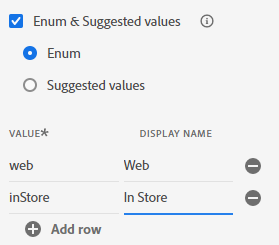

# Objetos personalizados do modelo

## Adição de campos personalizados

Conforme discutido na palestra, não há grupos de campos ou tipos de dados padrão prontos para uso que modelem os campos personalizados da Conta do cliente.  Os campos abaixo atualmente são considerados personalizados e devem ser modelados dentro do esquema XDM.

- \_\&lt;nome-do-locatário>.account.createDate
- \_\&lt;nome-do-locatário>.account.endDate
- \_\&lt;nome-do-locatário>.account.acqSource
- \_\&lt;nome-do-locatário>.plan.planID
- \_\&lt;nome-do-locatário>.plan.name
- \_\&lt;nome-do-locatário>.customerID

>[!NOTE]
>
>Observe que \&lt;nome-do-locatário> será específico para o ambiente em que você está trabalhando

## Criação do objeto Account

1. Adicione um novo campo clicando no botão **+ (adicionar)** na parte superior do esquema

>[!NOTE]
>
>Observe que o painel direito abre com alguns campos para você preencher

1. Crie o objeto de conta utilizando os detalhes abaixo. Quando terminar, clique no botão **Aplicar** no painel direito para ver a alteração no espaço de trabalho de esquema

| Nome do campo | Nome de exibição | Tipo | Atribuir a um novo grupo de campos |
| ---------- | ------------ | -------- | ----------------------------------------------------------------------------------------------------------------------------- |
| *conta* | *Conta* | *Objeto* | *Detalhes da Conta do Cliente - \[Suas Iniciais]* *(digite este item e selecione a lista suspensa ou pressione a tecla Enter)* |

>[!WARNING]
>
>Os nomes de campo precisam seguir uma capitalização específica. O motivo é que já pré-criamos o mesmo esquema que você está criando. Se sua caixa estiver desativada, isso causará um conflito com os caminhos de campo do esquema pré-existente na sandbox

>[!NOTE]
>
>Observe que o campo personalizado criado automaticamente é colocado em um namespace de locatário, indicado por `_devbc` na captura de tela. O namespace do locatário pode ser diferente. Os namespaces do locatário são usados para diferenciar objetos personalizados dos objetos padrão do Adobe e garantir que adições/atualizações futuras nos padrões do Adobe não entrem em conflito com os objetos criados de forma personalizada.

>[!NOTE]
>
>Observe que o novo grupo de campos personalizados aparece no painel esquerdo sob `Field groups` sem um ícone de cadeado.  Isso indica que é um grupo de campos criado de forma personalizada.

>[!WARNING]
>
>Não é possível salvar seu esquema neste momento. Se você fizer isso, ocorrerá um erro porque não é possível criar um objeto vazio no esquema JSON, pois ele não descreve quais são seus conteúdos

1. Adicione os seguintes campos exibidos abaixo no objeto Account que você acabou de criar.

| Nome do campo | Nome de exibição | Tipo |
| ------------ | ------------- | ---------- |
| *createDate* | *Criar Data* | *DateTime* |
| *endDate* | *Data de término* | *DateTime* |

>[!NOTE]
>
>Você percebe que, ao adicionar os novos campos, a opção **Atribuir a** já está preenchida e faz referência ao grupo de campos usado para o objeto da conta.

1. Quando concluído, seu objeto de conta de esquemas deve ter a aparência abaixo. **Salve** seu esquema!

1. Adicione mais um campo personalizado ao objeto da conta. Clique no botão **+ (adicionar)** ao lado do objeto de conta.  Crie o seguinte campo:

| Nome do campo | Nome de exibição | Tipo | Enumerações |
| ----------- | ----------------- | -------- | --------------------------------------- |
| *acqSource* | *Source adquirido* | *Cadeia de caracteres* | *Web :: Web * *inStore :: InStore* |

Este campo precisa de valores padronizados, portanto, use a opção **Enumerar &amp; Valores sugeridos** nas propriedades dos campos. Selecione o botão de opção **Enumerar** para adicionar a validação para este campo na assimilação, bem como rótulos amigáveis. Adicione os valores de enumeração conforme mostrado abaixo:

- *Web :: Web*
- *inStore :: InStore*

>[!NOTE]
>
>A meta de Enumerar e Valores sugeridos é facilitar a segmentação para o usuário final. As enumerações impõem validação no momento da assimilação de dados, enquanto os valores sugeridos não. Para saber mais sobre este recurso, você pode ler mais na documentação aqui -> [https://experienceleague.adobe.com/docs/experience-platform/xdm/ui/fields/enum.html?lang=pt-BR#enums-and-suggested-values](https://experienceleague.adobe.com/docs/experience-platform/xdm/ui/fields/enum.html?lang=pt-BR#enums-and-suggested-values)

1. Quando terminar, clique no botão **Aplicar** para adicionar o novo campo ao esquema.

1. **Salvar** seu esquema

>[!TIP]
>
>Você criou com sucesso seu primeiro objeto e campos personalizados no registro do esquema XDM.

## Criação do objeto de plano

Repita as etapas executadas acima e adicione o objeto **Plano** e os campos associados. Todos os novos campos devem ser adicionados no grupo de campos Detalhes da conta do cliente - \[suas iniciais].

Use os metadados na tabela abaixo para criar o objeto de plano e seus campos associados.

| Nome do campo | Nome de exibição | Tipo | Enumeração e valores sugeridos |
| ---------- | -------------- | -------- | ------------------------------------------------------------------------------------- |
| *plano* | *Detalhes do plano* | *Objeto* | - |
| *IDdoPlano* | *ID do Plano* | *Cadeia de caracteres* | - |
| *nome* | *Nome do Plano* | *Cadeia de caracteres* | Enum  *básico :: Básico * *final :: Ultimate * *pro :: Pro* |
| *tipo* | *Tipo* | *Cadeia de caracteres* | - |

>[!WARNING]
>
>Verifique se você está adicionando os novos campos criados ao grupo de campos Detalhes da conta do cliente - \[suas iniciais].  Uma maneira rápida de garantir que sejam adicionados automaticamente a esse grupo de campos é selecionar o grupo de campos no painel à esquerda antes de adicionar um campo personalizado.
>
>
>
>
>
>

Quando terminar de validar, seu esquema corresponderá à captura de tela abaixo. Se estiver bom **Salve** seu esquema

>[!TIP]
>
>Legal!  Você adicionou seu próprio objeto e campos personalizados sem ajuda.

## Criação do campo ID do cliente

Adicionar o campo **customerID** como este campo é crítico porque ele servirá como a identidade primária para o esquema, bem como um campo geral no qual manter os dados.

Execute as mesmas etapas que fez anteriormente e utilize a tabela abaixo para fazer referência aos metadados do campo.

| Nome do campo | Nome de exibição | Tipo | Grupo de campos |
| ------------ | ------------- | -------- | --------------------------------------------- |
| *customerID* | *ID do cliente* | *Cadeia de caracteres* | *Detalhes da Conta do Cliente - \[Suas Iniciais]* |

>[!NOTE]
>
>O `customerID` pode ser colocado em qualquer lugar no esquema de uma perspectiva hierárquica. Neste laboratório, escolhemos mantê-lo na raiz e não aninhado dentro de um dos objetos personalizados criados anteriormente.  É aqui que a arquitetura de dados tem opiniões
>
>😄

O resultado final deve ficar parecido com a captura de tela abaixo quando você estiver concluído

## Resultado final do esquema

>[!TIP]
>
>Você criou seu primeiro esquema XDM! Na próxima seção, você configurará o esquema para uso com o Perfil de cliente em tempo real.
