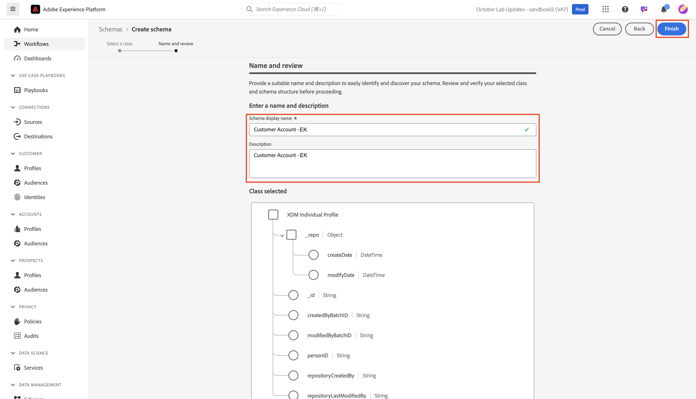

# Objetos padrão de modelo

## Navegar até esquemas

1. Clique na guia **Esquemas** no painel esquerdo

1. Na navegação superior, você vê opções para procurar esquemas existentes, bem como visualizar Grupos de campos e Tipos de dados que estão atualmente no registro XDM.

>[!NOTE]
>
>Você observa que já existem esquemas pré-criados em sua sandbox. Isso inclui esquemas que foram pré-criados como parte dessa campanha de inicialização (eles recebem o prefixo `dep`), bem como esquemas gerados pelo sistema para Adobe Real-Time CDP e Adobe Journey Optimizer.

## Criar esquema de perfil individual

1. Comece clicando em **Criar esquema**

1. Selecionar **Manual**

1. Selecionar **Perfil Individual**

## Nomeie seu esquema

Os esquemas baseados em classe de Perfil individual XDM permitem coletar atributos sobre um indivíduo que será anexado ao perfil. A própria classe contém campos que não são editáveis, como *modifiedByBatchID*, *PersonID*, etc.

1. Dê um nome e uma descrição ao esquema.
   - **Nome para Exibição do Esquema** —> *Conta do Cliente - \[Suas Iniciais]*
   - **Descrição** —> Este esquema coleta identidades, informações do plano, detalhes demográficos e detalhes de contato de uma pessoa.
1. Salve o esquema usando o botão **Concluir** na parte superior direita.

## Adicionar grupo de campos de Detalhes Demográficos

Existem muitos grupos de campos que existem como XDM padrão no Adobe Experience Platform para você adicionar ao esquema e personalizar.

1. Clique em **+ (adicionar)** no painel esquerdo da seção grupo de campos.

1. Pesquise por **Detalhes Demográficos** ou localize-os navegando na lista.

- Ao localizar o grupo de campos, clique na lupa à direita do grupo de campos para exibir sua estrutura.  Essa é uma maneira útil de visualizar o que você está prestes a adicionar ao esquema sem realmente adicioná-lo.
- Fechar a visualização ao concluir a revisão

3. **Marque** a caixa de seleção ao lado do grupo de campos e clique no botão **Adicionar grupos de campos**

## Adicionar outros grupos de campos padrão

Você precisa adicionar outros grupos de campos padrão ao esquema. Repita as etapas anteriores para adicionar os dois grupos de campos adicionais ao esquema:

- Detalhes de contato pessoal
- Detalhes sobre consentimento e preferência

Quando você terminar, seu esquema deverá ter a aparência da imagem abaixo. Certifique-se de clicar no botão **Salvar** e salvar seu trabalho!

>[!NOTE]
>
>Observe que os grupos de campos selecionados e adicionados agora aparecem no esquema e são exibidos no painel esquerdo. Observe que nem todos os campos em cada grupo de campos adicionado são necessariamente necessários.  A próxima etapa remove os campos irrelevantes.

>[!WARNING]
>
>Certifique-se de salvar seu esquema antes de continuar.

## Personalizar grupos de campos padrão

### Grupo de campos Detalhes Demográficos

O grupo de campos Detalhes demográficos trazia vários campos, mas com base no design do esquema da metodologia LID, você só precisa dos seguintes campos:

- person.name.firstName
- person.name.lastName
- person.birthDayAndMonth
- person.birthYear

Para remover campos de qualquer grupo de campos padrão do Adobe, você pode utilizar a opção **Gerenciar campos relacionados**. Gerenciar campos relacionados permite remover campos padrão do esquema, de modo que você só fica com os campos necessários.

1. Selecione o objeto **pessoa** no esquema
1. Clique no **Gerenciar campos relacionados** no painel direito

1. Expanda o objeto pessoa clicando na divisa à esquerda da pessoa e expanda o objeto de nome completo clicando na divisa à esquerda do objeto de nome. Manter apenas os seguintes campos:

- person.name.firstName
- person.name.lastName
- person.birthDayAndMonth
- person.birthYear

Quando terminar, clique no botão **Confirmar** no canto superior direito.

>[!NOTE]
>
>Você pode clicar na caixa de seleção mais acima para **Detalhes demográficos** para desmarcar automaticamente todos os objetos filho e, em seguida, selecionar novamente apenas aqueles de que necessita!

1. Quando terminar, você deverá ver o objeto person no esquema, como mostrado abaixo. Se tudo estiver bem, clique no botão **Salvar** para salvar seu esquema.

### Grupo de campos Consentimento e Preferências

Execute o mesmo conjunto de etapas que executou anteriormente, mas desta vez para o grupo de campos Consentimento e Preferências.

1. Clique no nome do grupo de campos **Consentimento e Preferências** no painel à esquerda para realçar seus campos no esquema.
1. Selecione o objeto **consentimentos** e use o processo **Gerenciar campos relacionados** para remover campos desnecessários do objeto de consentimento. Manter apenas os seguintes campos:

- consentimentos.marketing.email.val
- consentimentos.marketing.sms.val

>[!NOTE]
>
>Verifique se a opção está desativada para **Mostrar nomes para exibição dos campos** no canto superior direito do espaço de trabalho de esquema
>
>

Quando terminar, o esquema final deverá ter esta aparência.  Certifique-se de clicar em **Salvar** antes de continuar.

>[!TIP]
>
>Agora você terminou de adicionar componentes padrão ao esquema. Excelente trabalho! Continue criando alguns atributos personalizados para seu esquema.
