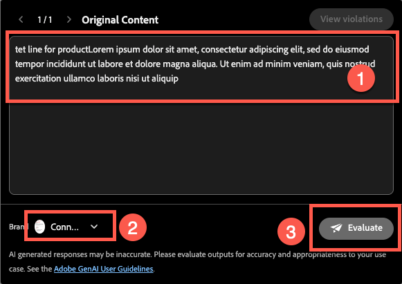
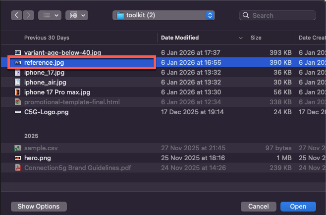

# Assistente de IA e personalização de conteúdo

**Finalidade:** saiba como usar o Assistente de IA do Adobe Journey Optimizer para gerar linhas de assunto, refinar texto de email, ajustar o tom e criar imagens Firefly sob a marca diretamente no designer de email.

## Objetivos de aprendizagem

Ao final deste módulo, você será capaz de:

1. Use o Assistente de IA para gerar linhas de assunto e pré-cabeçalhos.
1. Refine o texto principal, as descrições, o tom e as mensagens.
1. Aplique reformulação orientada por IA, resumo e ajustes de tom.
1. Gere imagens usando o Adobe Firefly com estilo de referência e configurações de marca.
1. Substitua os espaços reservados por imagens geradas no design do email.

## Introdução

O Assistente de IA no AJO ajuda você a criar conteúdo mais inteligente na marca.
Ele pode:

- Gerar linhas de assunto
- Melhorar texto existente
- Ajustar o tom e a clareza
- Criar imagens da marca usando o Firefly
- Verifique se tudo está alinhado às diretrizes 5G da Connection

Neste exercício, você melhora o email criado usando o Assistente de IA.

&#x200B;> [!NOTE]
>
>O Assistente de IA é **não determinístico**, o que significa que pode gerar conteúdo ligeiramente diferente sempre que for usado. O que você vê durante sua prática pode não corresponder exatamente às capturas de tela ou exemplos neste guia. Tudo bem — concentre-se em aprender o processo e os conceitos em vez de esperar resultados idênticos.

## Criar linha de assunto do email usando o Assistente do AI

1. Retorne ao Campaign clicando no botão Voltar ou edite o email criado no módulo anterior. Na etapa anterior, você pode clicar na guia **Configurações** no lado direito.
2. Clique em Container de email > Clique no botão Editar email.
3. Clique na guia Content e, em seguida, clique no corpo do email
4. Selecione o campo **Linha de assunto**.
5. Clique no **ícone do Assistente de IA**. (veja abaixo)

&#x200B;6. Você percebe que a Diretriz da marca é selecionada por padrão.
&#x200B;7. Digite o prompt:

>Estamos lançando o iPhone 17 e queremos que uma linha de assunto seja abrangente

&#x200B;8. Pressione **Gerar**.
&#x200B;9. Revise as quatro variantes geradas.
&#x200B;10. Escolha a variante com a melhor pontuação de alinhamento e clique em **Selecionar**.

&#x200B;> [!NOTE]
>
>Seus resultados podem ser completamente diferentes do guia do laboratório, então você não precisa se preocupar. Selecione o que você acha ser um título correto e continue com o laboratório.

## Melhorar o título e a descrição do herói

1. Abra o email clicando no botão &quot;Editar corpo do email&quot;.

&#x200B;2. Clique no cabeçalho **Linha capturada do produto**.
&#x200B;3. Abra o Assistente de IA clicando em **Gerar e selecionar um texto**

&#x200B;4. Selecione **Diretrizes de Marca 5G da Conexão** na lista suspensa.

&#x200B;5. Aviso:

>*Escreva um título arrojado e chamativo para o lançamento do iPhone 17. Mantenha abaixo de 10 palavras*

&#x200B;6. Clique em Configurações de texto para alterar o tom e a estratégia de comunicação. Altere a Estratégia de comunicação para **FOMO (Medo de ficar de fora)**, Idioma para **Inglês** e Tom para **Empolgante**. Use uma versão mais curta diminuindo a discagem.

&#x200B;7. Clique no botão **Gerar**
&#x200B;8. Revise e selecione a melhor versão,
&#x200B;9. Se o texto for longo, use o controle deslizante para **&quot;texto mais curto&quot;** e gere o texto novamente.

&#x200B;10. Quando estiver satisfeito com o texto, clique em **Selecionar**

## Prompt de descrição

Desta vez, você testa como a IA pode ajudar a encontrar problemas.

1. Selecione o texto abaixo, que é um texto de modelo e não tem significado.

&#x200B;2. Clique no botão de avaliação conforme mostrado abaixo.

&#x200B;3. O conteúdo original é selecionado automaticamente com a sua marca, conforme mostrado nas Etapas 1 e 2 abaixo. Clique no botão **Avaliar** para continuar.

&#x200B;4. Conforme esperado, você percebe muitos erros que violam as diretrizes da marca. Embora seja possível corrigi-los usando IA, nesse caso você não revisa os materiais existentes. Em vez disso, você os deixa como estão e cria novo conteúdo do zero que se alinha totalmente aos padrões da marca.

&#x200B;5. Use o novo parágrafo gerado para você usando IA com o prompt abaixo. Você pode usar a mesma abordagem para o texto de descrição usando o prompt abaixo.

Aviso:

>*Escreva uma descrição atraente para o novo iPhone 17. Destaque seus recursos mais impressionantes, como câmera avançada, duração da bateria e desempenho. O tom deve ser premium, emocionante e fácil de entender para um público amplo. Mantenha abaixo de 3 frases.*

Para economizar tempo, o texto já foi criado para você. Copie e cole abaixo para obter seu texto.

>Descubra o iPhone 17™ - com uma câmera avançada para fotos impressionantes, duração da bateria para o dia todo para mantê-lo em movimento e desempenho ultrarrápido que o mantém à frente. Não perca essa experiência inovadora.

Seu email é semelhante ao mostrado abaixo.

## Adicionar uma imagem gerada pela Firefly

Até agora, testamos o Assistente de IA na linha de assunto e texto. E as imagens?

Antes de mergulhar na geração de imagens de IA, analise quais tipos de experiências você pode criar.

Entendemos que temos o ano de nascimento do perfil. Uma das experiências que podemos fazer é criar um bloco com variantes diferentes. Com o Adobe Journey Optimizer, isso é possível e uma das maiores vantagens de ter o Adobe Experience Platform como sua base. Abordaremos a experimentação em nosso próximo módulo, mas, primeiro, prepare o bloco abaixo.

1. Arraste um componente **Imagem** para a coluna do lado esquerdo abaixo do bloco Família do iphone 17.

&#x200B;2. Clique fora e selecione o alocador de espaço de imagem. (Clique na imagem; caso contrário, você não verá a opção Firefly.)

&#x200B;3. Em **Firefly**, clique em **Gerar e selecione a imagem**.

## Fazer upload da imagem de referência

1. Ativar **Estilo de Referência**.
2. Selecione a **Diretriz de marca 5G da conexão** na seleção da marca

&#x200B;3. Clique em Fazer upload da imagem

&#x200B;4. Selecione reference.jpg na pasta toolkit

&#x200B;5. Adicionar prompt de imagem
   `Portrait-oriented image of a confident man in his early to mid-40s, standing alone at night in a neon-lit urban street, focused on his smartphone. Cinematic cyberpunk-inspired city atmosphere with colorful LED signs, cool blue and warm orange lighting, shallow depth of field, soft bokeh lights in the background. Modern lifestyle, tech-savvy mood, realistic skin tones, high contrast, photorealistic, professional lighting, ultra-detailed`.

## Escolher configurações da imagem

Escolha suas **configurações de imagem**:

1. Escolha as seguintes configurações:
   - **Proporção:** Paisagem (4:3)
   - **Tipo de conteúdo:** Foto
   - **Cor e tom:** Tom legal
   - **Iluminação:** Iluminação Dramática
1. Pressione o botão **Gerar**

## Selecionar e inserir a imagem gerada

1. Revise os resultados do Firefly verificando todas as imagens geradas.

&#x200B;2. Clique em **Selecionar** para a imagem escolhida.

&#x200B;3. Se for solicitado um modal de carregamento, clique em **Avançar**.

&#x200B;4. Depois clique em **Importar**.

## Finalizar design de bloco

Aplique um raio de borda arredondado de 10 apenas para que pareça moderno, se você tiver tempo.

Depois de algumas iterações e variações, você terá o design final. O layout final é semelhante ao exemplo.

Nesse ponto, você deve se sentir confiante usando IA para acelerar e elevar a criação de conteúdo.

## Recapitulação

Você usou com sucesso o Assistente de IA para:

- Gerar linhas de assunto
- Refinar texto herói
- Reformular parágrafos
- Alterar tom de mensagem
- Criar imagens da Firefly com marca usando o estilo de referência
- Inserir imagens geradas no email

Agora você está pronto para o próximo módulo - **Personalization e experimentação de conteúdo**, onde você criará variantes e testes orientados por perfil.
