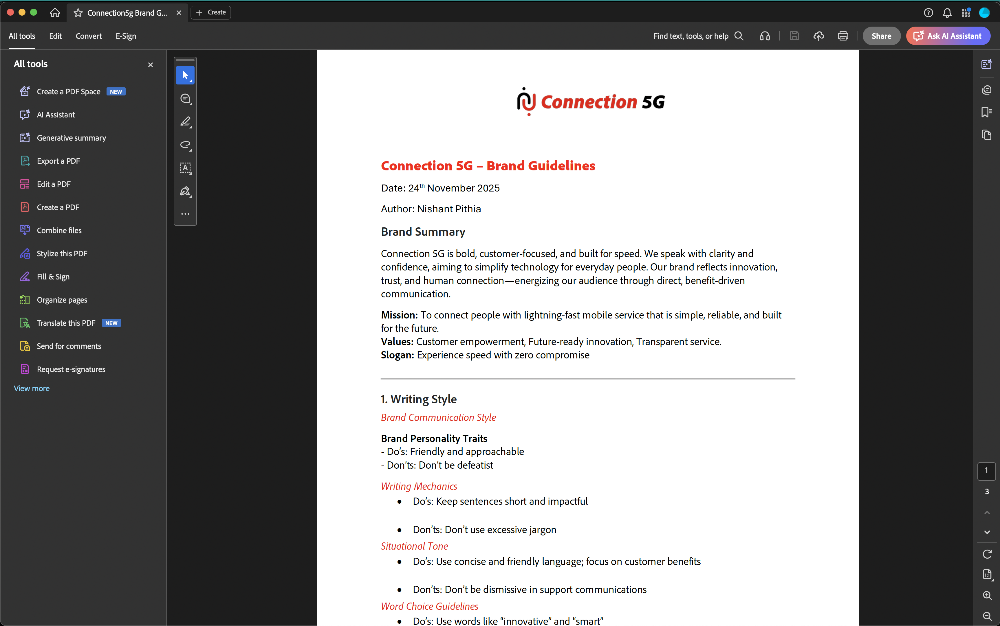
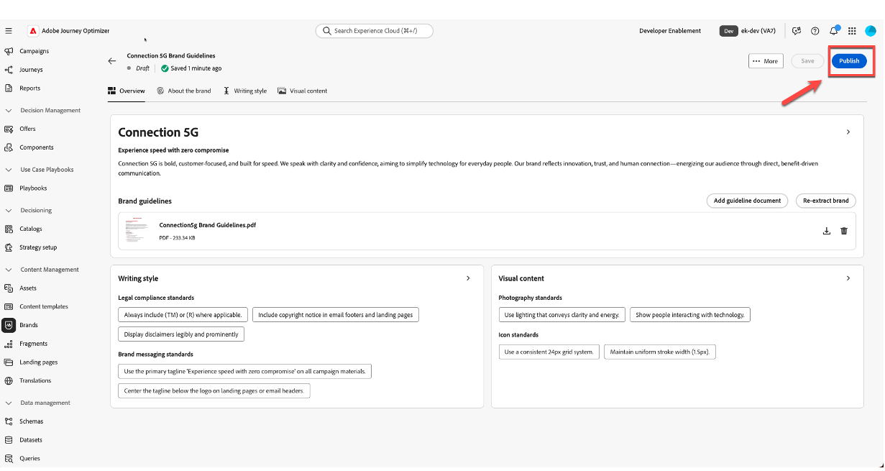

# Gerenciamento da marca

**Finalidade:** configurar, refinar e publicar as Diretrizes da Marca 5G Connection no Adobe Journey Optimizer (AJO), para que todo o conteúdo e recursos de IA permaneçam alinhados à marca.

## Objetivos de aprendizagem

Ao final deste módulo, você será capaz de:

- Crie uma nova marca no Adobe Journey Optimizer.
- Faça upload e extraia as informações das diretrizes da marca de uma PDF.
- Revise e refine os detalhes da marca nas guias Sobre a marca, Estilo de escrita e Conteúdo visual.
- Adicione uma regra de exclusão para evitar a cópia do botão de email de push.
- Publique a marca para que ela fique disponível para modelos, fragmentos, Assistente de IA e Alinhamento da marca.

Baixar Arquivo — [toolkit.zip](assets/toolkit.zip)

>[!NOTE]
>
>Antes de iniciar os laboratórios práticos, faça o download do arquivo do kit de ferramentas (veja abaixo toolkit.zip). Descompacte o arquivo para acessar as imagens e os arquivos de suporte necessários para os exercícios. Mantenha esses ativos em algum lugar fácil de acessar, pois você os referenciará em todo o laboratório.

## Introdução

Neste módulo, você criará a marca **Connection 5G** dentro da AJO usando uma PDF de diretriz de marca preparada.

O recurso **Marcas** da Adobe Journey Optimizer ajuda você a definir e manter uma identidade consistente em todas as iniciativas de marketing. De logotipos e cores a tom de voz e estilo de mensagem, a criação de uma marca garante que cada email, campanha e parte do conteúdo reflita uma personalidade unificada.

Usaremos o padrão 1 da palestra (somente AJO) neste laboratório. Observe que os ativos são armazenados usando o **Assets Essentials**.

Você começará com o documento Diretriz da marca 5G Connection, fará o upload dele, permitirá que a AJO extraia as principais informações e, em seguida, refine e publique o resultado.

## Preparar a diretriz da marca

1. Abra o PDF **Diretriz da marca 5G da conexão** na pasta do kit de ferramentas (descompacte-o primeiro).

2. Revise o documento para entender o conteúdo usado para a Conexão 5G:
   - Tom de voz
   - Cores e estilo visual
   - Estilo de escrita e exemplos de mensagens
   - Orientação de imagem
   - Notas legais e de conformidade

## Criar uma nova marca no AJO

1. No Adobe Journey Optimizer, vá para a navegação à esquerda e clique em **Marcas**.
2. Clique em **Criar Marca**.

3. No campo **Nome**, digite `Connection 5G Brand Guidelines`
4. Na área de carregamento, arraste e solte o arquivo **Diretrizes de Marca da Conexão5g.pdf** (ou clique em **Selecionar arquivos** e escolha-o no seu computador).

5. Clique em **Criar marca** para iniciar a extração.

Uma tela de progresso é exibida enquanto o AJO analisa o arquivo. Isso pode levar vários minutos, dependendo do tamanho do documento.

6. Quando a extração for concluída:
   - Uma barra de confirmação verde é exibida na parte superior.
   - Você é redirecionado automaticamente para a tela de configuração da marca.
   - Os padrões de criação de conteúdo e visual agora são automaticamente preenchidos com base no arquivo de Diretrizes de marca carregado.

7. Clique no botão **Publicar** para publicar as diretrizes da marca.

8. Confirme pressionando o botão &quot;Publicar&quot; para confirmar.

Uma barra de confirmação verde é exibida na parte inferior da página, indicando que sua marca foi publicada com êxito.

9. Clique novamente na página da marca principal e veja que sua marca está agora ativa (isso deve ser mostrado por um ponto verde com o rótulo **&quot;Ao vivo&quot;**).

## Revise as guias da marca

Agora você analisará e compreenderá as três guias principais que foram preenchidas para Connection 5G.

### Sobre a marca

Essa guia define a identidade da marca em um nível superior. Normalmente, inclui:

- Nome da marca
- Valores principais
- Princípios orientadores
- Promessas e propósito da marca
- A sensação que a marca quer criar

Todo o resto no sistema é construído a partir desta base, por isso é importante que esta guia reflita o verdadeiro DNA do Connection 5G.

Passe um momento navegando nos campos extraídos e verificando se eles correspondem à PDF original.

### Estilo de escrita

A guia **Estilo de Redação** define como a marca se comunica. Inclui:

- Diretrizes de tom
- O que fazer e o que não fazer
- Exemplos de frases e mensagens-chave
- Slogan e slogans
- Regras legais como quando incluir marcas comerciais

É possível adicionar e refinar regras em linguagem natural e até aplicá-las apenas a canais específicos, como email ou SMS. Isso oferece controle flexível, mas preciso, sobre como o Assistente de IA e os autores de conteúdo devem escrever.

### Conteúdo visual

A guia **Conteúdo visual** descreve a aparência da marca. Abrange:

- Padrões de fotografia
- Estilo de ilustração
- Regras de iconografia
- Vistos e desistências visuais

Isso garante que tudo, desde imagens a ícones, seja consistente e alinhado aos valores principais da Connection 5G.

## Adicionar visão ausente e posicionamento de mercado

No conteúdo extraído, alguns princípios orientadores podem estar incompletos. Agora complete usando a redação oficial da PDF.

1. Clique na marca que acabou de criar

2. Clique em **Editar marca**. Uma guia de confirmação é exibida; clique novamente em **Editar Marca** para confirmar.

3. Vá para a guia **Sobre a Marca**.

4. Localize a seção de **Princípios orientadores**, **Visão** ou descrição semelhante de alto nível.

5. Adicione o seguinte texto:

**Visão:**

>Capacite todos os indivíduos com conectividade instantânea e confiável que melhore a vida, o trabalho e o lazer, onde quer que estejam.

**Posicionamento no mercado:**

>Connection 5G oferece um serviço móvel de alta velocidade projetado para estilos de vida digitais, destacando-se com confiabilidade incomparável, simplicidade e inovação pronta para o futuro.

6. Clique em **Salvar**. (Se você não vir o botão **Salvar**, clique primeiro na guia **Visão geral** e, em seguida, clique em **Salvar**.)

>[!TIP]
>
>Agora você garantiu que o objetivo, a visão e o posicionamento da marca no mercado estejam claramente representados na AJO.

## Adicionar uma regra de exclusão de botão de email

Em seguida, aprimore a marca adicionando uma regra que garanta que os botões de email nunca sejam escritos de forma insistente.

1. Vá para a guia **Estilo de Escrita**.

2. Verifique se você está na seção **Estilo de comunicação da marca**.

3. Na área **Não**, clique no ícone **mais** para adicionar uma nova regra.

4. Configure a regra da seguinte maneira:
   - **Exclusão:** `Be pushy`

>[!NOTE]
>
>Isso é adicionado como uma regra Não, o que significa que a marca não deseja CTAs insistentes

**Canal:** email

Botão **Elemento:**

5. Clique em **Adicionar**.

6. Confirme se a nova regra Não aparecer como `Be pushy` na lista.

7. Clique em **Salvar**.

Essa regra se aplica sempre que o Assistente de IA ou os autores trabalham na cópia do botão de email, mantendo os CTAs alinhados ao tom da conexão 5G.

>[!NOTE]
>
>Você pode ver outras regras de &quot;não&quot; listadas que não correspondem exatamente à captura de tela. Ignore isso como esperado.

## Publicar as diretrizes da marca

Quando estiver satisfeito com a configuração:

1. Volte para a guia **Visão geral**. Clique em **Salvar**.
2. No canto superior direito, clique em **Publicar**.

3. Uma caixa de diálogo de confirmação será exibida explicando que você está prestes a publicar as Diretrizes de marca atualizadas para a conexão 5G. Clique em **Publicar** novamente para confirmar.

4. Aguarde até que a barra de confirmação verde seja exibida.
5. Clique em **Voltar** para retornar à lista de marcas.
6. Verifique se um novo cartão é exibido para as **Diretrizes da Marca 5G da Conexão** com um status mostrando que ele está ativo e disponível.

Sua marca agora está ativa e pronta para ser usada em toda a Adobe Journey Optimizer.

## Recapitulação

Neste módulo, você:

- Revisada a PDF Diretriz da marca 5G Connection.
- Criação de uma nova marca para Connection 5G dentro do Adobe Journey Optimizer.
- O arquivo de diretrizes da marca foi carregado e a AJO pôde extrair as principais informações.
- Revisamos e refinamos as guias Sobre a marca, Estilo de escrita e Conteúdo visual.
- Adição de uma regra de exclusão específica para que os botões de email nunca sejam pressionados.
- Publicação da marca para que ele possa potencializar o Assistente de IA, o Alinhamento da marca, modelos e fragmentos.

Agora você tem um perfil de marca do **Connection 5G** totalmente configurado e publicado, que será usado no restante do laboratório para manter todo o conteúdo sob a marca.
