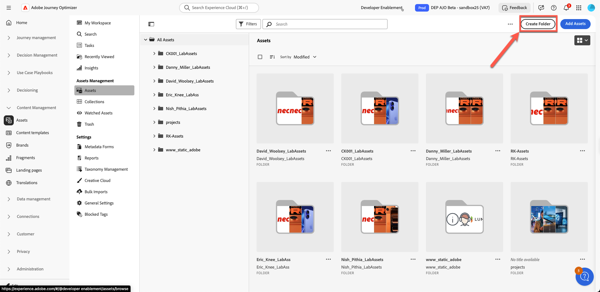
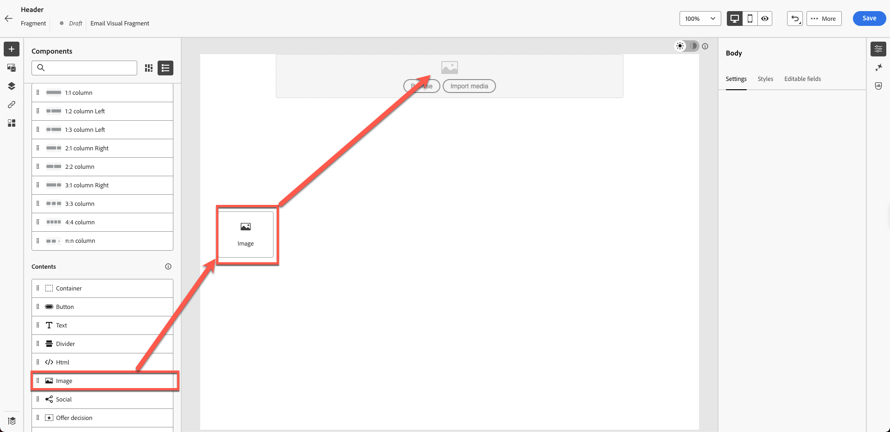
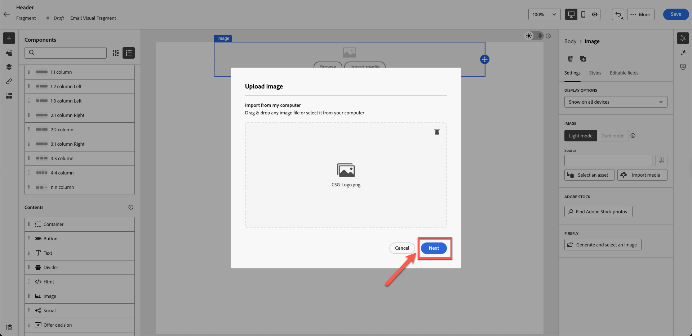

# Criação de fragmentos de conteúdo

## Criação de conteúdo com modelos e fragmentos

**Finalidade:** saiba como criar fragmentos reutilizáveis no Adobe Journey Optimizer e aplicá-los a um email real em uma jornada.

## Objetivos de aprendizagem

Ao final deste módulo, você será capaz de:

1. Divida um design de email em fragmentos reutilizáveis.
1. Crie fragmentos de cabeçalho, rodapé, banner, corpo e CTA.

## Por que os fragmentos são importantes

Os fragmentos permitem criar conteúdo consistente e alinhado à marca que pode ser reutilizado em emails, campanhas e jornadas.

### Fragmentos

Blocos de construção reutilizáveis, como:

- Cabeçalhos
- Rodapés
- CTA
- Banners
- Isenções de responsabilidade legais

Sempre que um fragmento é atualizado, todos os emails que o usam são atualizados automaticamente.

## Como isso se encaixa na criação de emails

- **Crie fragmentos** para elementos que raramente mudam.
- **Crie um modelo** que use esses fragmentos.
- **Use o modelo** no email da campanha e personalize seu conteúdo.

Abaixo está o email final que você criará neste laboratório.

Mas a equipe de design normalmente fornece modelos como este:

## Etapa 1: Criar fragmentos de conteúdo

O modelo abaixo é um modelo de design genérico e nosso objetivo é dividi-lo em blocos de conteúdo repetíveis. No Adobe jornada Otimizer, isso é chamado de **Fragmentos**.

A primeira etapa é identificar quantos fragmentos precisamos criar. Nesse modelo, faz sentido usar 5 fragmentos, como mostrado abaixo.

Identificamos os modelos que exigem 5 fragmentos, como demonstrado a seguir.

- Cabeçalho
- Banner
- CTA
- Corpo
- Rodapé

>[!NOTE]
>
>Para este exercício, você cria apenas um fragmento de cabeçalho para economizar tempo.

Crie um fragmento de cabeçalho para começar. No entanto, antes de criar o fragmento, configure uma pasta de ativos, já que o ambiente de ativos é compartilhado. Para fazer isso, primeiro crie sua própria pasta.

1. Na navegação à esquerda, localize a seção **Gerenciamento de Conteúdo** e clique em **Assets**.

2. Clique em **Assets** na seção Gerenciamento do Assets.

3. Crie uma pasta clicando no botão **&quot;Criar Pasta&quot;**.

4. Nomeie como seu nome e sobrenome. ex.: Nish\_Pithia\_LabAssets (algo que você possa lembrar)

5. **Crie um novo fragmento:** Em Gerenciamento de Conteúdo, clique em **Fragmentos** e crie um novo fragmento.

   Opção 

   Dê um nome amigável como mostrado abaixo. Adicione todos os detalhes da seguinte maneira:

   Cabeçalho **Nome:**

   **Descrição:** Cabeçalho de fragmento para o modelo

   **Tipo:** Selecionar fragmento visual

   

6. Clique no **Botão Criar** no canto superior direito.

Isso abre uma tela em branco do criador de fragmentos.

7. Clique nas colunas 1:1 em Estruturas e arraste na tela como mostrado abaixo. (Clique na imagem abaixo para ver o gráfico animado)

8. Em seguida, arraste &quot;**image**&quot; na linha 1:1 que acabamos de adicionar

9. Carregue a imagem do logotipo fornecida. Clique no **&quot;Botão Importar mídia&quot;**

10. **Carregue o logotipo:** Carregue o logotipo (*C5G-Logo.png*) da pasta de imagens do kit de ferramentas e clique em Avançar.

11. Selecione a **pasta de ativos** que você criou e clique em **Importar**. O arquivo é salvo na sua pasta.

12. O logotipo é colocado corretamente, mas é muito grande e precisa ser redimensionado. Para redimensionar o logotipo, atualize suas propriedades. Clique na **guia Estilo** e defina a largura para 40% arrastando o controle deslizante, como mostrado abaixo.

>[!NOTE]
>
>Observe que quando o botão de alternância está ativado, o número 40 representa % e não pixels. Se quiser um valor absoluto de pixel perfeito, alterne o botão para px.

13. Clique em **&quot;Salvar&quot;** e seu fragmento será salvo. Você recebe uma notificação de barra verde na confirmação.

14. O fragmento salvo está no modo de rascunho. Antes de usá-lo, você precisa publicá-lo. Clique no botão **voltar**.

15. Clique no botão **Publicar**. Você verá a mensagem &quot;Publicando fragmento, isso pode levar algum tempo. Notificaremos quando a tarefa for concluída.&quot; na confirmação. O fragmento está pronto para ser usado para criação de modelo.

Você verá a alteração de status para **&quot;Ao vivo&quot;**. Nesse ponto, você concluiu a criação de um fragmento de cabeçalho, que é usado na próxima etapa.

>[!NOTE]
>
>Observe que, neste exercício, você criou apenas um fragmento. Na prática, os arquitetos podem optar por criar vários fragmentos, como cabeçalhos, rodapés ou outros componentes reutilizáveis.

## Recapitulação

Neste módulo, você:

- Dividir um email em um fragmento de cabeçalho reutilizável
- Criação de blocos de conteúdo de cabeçalho

Agora você está pronto para seguir para o próximo módulo - **Criação de modelo de conteúdo**, onde você usará o fragmento criado para gerar um novo modelo.
