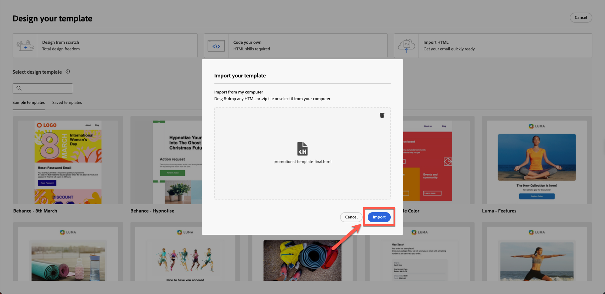
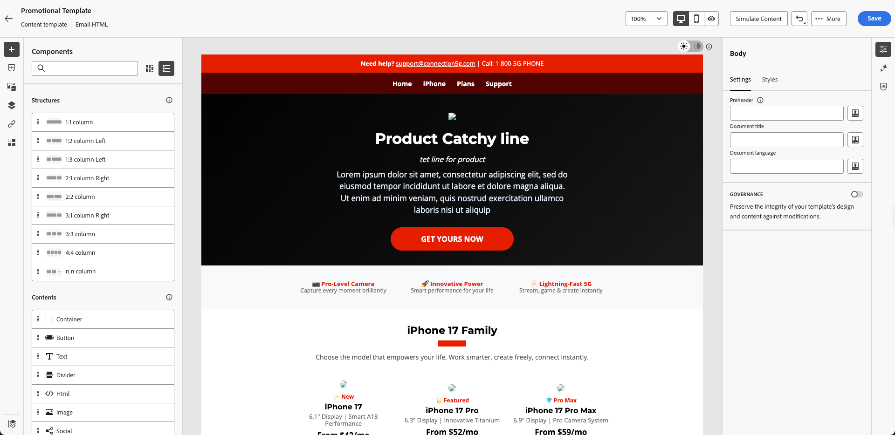
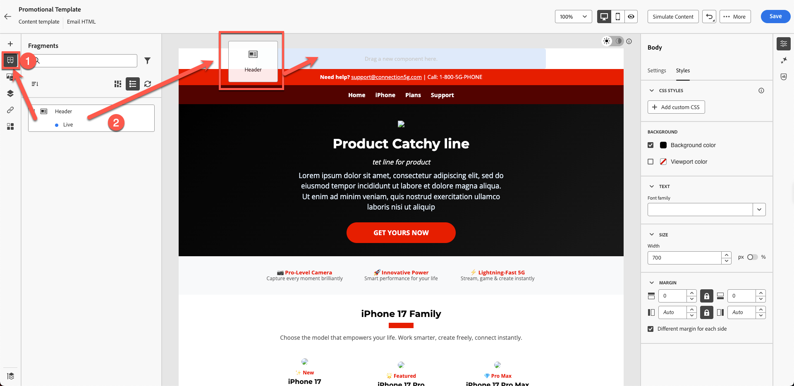

# Criação do modelo de conteúdo

## Criação de conteúdo com modelos e fragmentos

**Finalidade:** Saiba como criar modelos reutilizáveis no Adobe Journey Optimizer

## Objetivos de aprendizagem

Ao final deste módulo, você será capaz de:

1. Crie um modelo de email completo usando o HTML e fragmentos importados.

## Por que os modelos são importantes

Os templates permitem criar conteúdo consistente e alinhado à marca, que pode ser reutilizado em emails, campanhas e jornadas.

### Modelos

Blueprints que estruturam:

- Posicionamento do cabeçalho
- Área de conteúdo do corpo
- Área de rodapé
- Estilo de layout padrão

Os modelos garantem a consistência da marca em todas as equipes e economizam tempo significativo de criação.

## Criar um novo modelo usando fragmentos

Os modelos ajudam os usuários a reutilizar layouts completos em campanhas. Os modelos de conteúdo no Adobe Journey Optimizer são ferramentas eficientes projetadas para simplificar e simplificar a maneira como você cria conteúdo reutilizável para campanhas e jornadas. Independentemente de você estar criando um email, SMS ou notificação por push, os modelos ajudam a economizar tempo, fornecendo estruturas pré-projetadas que podem ser facilmente personalizadas e compartilhadas entre projetos.

Para um processo de design acelerado e aprimorado, crie modelos independentes para reutilizar conteúdo personalizado facilmente em campanhas e jornadas do Journey Optimizer.

Essa funcionalidade permite que usuários orientados a conteúdo trabalhem em modelos fora de campanhas ou jornadas. Os usuários de marketing podem então reutilizar e adaptar esses modelos de conteúdo independentes em suas próprias jornadas ou campanhas.

## Criar modelo

1. Vá para **Gerenciamento de Conteúdo → Modelos de Conteúdo**.

   

2. Clique em **Criar Modelo** e preencha o seguinte:
   - **Nome:** `Promotional Template`
   - **Descrição:** `Promotional Template for phone products`
   - **Canal:** `Email`

   

3. Clique em **Create**.

## Adicionar linha de assunto e abrir designer de email

1. Adicionar linha de assunto: `Promotional Template` e clique em **no corpo do email** para abri-lo para edição

   

2. Há três opções:
   1. Criar do zero
   2. Desenvolva o seu
   3. Importar HTML

Selecione a terceira opção. Clique em **Importar HTML**

## Importar modelo do HTML fornecido

1. Carregar o arquivo html de modelo da pasta do kit de ferramentas `promotional-template-final.html`

   

2. Clique no botão Importar para **importar** o modelo.

   

3. Aguarde a renderização do layout. Você percebe problemas como links de imagem quebrados e ausência de identidade visual. (Esse é o comportamento esperado, pois temos ativos de espaço reservado)

## Explorar estrutura do modelo

### Painel esquerdo

Os componentes de &quot;**Estruturas**&quot; e &quot;**Conteúdo**&quot; no Adobe Journey Optimizer (AJO) são elementos essenciais usados ao criar emails, páginas de aterrissagem e fragmentos de conteúdo. As estruturas definem a estrutura de layout, enquanto o Conteúdo fornece os blocos de construção reais colocados dentro desses layouts.

A seção do corpo no Adobe Journey Optimizer é o container principal do seu conteúdo de email ou página. Ele serve como a raiz do espaço de design visual, onde todos os componentes de estrutura (colunas, layouts) e componentes de conteúdo (texto, imagens, botões etc.) são aninhados.

### Painel direito

As opções &quot;**Configurações**&quot; e &quot;**Estilo**&quot; na seção do corpo do Adobe Journey Optimizer permitem definir a aparência e o layout fundamentais do seu email ou página. Esses controles afetam o design inteiro, pois o corpo é o pai de todos os componentes.

Na barra do painel esquerdo, há seções para:

- Fragmentos
- Arquivos
- Estrutura do corpo
- URLs rastreados

Você verá que o fragmento do cabeçalho criado no exercício anterior aparece aqui, como mostrado abaixo. Certifique-se de que o fragmento de cabeçalho seja exibido como ativo com um ponto azul e não no modo de rascunho. Passe tempo verificando o restante das seções.

>[!NOTE]
>
>Se você não vir seu fragmento aqui, significa que não o salvou corretamente e precisa carregá-lo novamente.

## Inserir fragmentos de cabeçalho

Agora, melhore o template. Você já criou o cabeçalho e o rodapé.

1. Arraste uma **Coluna 1:1** acima do conteúdo existente.

   

   Você vê algo assim.

   

2. O plano de fundo usa a cor de plano de fundo do modelo, que atualmente é preta. Defina sua cor de fundo **para branco. Clique em** na guia Estilo no painel direito e use a cor branca do seletor de cores.

   

3. Abra **Fragmentos** e arraste o fragmento **Cabeçalho**.

   

4. Observe que o fragmento do cabeçalho está alinhado perfeitamente ao seu modelo, conforme mostrado abaixo.

   

5. Clique no botão **Salvar** para salvar seu modelo e em **Voltar**.

>[!NOTE]
>
>Observe que você pode ver algumas imagens quebradas. Resolveremos isso mais tarde.

## Recapitulação

Neste módulo, você:

- HTML importado para criar um modelo promocional completo

Agora você está pronto para seguir para o próximo módulo - **Criando o email**
