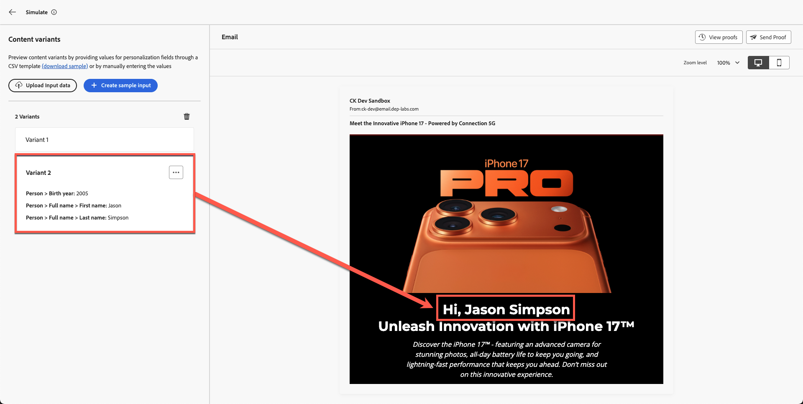

# Simulação de conteúdo

**Finalidade:** valide a personalização, a lógica condicional e as variantes de conteúdo usando as ferramentas de Simulação e Prova do Adobe Journey Optimizer.

## Objetivos de aprendizagem

Ao final deste módulo, você será capaz de:

1. Carregue e use dados de perfil de teste para simulação.
1. Validar campos personalizados e lógica de variante.
1. Testar comportamento de fallback para dados ausentes ou sem correspondência.

## Introdução

Neste módulo final, você testará seu email com **duas variantes condicionais** usando a ferramenta Simulação no Adobe Journey Optimizer.
Isso permite que você visualize como clientes diferentes experimentarão sua mensagem personalizada, garantindo a precisão antes de lançar a campanha.

Você usará o arquivo de perfil de teste de exemplo **sample.csv** do seu kit de ferramentas.

## Abrir a ferramenta de simulação

1. Abra o email preenchido.
1. Clique em **Simular Conteúdo**.
1. Selecione **Simular variação de conteúdo**.

Um painel de simulação é aberto após alguns segundos.

## Fazer upload dos dados do perfil de teste

1. Abra **sample.csv** da pasta do kit de ferramentas.
   - **Alex** → Acima de 40 anos
   - **Jason** → Abaixo de 40 anos
2. Clique em **Carregar dados de entrada**.

3. Escolha **sample.csv** e clique em **Continuar**.

O AJO processa o arquivo e prepara visualizações.

## Revisar renderização da variante

O AJO mostra ambas as variantes lado a lado com base nos perfis carregados.

**Resultados esperados:**

- **Alex** → Vê **Variante 1** (Idade acima de 40)

Ao rolar a tela para cima, você também verá campos personalizados com o nome agora, como pode ver abaixo.

- **Jason** → Vê **Variante 2** (Idade abaixo de 40)

Com o nome completo do Jason também. Como isso é legal!

## Validar comportamento de fallback

**Fallbacks e Padrões:** Verifique se o seu email trata adequadamente todos os dados ausentes ou cenários sem correspondência. Por exemplo, simule um perfil com um campo de ano de nascimento vazio ou que não se qualifique para nenhuma oferta direcionada. A visualização deve mostrar um bloco de conteúdo padrão ou um espaço reservado adequado, em vez de conteúdo corrompido ou vazio. Se a simulação mostrar uma seção vazia onde o conteúdo deve ser exibido, isso indica que talvez seja necessário configurar uma oferta substituta ou um texto padrão no design.

## Recapitulação

Neste módulo, você:

- Conteúdo personalizado simulado usando perfis de amostra
- Lógica de alternância de variante validada
- Campos personalizados confirmados são preenchidos corretamente

Agora você está pronto para o próximo módulo - **Alinhamento da marca**,
onde você avaliará seu e-mail em relação às diretrizes da marca Connection 5G usando IA.
