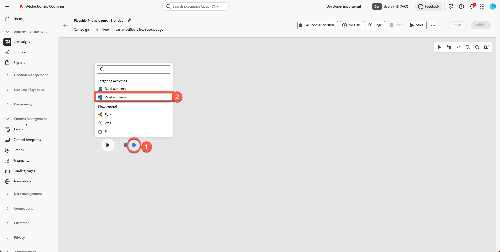

# Criação do email

## Criação de conteúdo com modelos

**Finalidade:** saiba como criar modelos reutilizáveis no Adobe Journey Optimizer e aplicá-los a um email real em uma campanha.

## Objetivos de aprendizagem

Ao final deste módulo, você será capaz de:

1. Crie uma nova campanha e use seu novo modelo de marca.
1. Atualize as imagens principais, as imagens do produto, os botões e o estilo de layout.

## Criar e atualizar o email em uma campanha

### Objetivo

Neste exercício, aprenderemos como aplicar o modelo criado a um email dentro de uma jornada. Em um cenário ideal, você pode usar qualquer jornada ou campanha existente e substituir seu conteúdo de email por um modelo padronizado para garantir a consistência da marca e uma execução mais rápida.

Esta etapa demonstra como os modelos podem ser reutilizados em jornadas, permitindo que as equipes atualizem designs sem recriar emails do zero.

## Criar nova campanha de email

1. Volte para a tela principal e clique em **Gerenciamento do Jornada → Campanhas**.
2. Clique em **Criar campanha**

   

3. Selecione &quot;**Orquestração - Marketing**&quot; e clique em **confirmar**

   

4. Nomeie sua campanha `Flagship Phone Launch Branded`. Pressione o botão **Salvar**.

   

5. Clique no sinal **+** e selecione a atividade **Ler público**

   

6. A próxima etapa é selecionar a caixa **&quot;Ler público-alvo&quot;** e clicar no **ícone da pasta Público-alvo**

   

7. Selecione a **dep: Interessado no público-alvo do iPhone 17** e clique no botão &quot;**Adicionar público-alvo**&quot;

   

8. Selecione a Entidade - **dep-rel: Conta do Cliente - customer\_id** (ou qualquer uma, pois não importa para esta parte)
9. Adicione a **Atividade de email** clicando no sinal **+** e selecione **Email** nas atividades de Canal.

   

10. Clique em **Editar email**.

11. Clique na **guia Ação** e selecione **sua** configuração de email. Sua sandbox pode mostrar isso como Email relacional. (Selecione qualquer)

12. Clique na **guia Conteúdo**

13. Clique em **Aplicar modelo de conteúdo**

14. Selecione o modelo **&quot;Modelo Promocional&quot;** que você criou e clique em **Confirmar**

15. Clique em **Editar corpo do email**

16. Confirme se os novos blocos de cabeçalho, herói, rodapé e conteúdo são exibidos corretamente.

## Substituir imagem principal e imagens do produto

Alterar as imagens do herói e do telefone. Você precisa fazer upload do conteúdo para ativos da pasta do kit de ferramentas. Atualmente, a imagem do banner principal do seu produto é um espaço reservado.

1. Clique na imagem de banner principal quebrada.

   

2. Remova o URL de origem temporário.

   

3. Clique em **Importar mídia**

   

4. Carregue `hero.png` do seu kit de ferramentas. (Você pode arrastar o arquivo)

   

5. Clique em **Avançar** Selecione **sua pasta para os ativos** e pressione **importar**

   

6. Seu modelo de email está surgindo muito bem. Ela é exibida da seguinte forma. Clique em **&quot;Salvar&quot;** para salvar seu trabalho.

## Exercício opcional

### Substituir imagens do produto

Vá em frente e atualize todas as imagens do produto (imagens fornecidas na pasta do kit de ferramentas) e também adicione borda arredondada ao seu gosto. Seu email fica melhor sem links quebrados, como mostrado abaixo. Repita o processo para todos os cartões de produto.

## Recapitulação

Neste módulo, você:

- Criou uma nova campanha com email usando seu modelo de marca
- Imagens do herói e do produto atualizadas
- Estilo aprimorado

Agora você está pronto para seguir para o próximo módulo - **Assistente de IA e personalização de conteúdo**, em que você usará a IA para refinar o texto e gerar imagens automaticamente.
