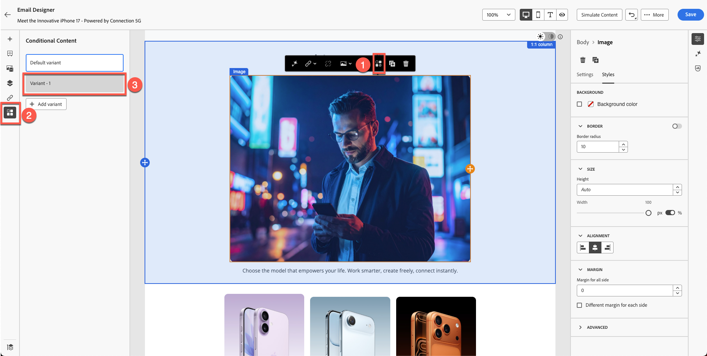
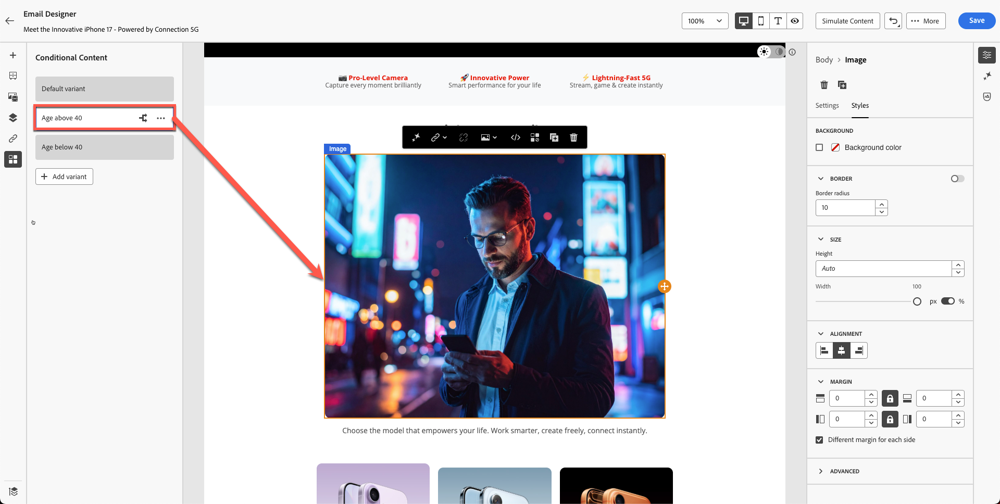

# Personalization e experimentação de conteúdo

**Finalidade:** saiba como personalizar conteúdo de email usando atributos de perfil, criar variantes de conteúdo dinâmico e aplicar lógica condicional no Adobe Journey Optimizer.

## Objetivos de aprendizagem

Ao final deste módulo, você será capaz de:

1. Adicione campos de personalização usando atributos de perfil.
1. Use o Editor de personalização e a sintaxe Handlebars.
1. Crie variantes de conteúdo dinâmico com base na lógica do perfil.
1. Crie regras condicionais para blocos de conteúdo personalizados.
1. Teste a alternância de variante com base em atributos, como ano de nascimento.

## Introdução

A personalização no Adobe Journey Optimizer permite experiências individuais em escala.
Neste módulo, você deverá:

- Inserir texto personalizado (nome e sobrenome)
- Criar variantes de conteúdo com base na idade
- Aplicar lógica condicional usando atributos de perfil
- Preparar conteúdo para simulação no Módulo 7

O Personalization no Adobe Journey Optimizer permite criar experiências personalizadas e impactantes do cliente, personalizando dinamicamente o conteúdo com base em perfis individuais, comportamentos e dados contextuais. Quer você esteja criando emails, notificações ou ofertas personalizados, as ferramentas e técnicas fornecidas facilitam a conexão da mensagem certa à pessoa certa, na hora certa. Saiba como o Editor do Personalization, a sintaxe Handlebars e os dados do Adobe Experience Platform trabalham juntos para dar vida às suas ideias, explorar blocos de conteúdo reutilizáveis com fragmentos de expressão e mergulhar em funções avançadas de ajuda para explorar possibilidades mais profundas. Cada tópico desenvolve passo a passo suas habilidades, garantindo que você esteja pronto para projetar jornadas personalizadas com confiança.

## Adicionar personalização básica

Essa parte do exercício simplifica a personalização. Adicione o nome e o sobrenome ao email com base no perfil. O Personalization é baseado nos dados de perfil gerenciados pelo esquema do Perfil individual XDM definido. O esquema do Perfil individual XDM é o único esquema que você pode usar para personalizar conteúdo no Journey Optimizer.

1. Abra o email criado em módulos anteriores.
2. Adicione um bloco de texto acima do título herói com o conteúdo: **Olá,**
3. Clique no ícone **Personalização**.

   

4. Pesquisar **F****Nome**.

   

5. Clique em **+** para adicioná-lo à área de expressão.
6. Adicione um **espaço** após o campo **Nome**.

   

7. Repita o processo acima, mas desta vez pesquise e adicione **Sobrenome**.

   A sintaxe final mostra as variáveis de nome e sobrenome claramente separadas.

   

8. Valide o fragmento. Observe que há uma opção para salvar o conteúdo como fragmento. Esta é uma ótima oportunidade para fazer se estiver usando o Nome completo para outras criações de conteúdo de email. Pule isso e vá para a próxima etapa.
9. Clique em **Salvar**

Sua visualização fica assim. As chaves consistem em variáveis e cada indivíduo recebe um email com seu nome.

Nesse ponto, você sabe como adicionar personalização para perfis individuais.

## Introdução ao conteúdo dinâmico

O conteúdo dinâmico no Adobe Journey Optimizer permite criar mensagens personalizadas que se adaptam perfeitamente ao seu público-alvo. Usando regras condicionais, você pode adaptar emails, SMS e notificações por push com base em atributos de perfil, associação de público-alvo ou eventos em tempo real. Esteja você criando uma mensagem de fallback para quando critérios específicos não forem atendidos ou salvando regras reutilizáveis para fins de consistência, o editor de personalização e o Email Designer oferecem ferramentas intuitivas para dar vida às suas ideias.

Este é um caso de uso perfeito para adicionar conteúdo condicional ao email e personalizá-lo com base na idade do usuário.

Consulte seu esquema: Você tem **&quot;person.birthYear&quot;** como ano de nascimento. Esse atributo pode ser útil. Direcione e configure uma campanha com base na idade.

Para este exercício, você criará duas variantes com base na idade. Uma variante é direcionada a usuários com mais de 40 anos e a outra é direcionada a usuários com menos de 40 anos (talvez em meados de 20 e 30 anos). Qualquer pessoa nascida antes do ano de 1986 é considerada acima de 40, enquanto qualquer pessoa nascida em 1986 ou depois é considerada abaixo de 40.

**Lógica de idade**

Você usará o atributo de perfil `person.birthYear`.

| Grupo alvo | Condição |
| ------------ | ----------------- |
| Acima de 40 | birthYear \&lt; 1986 |
| Abaixo de 40 | birthYear >= 1986 |

## Criar duas variantes de imagem

Lembrar deste bloco que criamos no módulo anterior? Sua imagem é diferente da minha.

Crie outra imagem para pessoas com menos de 40 anos (lembre-se, você criou uma imagem do Firefly de uma pessoa com 40 e poucos anos) e use-a para este exercício.

1. Selecione o bloco de imagem existente. (Clique na imagem) e clique em **Bloco Condicional**.
2. Clique em **Adicionar variante**.

   

3. Renomeie a primeira variante para **Idade acima de 40**.

   

4. Crie uma nova Variante clicando no botão **&quot;Adicionar Variante&quot;** e Renomeie-a para **Idade abaixo de 40.**

   

5. É possível criar uma imagem usando o Firefly usando um prompt como &quot;mid-20-year-old&quot;. Entretanto, para economizar tempo, já temos uma imagem no kit de ferramentas chamada &quot;**variant-age-below-40.jpg**.
6. Clique na imagem e em Importar mídia.

   

7. Selecione a imagem **variant-age-below-40.jpg**. Importe-o clicando em **Próximo** e, por fim, pressione **Importar** na pasta (você já deve estar na pasta por padrão).

   

8. Tente alternar entre variantes e verá uma imagem diferente aplicada.

Até agora, você criou o design, mas ainda não aplicou a lógica. A próxima etapa aplica a lógica.

## Aplicar lógica condicional a variantes

Ambas as variantes estão prontas, mas você ainda não aplicou a lógica condicional.

## Lógica para &quot;Idade acima de 40&quot;

1. Selecione e passe o mouse sobre a **Idade acima da variante 40**.
2. Clique no ícone **Lógica condicional**.

   

3. Crie uma nova condição.

   

4. Pesquisar **ano** na lista de atributos.
5. Arraste **Ano de Nascimento** para a tela.
6. Definir condição para:
   - **birthYear \&lt; 1986**

   

7. Nomeie a condição: **Idade acima de 40**
8. Adicionar uma descrição - &quot;**Variante de imagem para pessoas acima de 40**&quot;
9. Clique em **Adicionar → Selecionar**.

## Lógica para &quot;Idade abaixo de 40&quot;

1. Selecione e passe o mouse sobre a seção **Idade abaixo de 40**.
2. Repita as etapas, mas altere a lógica para:
   - **birthYear >= 1986**

   

3. Nomear a condição: **Idade abaixo de 40**
4. Adicionar descrição. &quot;**Variante de imagem para pessoas abaixo de 40**&quot;
5. Clique em **Adicionar → Selecionar**.

## Validar alternância de variante

Alterne entre as duas variantes para garantir:

- As imagens corretas são exibidas
- A lógica foi aplicada corretamente
- Nenhuma variante é exibida como &quot;Nenhuma condição aplicada&quot;

Variante: **Idade acima de 40**

Variante: **Idade abaixo de 40**

Clique no botão &quot;**Salvar**&quot; para salvar o email.

## Recapitulação

Neste módulo, você aprendeu com sucesso a:

- Adicionar campos de personalização para mensagens individuais
- Criar variantes de imagem dinâmicas
- Aplicar regras condicionais com base na idade

Agora você está pronto para o próximo módulo - **Simulação de conteúdo**, para testar ambas as variantes.
