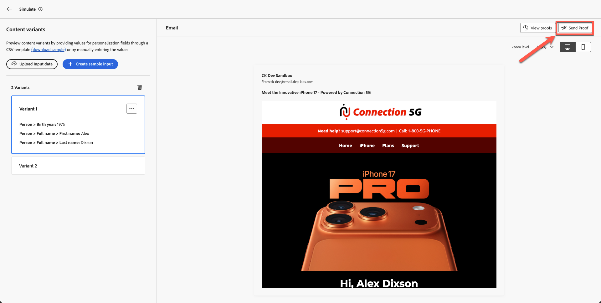

# Testar o email

## Objetivos de aprendizagem

Ao final deste módulo, você será capaz de:

- Envie emails de prova do editor de email do Adobe Journey Optimizer.
- Valide o conteúdo personalizado e as variantes condicionais usando emails de prova.
- Verifique a entrega do email de prova em sua caixa de entrada, incluindo o tratamento de spam e mensagens recortadas.
- Revise logs do delivery de prova, carimbos de data e hora e variantes no Adobe Journey Optimizer.
- Confirme se o conteúdo de e-mail está preciso, personalizado e pronto para ativação.

## Enviar emails de prova (opcional, mas recomendado)

Neste ponto, você aprendeu que podemos não apenas personalizar os atributos do perfil, mas também usar atributos para criar uma lógica condicional que determinaria o conteúdo que você deseja mostrar. O Adobe Journey Optimizer é extremamente eficiente e oferece muita flexibilidade aos profissionais de marketing.

1. Clique em **Simular Conteúdo**.
2. Selecione **Simular variação de conteúdo**.

   

   Um painel de simulação é aberto.

3. Clique em **Enviar prova**.

   

4. Adicione seu próprio endereço de email pessoal.

   >[!NOTE]
   >
   >Observe que, às vezes, o email corporativo bloqueará emails da sandbox. Eu recomendaria que você usasse seu email pessoal.

5. Selecione ambas as variantes.
6. Adicionar prefixo da linha de assunto
   1. Variante 1: acima de 40
   2. Variante 2: Abaixo de 40
7. Clique em **Enviar prova**. Você recebe uma mensagem de confirmação verde &quot;**Provas enviadas com êxito**&quot;

Verifique se ambos os emails chegaram à sua caixa de entrada.

>[!NOTE]
>
>Os emails de prova podem chegar ao **Spam**, dependendo dos filtros.

Você pode ver a mensagem recortada, mas não há problema, pois alguns links de rodapé não são reais. Se clicar no link, você verá que ambos os emails com variantes foram recebidos.

### Verificar a entrega da prova no AJO

Por fim, você também pode ver o delivery de prova no Adobe Journey Optimizer.

1. Retorne ao editor de email.
2. Volte para a tela de criação de email e clique em **Exibir Prova**.
3. Revisar logs do delivery, carimbos de data e hora e variantes enviadas.

Você percebe os detalhes do email de prova.

## Recapitulação

Neste módulo, você:

- Emails de prova enviados e verificados no AJO

Agora você concluiu a Jornada completa do Connection 5G AJO Lab e validou que seu email é preciso, personalizado e pronto para ser ativado.
