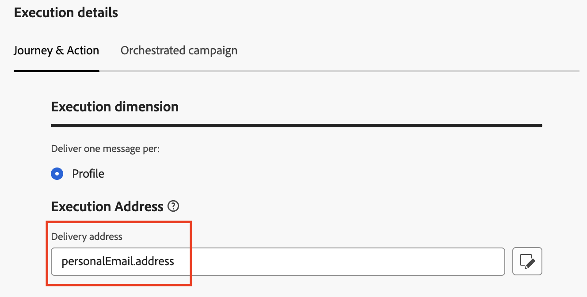
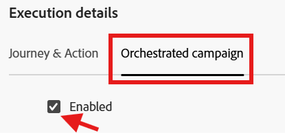

# Configurar para perfil

## Objetivo

No próximo conjunto de etapas, você criará uma Configuração de canal de email com Jornadas e Campanhas orquestradas usando o atributo de Perfil do AEP `personalEmail.address`

## Criar configuração de canal

1. Navegue até **Configurações de Canal** encontradas no menu **Administração → Canais → Configurações gerais**
2. Clique no botão **Criar configuração**

&#x200B;3. No assistente Criar, defina os seguintes valores:
   - **Nome:** `Profile-Email`
   - **Canal:** `Email`
   - **Ação de marketing:** `Email Targeting`

>[!NOTE]
>
>Ao selecionar Email como canal, uma nova seção **Configurações de email** é exibida.

## Configurar tipo de email

Defina o **Tipo de email** como **Marketing**

## Configurar subdomínio

Na lista suspensa **Subdomínio**, selecione **email.dep-labs.com**

## Configurar detalhes do pool de IPs

Na lista suspensa **Pool de IP**, selecione **marketing**

## Configurar cancelamento de inscrição da lista

1. Verifique se o botão de alternância está **habilitado** para list-unsubscribe
1. Na área de preferência List unsubscribe, verifique se todas as caixas de seleção estão **marcadas**
1. Em Gerenciamento de link, verifique se **Adobe managed** está selecionado
1. Para o nível de Consentimento, verifique se está definido como **Canal**

## Configurar parâmetros de cabeçalho

1. Defina os seguintes campos da seguinte maneira:
   - **De nome:** `DEP Labs`
   - **Do prefixo de email:** `dep`
   - **Responder ao nome:** `DEP Labs Support`
   - **Responder ao email:** `reply@email.dep-labs.com`
   - **Prefixo do email de erro:** `error`

## Configurar email com CCO

Deixe em branco

>[!NOTE]
>
>Você pode manter uma cópia dos emails enviados enviando-os para uma caixa de entrada CCO. Digite o endereço de email de sua escolha para que cada email enviado seja copiado para o CCO. Observe que o domínio de endereço CCO deve ser distinto de qualquer subdomínio delegado à Adobe. Esse recurso é opcional. *Como usar Cco para emails*

## Configurar parâmetros de nova tentativa de email

Deixar com as configurações padrão de **Horas** definidas como **84**

## Configurar parâmetros de rastreamento de URL

Manter as configurações padrão

## Detalhes da execução

1. Conclua a seção **Detalhes da execução**. Na guia **Jornada e Ação** -> **Dimensão de execução**, selecione **Perfil** como **Source** e clique no ícone Editar para **Endereço de entrega** na seção **Endereço de execução**

&#x200B;2. Clique na pasta denominada **Email Pessoal** para abri-lo

&#x200B;3. Clique na **caixa de seleção** no campo `Address` e no botão **Selecionar**

&#x200B;4. Para **Perfil**, `personalEmail.address` agora está configurado como o **Endereço de entrega** na seção **Endereço de Execução**

&#x200B;5. Clique na guia Campanha orquestrada e **marque** a caixa de seleção Habilitado.

&#x200B;6. No cabeçalho Execution dimension, configure o seguinte:
   - **Entregar uma mensagem por:** `Target Dimension`
   - **Dimension de Destino do Perfil:** `dep-rel: Customer Account - customer_id`

&#x200B;7. Em Endereço de execução, configure o seguinte:
   - **Source:** `Profile`
   - **Endereço de entrega:** `click on the Edit icon`

&#x200B;8. Procure por e clique na pasta `Personal Email` para abri-la

&#x200B;9. Selecione o campo `Address` na pasta Email Pessoal e clique em **Selecionar**

&#x200B;10. Para a **campanha orquestrada**, a **dep-rel: Conta de Cliente - customer\_id** está configurada como **Dimension de Destino de Perfil** para a **Dimensão de Execução** com **Endereço de Execução** tendo uma **Source** do **Perfil** e `personalEmail.address` como **Endereço de entrega**

>[!NOTE]
>
>Para Campanhas Orquestradas, você direciona a conta do cliente com um email para que envie apenas *uma mensagem por Perfil*.  O Endereço de execução que você usa vem do próprio Perfil (ou seja, o que é armazenado no Perfil do AEP sob o atributo **personalEmail.address**)

## Revisar e salvar

1. Revise todos os detalhes novamente para garantir que correspondam.
1. Role para cima e clique em **Enviar**.

&#x200B;> [!NOTE]
>
>Observou-se que o processamento da configuração do canal de email leva até 2h!  Uau!
>
>Prossiga para o próximo exercício enquanto aguarda o processamento dessa configuração de canal.

>[!TIP]
>
>🚀 Assim que o status de configuração do canal de email for **Ativo**, ele estará pronto e poderá ser selecionado diretamente nas **Atividades de email** dentro das Campanhas Orquestradas.

## Recapitulação

Agora você viu como criar uma Configuração de canal de email para usar o atributo de Perfil do AEP para Campanhas do Jornada e Orquestradas.
