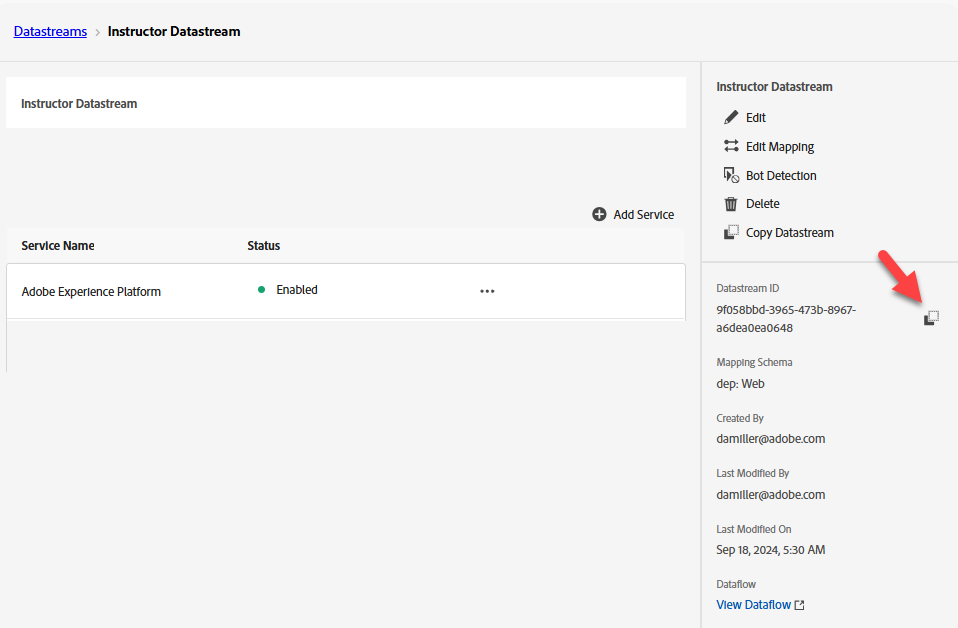

# Criar sequência de dados

## Objetivo de aprendizado

Crie e configure uma sequência de dados com os serviços necessários para habilitar o processamento de eventos do Edge.

Uma sequência de dados define quais serviços a utilizarão.

- Ao enviar dados para a Edge, você especifica qual sequência de dados usar
- Os dados enviados para esses Datastreams podem agir de acordo com o serviço configurado
  - Adobe Experience Platform

## Criar um novo fluxo de dados

1. No painel esquerdo, em **Coleção de dados**, clique em **Sequências de dados**
1. Em seguida, clique em **Novo Datastream** para criar um

## Configurar sequência de dados

Configure o fluxo de dados com as seguintes informações:

1. Nome -> **Datastream SB + \&lt;sandbox name> (ou seja, Datastream SB01)**
1. Esquema de Mapeamento -> **dep: Web**
1. Ative **em** todas as opções em **Geolocalização e Pesquisa de Rede** se desejar capturar essas informações.
1. Clique no botão **Salvar** quando terminar

>[!WARNING]
>
>Não clique em Salvar e Adicionar Mapeamento.  Se você acidentalmente fizer isso, basta cancelar

Depois de salvar o fluxo de dados, você verá a seguinte tela:

## Adicionar serviço Adobe Experience Platform

Isso permite enviar dados para o Hub e chegar a um conjunto de dados para os dados recebidos por esse fluxo de dados.

1. Clique no botão azul **Adicionar serviço** localizado no meio da tela

&#x200B;2. Configure os seguintes itens:
   - **Serviço** -> `Adobe Experience Platform`
   - **Conjunto de Dados do Evento** -> `dep: Web`
   - **Conjunto de Dados de Perfil** -> `dep: Customer Account`
   - **Marcar Caixa de Seleção** -> `Offer Decisioning`
   - **Marcar Caixa de Seleção** -> `Adobe Journey Optimizer`
&#x200B;3. Quando terminar, clique em **Salvar**

Você vê o serviço agora adicionado ao seu fluxo de dados

**Copiar** e **salvar** a **ID da sequência de dados** no computador local (vamos usá-la posteriormente no Postman)

## Recapitulação

Você deve ter uma sequência de dados em funcionamento com o serviço Adobe Experience Platform configurado.
